# From Tokens to Attention

Attention addresses a central question: **when processing one position in a
sequence, how much information should the model read from every other
position?** Transformers implement this process with parallel matrix
operations, allowing each token to acquire a new representation based on its
context.

This note follows the complete data path. Text is split into tokens and mapped
to vectors; those vectors enter a Transformer, exchange contextual information
through self-attention, and are ultimately used to generate the next token or
perform tasks such as classification.

## From Text to Tokens

Language models do not read strings directly. A tokenizer first calls `encode`
to split text into tokens and map each token to an integer ID in its vocabulary.
The model receives these IDs and outputs either the ID of a vocabulary token or
a probability distribution over all candidate tokens.

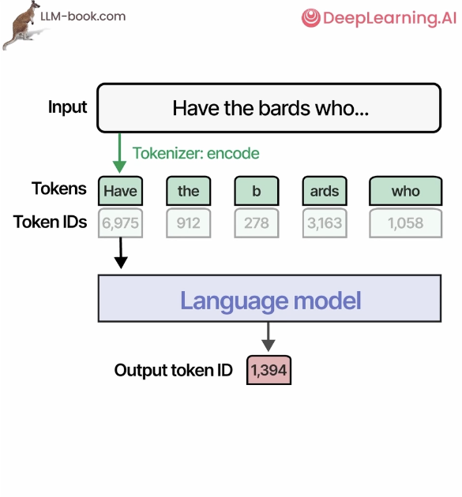

A token is not necessarily a complete word. Common tokenization granularities
include:

- **Word-level:** intuitive, but requires a large vocabulary and struggles with
  unseen words and inflections.
- **Subword-level:** balances vocabulary size and sequence length, making it a
  common choice for modern language models.
- **Character-level:** uses a small vocabulary but produces much longer
  sequences.
- **Byte-level:** can represent almost any input, usually at the cost of more
  positions.

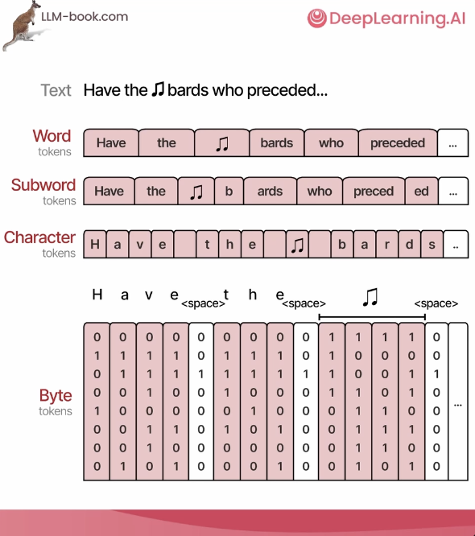

Consequently, a model's "context length" is measured in tokens, not characters
or words. Different tokenizers may produce different token counts for the same
sentence.

## Where the Transformer Fits

The original Transformer uses an encoder-decoder architecture. The encoder
reads the complete input sequence and uses self-attention to produce a
contextual representation at every position. The decoder reads both the
encoder output and the content generated so far to predict the next token.

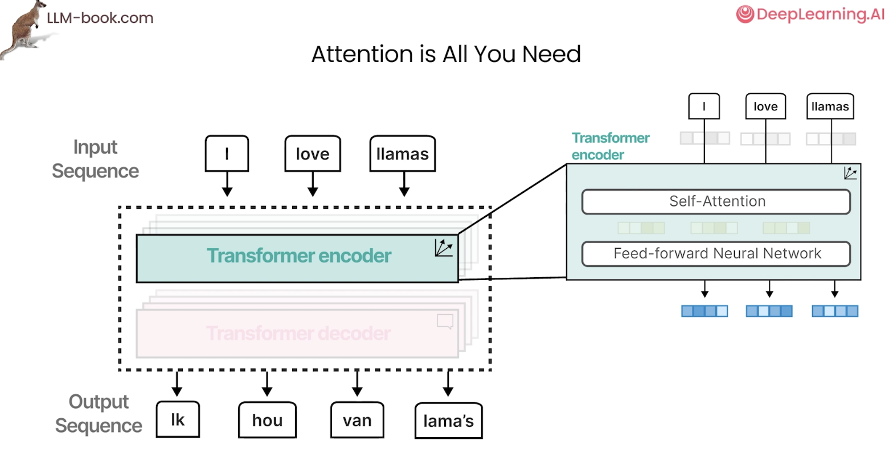

Many later pretrained models retain only one side of this architecture:

| Architecture | Example | Visible context | Typical uses |
| --- | --- | --- | --- |
| Decoder-only | GPT family | Current and preceding positions only | Text generation, dialogue, code completion |
| Encoder-only | BERT | The complete input from every position | Classification, retrieval, sequence labeling |
| Encoder-decoder | T5, original Transformer | Bidirectional encoder, causal decoder, and cross-attention | Translation, summarization, conditional generation |

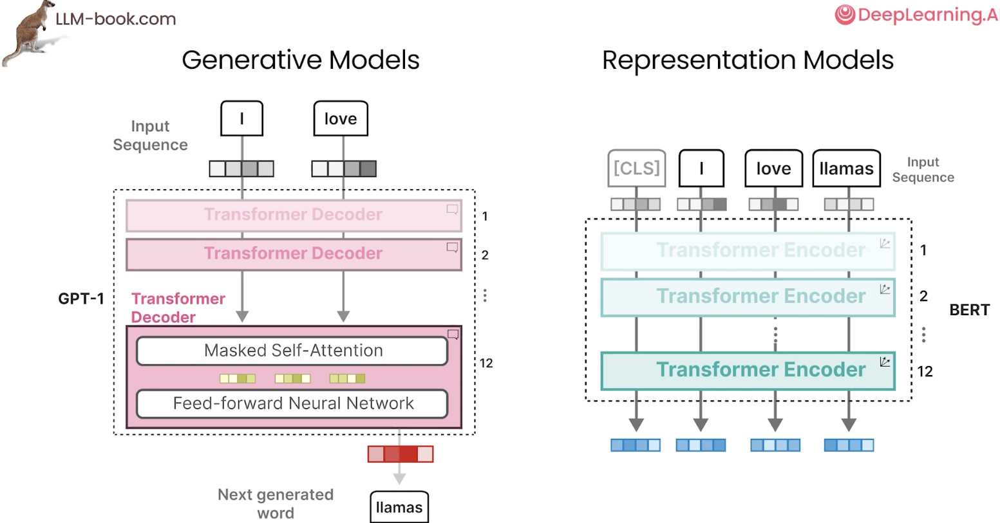

"Encoder" and "decoder" describe information flow and training objectives.
They do not imply that only a decoder can produce vector representations or
that an encoder cannot participate in a generation task.

## What Self-Attention Does

A token embedding initially represents the token itself. Self-attention lets
the current position inspect other positions, estimate how relevant each one
is, and combine their information according to that relevance. The same word
can therefore acquire different contextual representations in different
sentences.

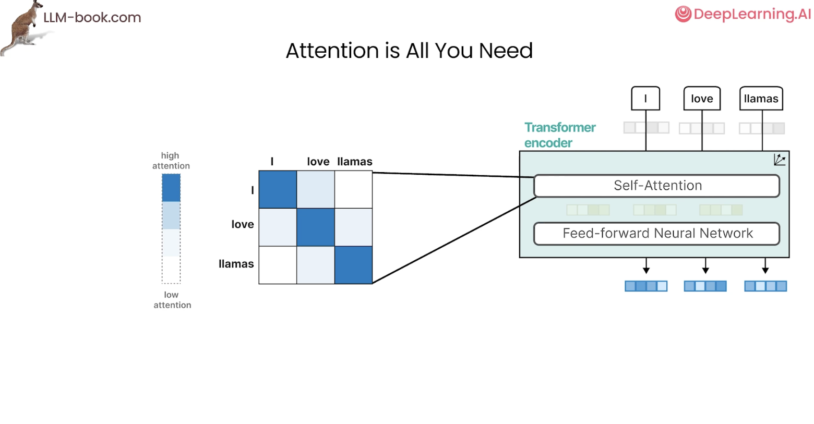

For example, when processing a pronoun, attention may read more heavily from a
noun earlier in the sentence. When processing a verb, some attention heads may
focus on its subject or object. These patterns are learned during training
rather than encoded as hand-written grammar rules.

An attention matrix visualizes these relationships. Each row is the position
being updated, each column is a position it can read, and a darker cell means a
higher weight. Encoder self-attention can usually access the entire matrix.

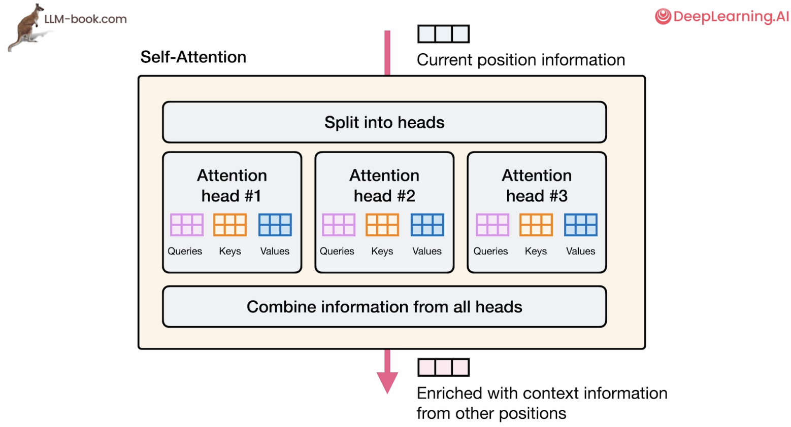

## Q, K, and V: Queries, Keys, and Values

Each input vector $x_i$ passes through three learned linear projections to
produce a Query, Key, and Value:

$$
q_i = x_i W_Q, \qquad k_i = x_i W_K, \qquad v_i = x_i W_V
$$

The three roles can be understood through the analogy of retrieval:

- **Query:** what information the current position is looking for.
- **Key:** the matching clues offered by each position.
- **Value:** the content that is actually retrieved after a match.

The current position's Query is dotted with the Key at every visible position.
A larger dot product indicates greater relevance. Dividing by $\sqrt{d_k}$
keeps dot products from growing too large as the dimension increases, and
softmax normalizes the scores into weights that sum to 1:

$$
S = \frac{QK^\mathsf{T}}{\sqrt{d_k}}, \qquad
A = \operatorname{softmax}(S)
$$

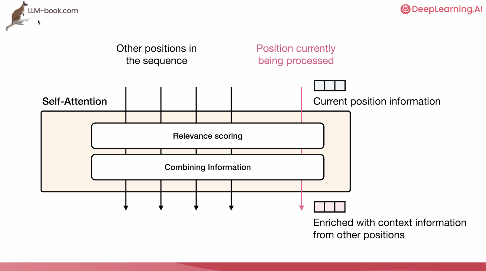

The attention weights are then used to compute a weighted sum of the Values:

$$
\operatorname{Attention}(Q,K,V)
= \operatorname{softmax}\left(\frac{QK^\mathsf{T}}{\sqrt{d_k}}\right)V
$$

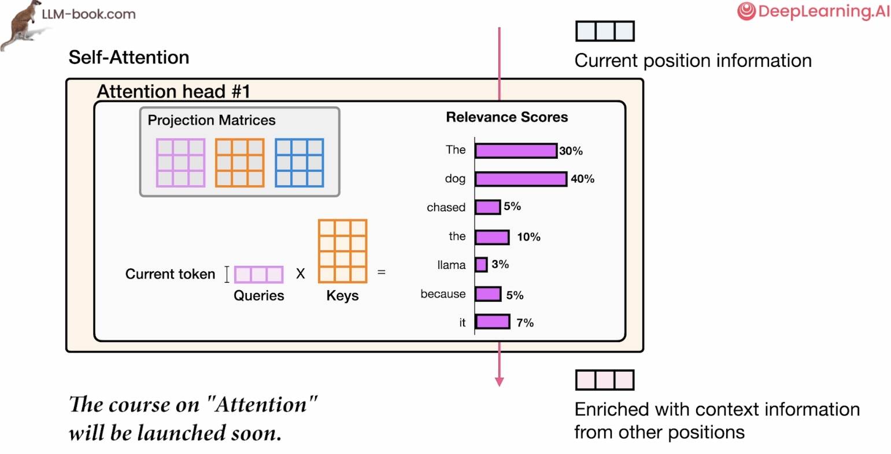

One common misconception is that attention "selects one word." Its output is a
weighted combination of every visible Value. Multiple positions can contribute
information, just in different amounts.

## Multi-Head Attention

A single attention pattern cannot easily represent many relationships at once.
Multi-head attention splits the representation into several subspaces. Each
head has its own $W_Q$, $W_K$, and $W_V$ and computes attention independently.
The head outputs are concatenated and passed through an output projection
$W_O$:

$$
\operatorname{head}_h = \operatorname{Attention}(Q_h,K_h,V_h)
$$

$$
\operatorname{MHA}(X)
= \operatorname{Concat}(\operatorname{head}_1,\ldots,\operatorname{head}_H)W_O
$$

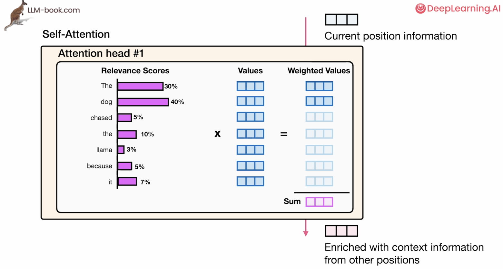

Different heads can learn different kinds of associations, such as local
collocations, long-range dependencies, positional relationships, or
coreference. Their roles are not assigned in advance, and not every head maps
cleanly to a concept that humans can name.

### Grouped-Query Attention

In standard multi-head attention, every Query head has its own Key and Value
heads. Grouped-Query Attention (GQA) lets a group of Query heads share one set
of Keys and Values:

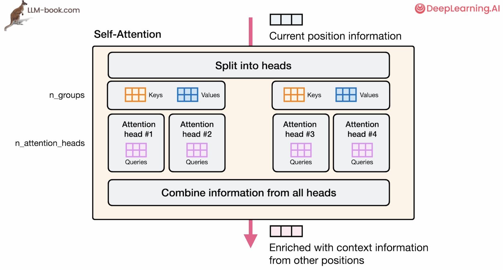

Let $H_q$ be the number of Query heads and $H_{kv}$ the number of Key/Value
heads:

- $H_{kv}=H_q$ is standard Multi-Head Attention (MHA).
- $H_{kv}=1$ is Multi-Query Attention (MQA).
- $1 < H_{kv} < H_q$ is Grouped-Query Attention (GQA).

Autoregressive inference must cache the Keys and Values of previous tokens.
Reducing $H_{kv}$ substantially lowers KV-cache size and memory-bandwidth use,
while GQA usually retains more capacity than fully shared MQA.

## Causal Masking

A generative model can process a complete training sequence in parallel, but
when predicting position $i$, it must not look at future tokens. A causal mask
sets the attention scores of future positions to $-\infty$, giving them a
weight of 0 after softmax:

$$
M_{ij} =
\begin{cases}
0, & j \le i \\
-\infty, & j > i
\end{cases}
$$

$$
\operatorname{CausalAttention}(Q,K,V)
= \operatorname{softmax}\left(\frac{QK^\mathsf{T}}{\sqrt{d_k}}+M\right)V
$$

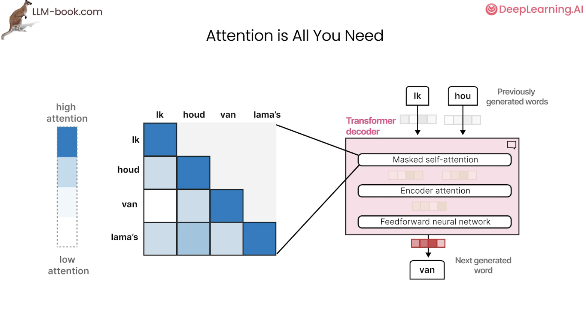

The attention matrix is therefore lower triangular. Parallel computation
during training does not violate the autoregressive constraint. During
inference, tokens are generated one at a time and the KV cache is reused to
avoid recomputing every earlier position.

## Positional Information and RoPE

On its own, $QK^\mathsf{T}$ cannot distinguish the order of tokens. A
Transformer must therefore inject positional information. Approaches include
fixed sinusoidal encodings, learned absolute position embeddings, relative
position biases, and Rotary Positional Embeddings (RoPE), which are common in
modern language models.

### Giving Each Token a Set of Clock Hands

Think of RoPE as attaching a set of clock hands to every token's Query and Key.
At position 0, the hands point in their initial directions. Each step forward
in the sequence rotates them by a fixed amount. When two tokens compute
attention, the model compares not only their content but also the angle between
their hands, which reveals how far apart they are.

In practice, RoPE groups vector dimensions into pairs such as $(x_1,x_2)$ and
$(x_3,x_4)$, treats each pair as an arrow on a plane, and rotates it according
to the token's position. Different dimension pairs rotate at different speeds.
Fast pairs behave like second hands and distinguish short distances; slower
pairs behave like minute and hour hands and cover longer distances. Together,
these frequencies represent position at several scales.

The Query at position $i$ receives rotation $i$, while the Key at position $j$
receives rotation $j$:

$$
q_i' = R_i q_i, \qquad k_j' = R_j k_j
$$

In their dot product, the rotation shared by both vectors cancels. What remains
depends on the difference between their rotations, or the relative position
$j-i$:

$$
{q_i'}^\mathsf{T}k_j'
= q_i^\mathsf{T}R_{j-i}k_j
$$

Positions 5 and 7 and positions 100 and 102 have different absolute positions,
but both pairs are two positions apart. RoPE lets them exhibit a similar
positional relationship. Rather than inserting a position number directly into
a token vector, it stores relative distance in the angle between Queries and
Keys.

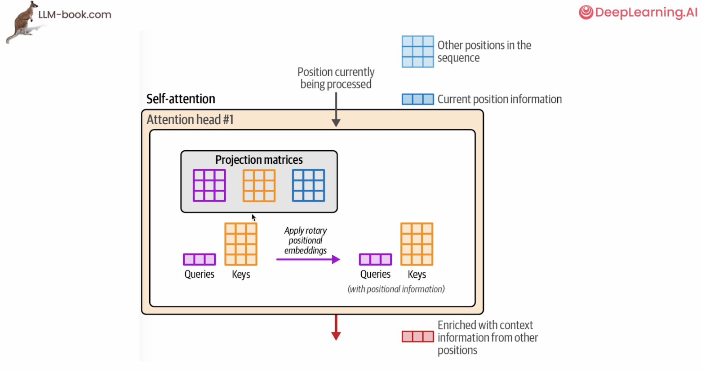

RoPE is normally applied only to Queries and Keys because they decide "where to
look." Values determine "what to retrieve" after a match and generally do not
need rotation. In short: **RoPE uses vector rotation to represent position and
the difference between rotation angles to represent relative distance.**

## From Full to Sparse Attention

A sequence of length $n$ produces $n\times n$ attention scores. The compute and
attention-matrix memory of standard full attention therefore usually grow as
$O(n^2)$ with sequence length. This becomes a major bottleneck for long
contexts.

One direct alternative is local attention. Each token reads only a fixed window
of nearby positions, reducing complexity to approximately $O(nw)$, where $w$
is the window size.

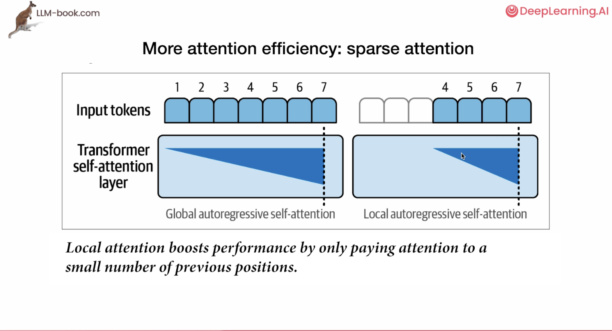

More general sparse-attention methods use structured connection patterns such
as:

- **Sliding windows:** attend to nearby tokens for local dependencies.
- **Strided connections:** attend to distant positions at fixed intervals.
- **Fixed or blocked connections:** preserve a small number of cross-block
  paths in addition to local blocks.
- **Global tokens:** allow a few special positions to connect to the entire
  sequence.

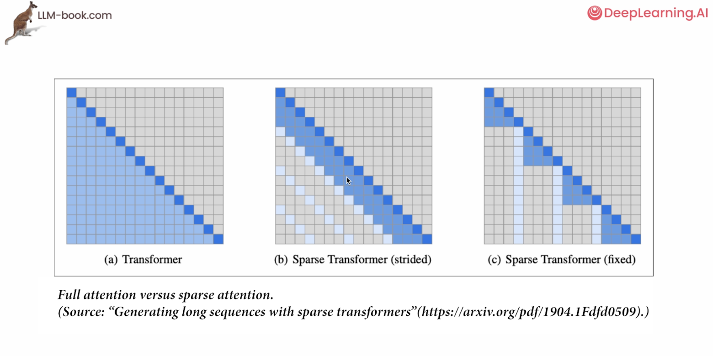

Sparsity reduces compute and memory use, but it may also sever important
long-range dependencies. Practical models often combine local windows, a small
number of global connections, and information flow across layers to balance
efficiency with coverage.

## The Complete Data Flow

Putting the concepts together, a self-attention layer follows these main steps:

1. The tokenizer converts text into token IDs.
2. The embedding layer maps token IDs to vectors and injects positional
   information.
3. Linear projections produce Queries, Keys, and Values.
4. Queries and Keys produce relevance scores, with optional causal or sparse
   masks applied after scaling.
5. Softmax produces attention weights, which form a weighted sum of Values.
6. The outputs of multiple heads are concatenated and projected into
   contextual information.
7. The result passes through residual connections, normalization, and a
   feed-forward network before entering the next layer.

Self-attention is only one part of a Transformer layer. A complete layer also
contains a feed-forward network, residual connections, and normalization. By
stacking many layers, the model progressively combines information into more
complex representations.

## Key Takeaways

- Tokens are the discrete units a model reads and writes; their granularity is
  determined by the tokenizer.
- Self-attention uses Queries to match Keys and aggregates Values according to
  their relevance.
- Multi-head attention learns relationships in several representation
  subspaces in parallel.
- GQA reduces KV-cache cost by sharing Key/Value heads.
- Decoder-only models use causal masks to prevent access to future tokens.
- RoPE encodes relative positional information in Queries and Keys.
- Full attention is $O(n^2)$; local or structured sparse attention can reduce
  the cost of long contexts.

## References

- [Attention Is All You Need](https://arxiv.org/abs/1706.03762)
- [RoFormer: Enhanced Transformer with Rotary Position Embedding](https://arxiv.org/abs/2104.09864)
- [GQA: Training Generalized Multi-Query Transformer Models from Multi-Head Checkpoints](https://arxiv.org/abs/2305.13245)
- [Generating Long Sequences with Sparse Transformers](https://arxiv.org/abs/1904.10509)