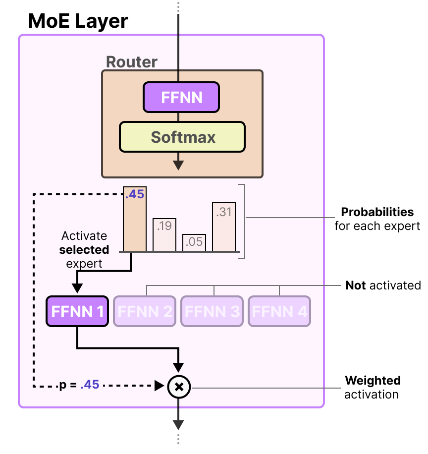
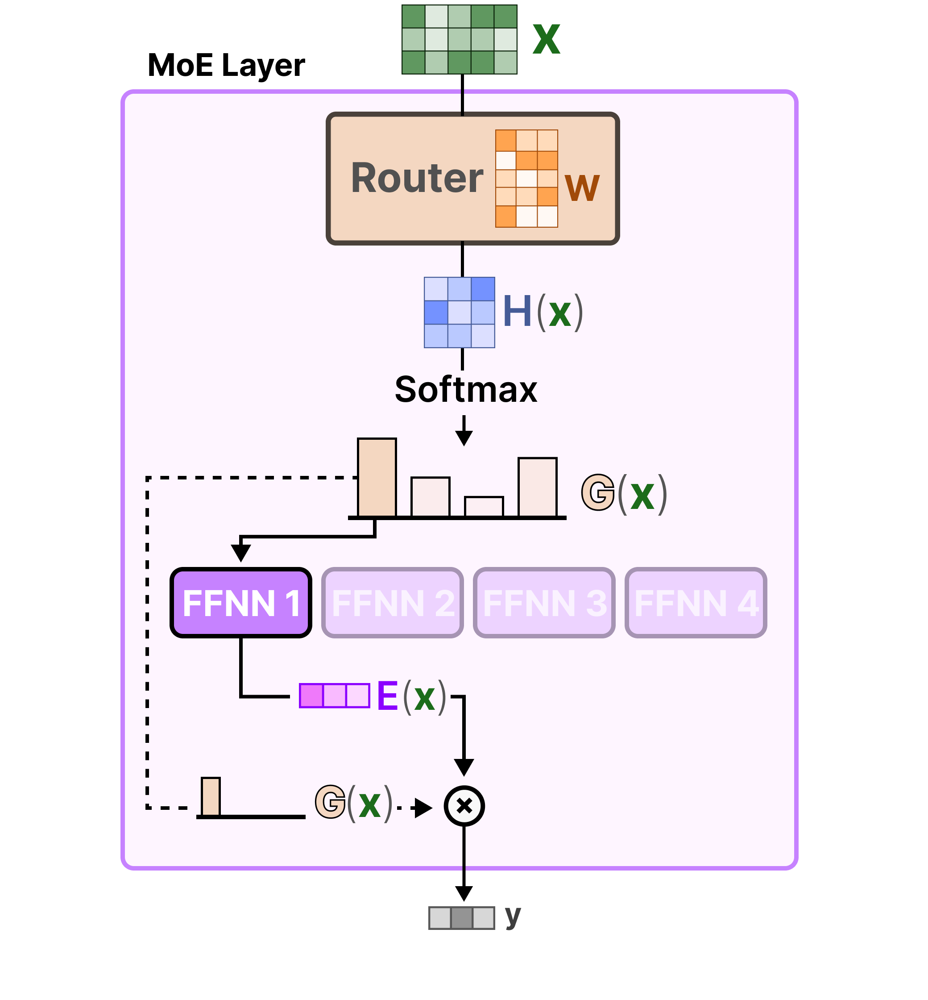
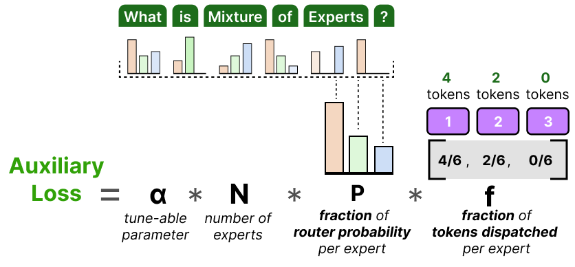
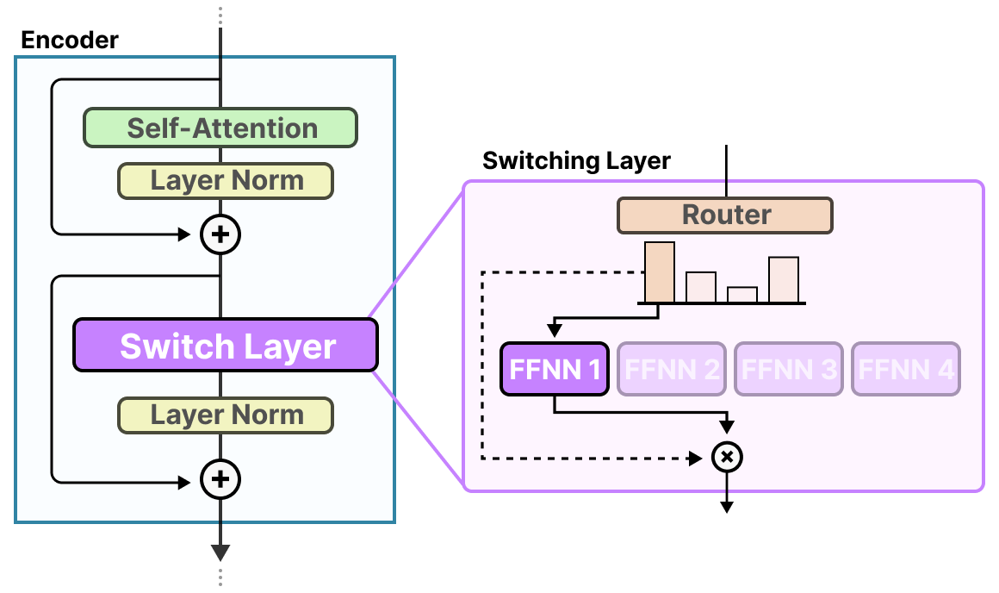
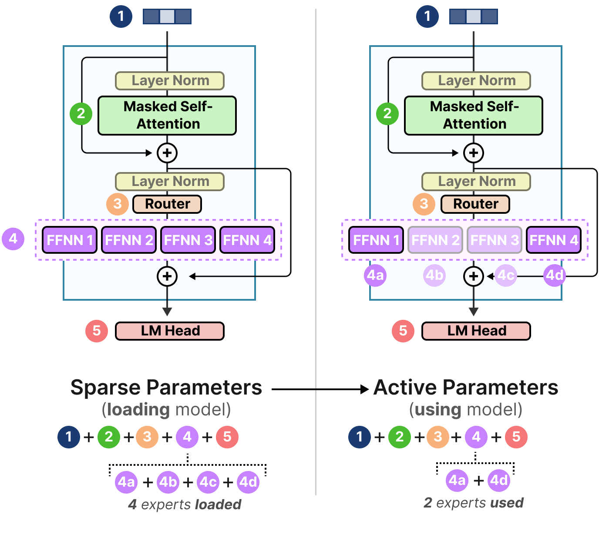

# A Visual Guide to Mixture of Experts

The central goal of Mixture of Experts (MoE) is to **increase model capacity
without making every token use every parameter**.

A conventional dense model sends every token through the same feed-forward
network. An MoE model provides several feed-forward networks as experts and
uses a router to select a small subset for each token. The model gains more
parameters for learning different patterns while activating only a fraction of
them in each forward pass. This makes MoE a form of **conditional computation**.

> **Keep this in mind:** MoE normally replaces the FFN in a Transformer layer,
> not its attention module. Routing also happens independently for each token
> and layer; it does not select one complete domain model for an entire prompt.

## From One FFN to Many Experts

In a standard Transformer block, self-attention exchanges contextual
information between tokens, while the FFN transforms each token independently.
FFNs often contain a large share of the model's parameters, making them a
natural component to expand into multiple branches.

An MoE layer replaces one FFN with $E$ structurally identical FFNs whose
parameters are independent:

For a token $x$, a dense layer always computes the same function:

$$
y = \operatorname{FFN}(x)
$$

An MoE layer instead selects a small subset from
$\{E_1,E_2,\ldots,E_E\}$:

$$
y = \sum_{i \in \operatorname{TopK}(x)} g_i(x)E_i(x)
$$

Here, $g_i(x)$ is the router weight assigned to expert $i$. If a model has 64
experts and selects only 2 for each token, it has many expert parameters but
computes only $2/64$ of those branches per token.

### What Do Experts Specialize In?

The name "expert" can suggest complete specialists in mathematics, medicine,
or programming. In practice, specialization is usually more granular:

- Some experts favor punctuation, numbers, proper nouns, or particular
	languages.
- Some respond to particular syntax or contextual patterns.
- Experts at different layers may serve different functions.
- Experts in decoder models do not always map to clear, stable, human-readable
	domains.

Their roles are learned from data, routing, and optimization rather than
assigned by hand. Different tokens in one sentence may visit different
experts, and the same token may take a different route at every layer.

## How the Router Selects Experts

The router, also called the gate, is usually a small linear layer. It receives
a token's hidden state $x$ and produces one score for each expert:

$$
s = xW_r
$$

A softmax converts the scores into expert probabilities:

$$
p_i(x) = \frac{\exp(s_i)}{\sum_{j=1}^{E}\exp(s_j)}
$$

The model selects the $K$ highest-probability experts, computes only those
experts, and combines their outputs using the retained gate weights.

The full path is:

1. A token hidden state enters the router.
2. The router computes a score and probability for each expert.
3. Top-K removes the unselected experts.
4. The token is dispatched to the selected experts.
5. Each selected expert runs its FFN.
6. Expert outputs are multiplied by gate weights and summed.

Despite having few parameters, the router determines both which experts run at
inference time and which experts receive gradients during training. Routing
quality therefore affects both model quality and system efficiency.

## Top-1 and Top-2 Routing

**Token Choice** is the most common routing scheme: each token chooses the
experts with its highest scores.

Top-1 routing activates one expert, minimizing computation and communication:

Top-2 routing activates two experts and combines their outputs using gate
weights:

| Routing | Benefit | Cost |
| --- | --- | --- |
| Top-1 | Less computation and cross-device communication; simpler implementation | Less expert-combination capacity and greater dependence on each routing decision |
| Top-2 | Can blend two experts and is often more robust | More expert computation, activation transfer, and communication |

Top-K selection does not necessarily end after probabilities are filtered.
Implementations commonly renormalize the selected weights to sum to 1. During
training, noise may also be added to router scores to encourage exploration and
avoid locking into the same choices too early.

## The Central Problem: Routing Collapse

If one expert gains a small advantage early in training, the router sends it
more tokens. It receives more gradients and improves faster, attracting still
more tokens. This positive feedback can produce **routing collapse**, where a
few experts are overloaded and the rest are barely trained.

This has practical consequences:

- Underused experts fail to turn their parameters into useful capacity.
- Popular experts become compute and communication bottlenecks while other
	devices sit idle.
- Batch throughput drops, and some tokens may even be dropped.
- Increasingly biased routing can destabilize training.

### Load-Balancing Auxiliary Loss

The main language-modeling loss cares about correct predictions, not balanced
expert usage. Training therefore commonly adds a small auxiliary loss that
penalizes concentrated routing.

In the Switch Transformer formulation, for a batch of $T$ tokens and $E$
experts:

$$
f_i = \frac{1}{T}\sum_{t=1}^{T}\mathbf{1}
\left[\operatorname*{argmax}_j p_j(x_t)=i\right]
$$

$f_i$ is the fraction of tokens actually sent to expert $i$, while $P_i$ is
the router's mean probability for that expert:

$$
P_i = \frac{1}{T}\sum_{t=1}^{T}p_i(x_t)
$$

The balancing term can be written as:

$$
L_{\text{balance}} = \alpha E\sum_{i=1}^{E}f_iP_i
$$

Balanced use makes both $f_i$ and $P_i$ approach $1/E$. The coefficient
$\alpha$ must be moderate: too small has little effect; too large can overwhelm
the language-modeling objective and force unlike tokens into an artificially
uniform distribution.

Modern MoEs also use auxiliary-loss-free balancing and dynamic biases on expert
scores. The formulas differ, but the goal remains the same: **allow experts to
specialize without letting a few of them monopolize the traffic.**

## Expert Capacity and Token Overflow

Even when average usage is balanced, one batch may send too many tokens to one
expert. Systems therefore limit how many tokens each expert can process at
once. This limit is called **expert capacity**.

For Top-1 routing, a common definition is:

$$
C = \left\lceil
\frac{T}{E}\times \text{capacity factor}
\right\rceil
$$

Top-K routing generally also includes $K$ in the dispatched-token count. A
capacity factor above 1 reserves space beyond perfectly even utilization.

If the first expert is full, the token may be sent to its next candidate. If
all candidates are full, traditional implementations may skip MoE computation
for that token and carry it to the next layer through the residual path. This
is **token overflow**.

The capacity factor exposes a direct systems tradeoff:

- Too little capacity causes overflow and lost processing.
- Too much capacity wastes reserved slots and memory.
- Better-balanced routing needs less spare capacity for the same overflow rate.

Modern implementations mitigate this with better routing, dynamic shapes, or
token-dropless scheduling, but uneven load remains a central challenge in
distributed MoE systems.

## The Switch Transformer Simplification

Switch Transformer replaces the FFN with a **Switch Layer** and uses Top-1
routing. Sending each token to one expert substantially reduces computation and
communication compared with Top-2 routing.

Its significance is not merely selecting one fewer expert. It demonstrated a
practical path for increasing the expert count while keeping per-token compute
relatively stable. Top-1 routing, however, places greater pressure on load
balancing, capacity configuration, and training stability.

## Shared and Routed Experts

Not all knowledge benefits from specialization. Grammar, common facts, and
basic transformations may be useful to most tokens. Replicating these shared
patterns independently in every routed expert wastes capacity.

Some modern architectures therefore divide experts into:

- **Shared experts:** run for every token and capture common capabilities.
- **Routed experts:** only a selected subset runs, providing conditional
	capacity for more differentiated patterns.

A simplified output is:

$$
y = \sum_{s=1}^{S}E_s^{\text{shared}}(x)
+ \sum_{i \in \operatorname{TopK}(x)}g_i(x)E_i^{\text{routed}}(x)
$$

Shared experts improve reuse of common knowledge and give every token a stable
path, at the cost of always being active. This is separate from load balancing:
shared experts decide which capabilities do not compete, while load balancing
distributes traffic among routed experts.

## Total Parameters Are Not Active Parameters

An MoE model specification should distinguish at least two quantities:

- **Total parameters**, also called sparse parameters: every parameter that
	must be loaded, including all experts.
- **Active parameters:** the parameters that participate in the forward pass
	for one token.

"Only a few parameters are active" does not mean "only a few parameters must
be loaded." If all experts reside on GPUs, weight memory still follows total
parameter count. MoE primarily reduces expert computation per token; it does
not inherently reduce weight storage.

Runtime also does not improve in direct proportion to the active fraction.
Routing adds token permutation, cross-device all-to-all communication, load
imbalance, and smaller matrix multiplications. MoE works best with large
batches, effective parallelism, and optimized expert kernels.

### The Mixtral 8x7B Parameter Count

Mixtral 8x7B has eight experts in each MoE layer and selects two per token. The
"7B" in its name does not mean that every expert is a complete independent 7B
model. Attention, embeddings, and the output head are shared; only the FFN is
replicated across experts.

The model has about 46.7B total parameters but activates about 12.9B when
processing one token. The active count is not simply $2/8$ of the total because
the shared attention, embeddings, and output layer always run.

These numbers capture the value and cost of MoE: storage capacity approaching
46.7B parameters, with the main per-token computation closer to 12.9B active
parameters.

## End-to-End Training and Inference Flow

As one token passes through an MoE Transformer layer:

1. Self-attention first gathers sequence context.
2. The router scores experts from the current token hidden state.
3. Top-K selects routed experts and checks their capacity.
4. The system groups tokens by expert, communicating across devices if needed.
5. Experts run their FFNs in parallel.
6. Results return to their original token positions and are combined by gate
	 weights.
7. During training, the model also computes a balancing loss and updates the
	 selected experts.

This is why MoE is as much a distributed-systems problem as a model-design
problem. Experts often live on different devices, so every routing decision
directly affects network communication and device utilization.

## Key Takeaways

- MoE usually replaces one dense Transformer FFN with multiple expert FFNs.
- A router scores experts per token and layer; Top-K activates only a subset.
- Experts tend to specialize in granular token patterns, not complete human
	knowledge domains.
- Auxiliary losses and capacity limits mitigate routing collapse and uneven
	device load.
- Shared experts handle common patterns, while routed experts add conditional
	capacity.
- Total parameters determine weight storage; active parameters better
	approximate per-token computation.
- MoE exchanges more memory and communication for greater model capacity at
	relatively controlled compute.

## References

- [A Visual Guide to Mixture of Experts](https://newsletter.maartengrootendorst.com/p/a-visual-guide-to-mixture-of-experts)
- [MoE Visual Guide: Chinese Translation and Notes](https://blog.csdn.net/qq_36667170/article/details/148955499)
- [Outrageously Large Neural Networks: The Sparsely-Gated Mixture-of-Experts Layer](https://arxiv.org/abs/1701.06538)
- [Switch Transformers: Scaling to Trillion Parameter Models with Simple and Efficient Sparsity](https://arxiv.org/abs/2101.03961)
- [Mixtral of Experts](https://arxiv.org/abs/2401.04088)
- [DeepSeekMoE: Towards Ultimate Expert Specialization in Mixture-of-Experts Language Models](https://arxiv.org/abs/2401.06066)
