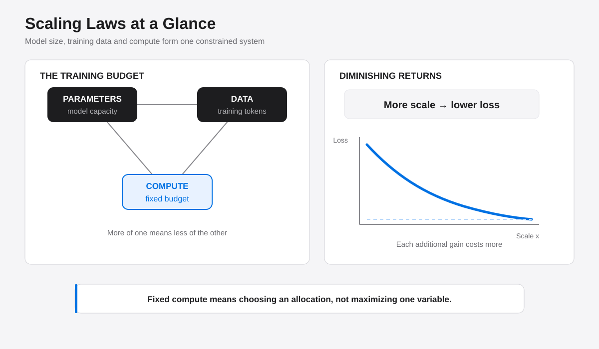
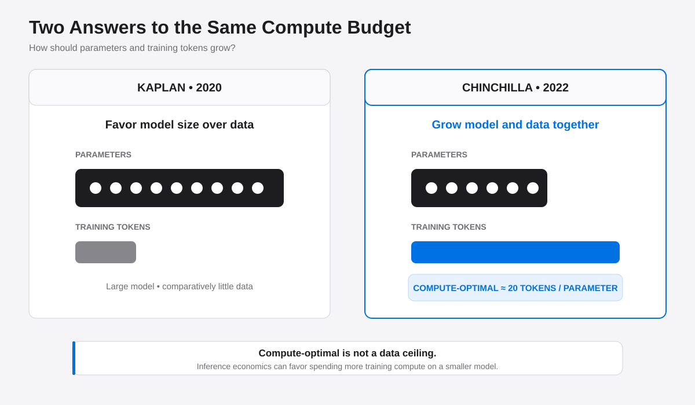
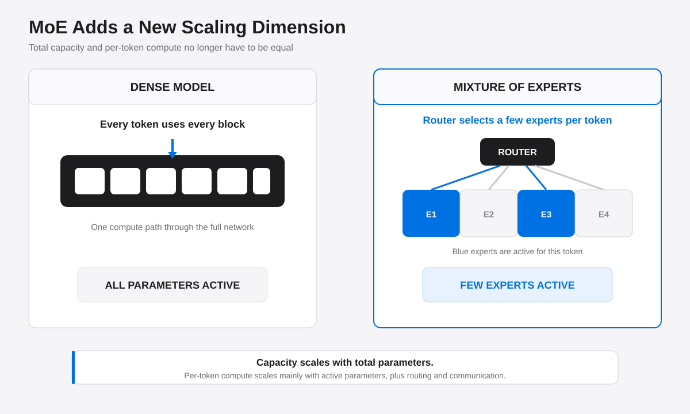

# Scaling Laws：参数、数据与算力

Scaling Laws（缩放定律）描述模型性能如何随**参数量**、**训练数据量**和**计算量**变化。
它们不是从理论上严格推导出的自然定律，而是从一系列训练实验中拟合出的经验幂律，通常以
验证集交叉熵 loss 衡量模型性能。

这类规律主要回答一个工程问题：**给定有限的训练算力，应该把预算用于增大模型，还是增加
训练数据？**

## 三个核心变量

| 变量 | 含义 |
| --- | --- |
| 参数量 | 模型能够容纳多少模式和知识 |
| 数据量 | 训练时读取了多少 token |
| 计算量 | 整个训练过程消耗了多少算力 |

计算预算固定时，参数量与数据量必须取舍：可以训练“更大的模型 + 更少的数据”，也可以训练
“更小的模型 + 更多的数据”。Scaling Laws 的作用就是寻找效果最好的分配方式。

## 缩放规律意味着什么

随着参数、数据和算力增加，模型的验证 loss 通常会稳定下降，但收益会越来越小。换句话说，
扩大规模通常有效，却需要付出越来越高的成本，才能换来相同幅度的提升。

## Kaplan Scaling Laws：参数优先

OpenAI 在 2020 年的研究认为，算力增加时应让参数量比数据量增长得更快。其核心观察是：
大模型似乎能用较少数据达到较低 loss，因此当时的工程实践更强调扩大参数规模。

这一结论推动了 GPT-3、Gopher 等超大模型的发展。例如 GPT-3 有 175B 参数，但只训练了约
300B tokens，约为 **1.7 tokens/parameter**。

Kaplan 的实验比较存在一个重要限制：不同训练规模没有采用完全一致、且都充分训练的学习率
调度。小模型可能因训练 token 不足或调度不匹配而提前停止，进而使“大模型 + 少数据”看起来
比实际更有优势。

## Chinchilla Scaling Laws：参数与数据均衡增长

DeepMind 在 2022 年使用更多模型规模和训练数据组合，并采用更一致的训练设置，发现参数量
与数据量应该近似同步增长。常用的工程经验是每个参数搭配约 20 个训练 token。

70B 参数的 Chinchilla 使用 1.4T tokens 训练，在相近训练
算力下超过了 280B 参数、仅使用约 300B tokens 的 Gopher。这说明 Gopher 并不是参数太少，
而是相对于参数量**训练不足**。

| 模型 | 参数量 | 训练 tokens | tokens/parameter |
| --- | ---: | ---: | ---: |
| GPT-3 | 175B | 约 300B | 1.7 |
| Gopher | 280B | 约 300B | 1.1 |
| Chinchilla | 70B | 1.4T | 20 |
| LLaMA 1 | 65B | 1.4T | 21.5 |
| LLaMA 2 | 70B | 2T | 28.6 |
| LLaMA 3.1 | 405B | 约 15T | 约 37 |

### 20:1 不是数据上限

“20 tokens/parameter”回答的是**只考虑一次训练时，怎样分配固定训练算力以得到最低 loss**，
而不是模型最多能从多少数据中获益。部署时，模型越小，推理的显存占用和每 token 计算成本
通常越低。因此实际项目可能愿意投入更多一次性的训练算力，用远超 20:1 的数据训练较小模型，
换取更低的长期推理成本。

该比例也不是跨模型、数据集和训练方法都不变的常数。数据质量、去重程度、架构、优化器和
上下文长度变化后，最优比例也会变化。

## MoE：总参数与激活参数分离

稠密模型每次计算都会使用全部参数。混合专家模型（Mixture of Experts，MoE）则通过路由器，
让每个 token 只使用少数专家，把“模型总容量”和“单次计算量”分离开。

这引入了两个不同的缩放维度：

- **总参数量**决定模型可容纳的知识与专家容量，也决定权重存储和加载成本；
- **激活参数量**更直接决定每个 token 的计算量与推理成本。

增加专家总数可以扩大模型容量，而不按相同比例增加单 token 计算。但 MoE 并不是免费扩容：
它还需要处理路由、负载均衡、专家并行通信和更大的总权重内存。若 token 长期集中到少数专家，
会出现负载不均甚至路由退化，因此通常需要辅助负载均衡机制。

估算 MoE 成本时不能只看总参数量，还要看每个 token 激活多少参数，并计入路由与通信开销。

## 经典 Scaling Laws 的边界

- **数据并不等价**：高质量、去重良好的数据通常比相同数量的噪声数据更有效；
- **优质数据有限**：继续扩大训练需要合成数据、多模态数据和更好的数据筛选；
- **Loss 不等于能力**：事实性、推理、安全性和下游表现不能只靠预训练 loss 判断；
- **结论不能无限外推**：数据、架构和训练方法改变后，原有规律可能不再准确。

## 推理时间 Scaling

经典 Scaling Laws 主要研究预训练阶段。推理模型增加了另一条轴：对同一个问题投入更多
推理计算，例如生成更长的思考过程、采样多个候选答案、使用 verifier 筛选，或反复调用工具。

推理时间扩展可以用更高延迟和成本换取更好的单题质量，但它不能完全补偿基础模型缺失的知识
或能力，也同样受到边际收益递减和验证器可靠性的约束。