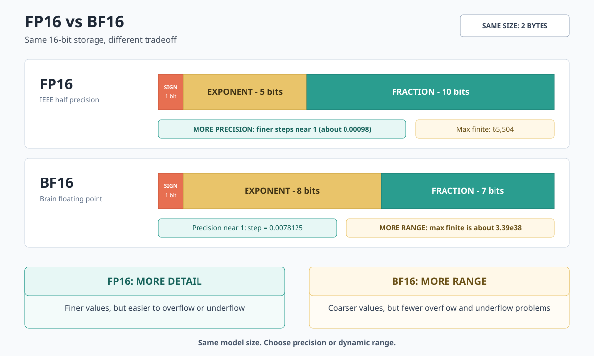

# LLM Weight Formats and Data Types

An LLM distribution has three independent properties:

- **File format**: how tensors and metadata are stored, such as SafeTensors or
	GGUF.
- **Weight representation**: how many bits each stored value uses, such as BF16,
	FP16, FP8, or INT4.
- **Quantization method**: how low-bit weights are produced and interpreted, such
	as AWQ, GPTQ, or a GGUF `Q4_K_M` encoding.

A model can therefore be **SafeTensors + BF16**, **SafeTensors + AWQ INT4**, or
**GGUF + Q4_K_M**. These names describe different layers and are not
interchangeable.

## Mainstream Choices

> **Short answer:** SafeTensors is the mainstream format for original open-weight
> checkpoints. BF16 is the mainstream dense weight type on modern accelerators.
> For local inference, GGUF with a 4-bit encoding such as `Q4_K_M` is the common
> choice.

| Goal | Common choice | Reason |
| --- | --- | --- |
| Publish, preserve, or fine-tune a model | **SafeTensors + the original dtype**, commonly BF16 | Safe loading, broad framework support, sharding, and no unnecessary conversion |
| Dense inference on modern GPUs or TPUs | **SafeTensors + BF16** | FP32-like numerical range at half the FP32 storage; native accelerator support |
| Dense inference on older GPUs | **SafeTensors + FP16** | Wider compatibility with older hardware and kernels |
| Local CPU, Apple Silicon, or mixed CPU/GPU inference | **GGUF + `Q4_K_M`** | Single-file deployment, memory mapping, portable backends, and a strong size/quality balance |
| Memory-constrained GPU inference | **SafeTensors + AWQ/GPTQ INT4** | Weight-only compression with optimized GPU kernels |
| High-throughput serving on recent datacenter GPUs | **FP8 checkpoint or compiled engine** | Lower memory bandwidth and faster supported matrix operations |

The safest default is to keep the model author's format and dtype unless the
target runtime or hardware requires conversion.

## File Formats

| Format | Status | Why it is used | Main limitation |
| --- | --- | --- | --- |
| **SafeTensors** (`.safetensors`) | Mainstream checkpoint and interchange format | Stores tensors without executable pickle code; supports fast, lazy loading and sharded checkpoints | Configuration and tokenizer files normally remain beside the weights |
| **GGUF** (`.gguf`) | Mainstream local-inference format | Self-describing, memory-mappable, often single-file, and supports many quantized encodings | Inference-oriented and tied to GGML-compatible runtimes |
| **PyTorch checkpoint** (`.bin`, `.pt`, `.pth`) | Legacy distribution format; still used for internal training state | Can serialize tensors, optimizer state, and Python objects | Pickle-based variants are less portable and should only be loaded from trusted sources |
| **ONNX / TensorRT** (`.onnx`, `.engine`, `.plan`) | Derived deployment artifacts | Store or compile a graph for a specific inference runtime | Not the canonical source checkpoint; exports may be hardware or runtime specific |

A Hugging Face model repository is a **package**, not a weight format. It usually
contains SafeTensors shards plus `config.json`, tokenizer files, generation
settings, and a shard index.

## Weight Data Types and Size

For $P$ billion parameters stored at $b$ bits per parameter, the raw weight size
in decimal gigabytes is:

$$
\text{size (GB)} \approx P \times \frac{b}{8}
$$

| Stored representation | Bits / parameter | 8B model | 70B model | Main role |
| --- | ---: | ---: | ---: | --- |
| **BF16** | 16 | 16 GB | 140 GB | Mainstream dense training and inference on modern accelerators |
| **FP16** | 16 | 16 GB | 140 GB | Dense inference and compatibility with older GPU generations |
| **FP8** | 8 plus scales | About 8 GB | About 70 GB | Datacenter training or serving on supported accelerators |
| **INT8** | 8 plus scales | About 8 GB | About 70 GB | Quantized inference with mature kernel support |
| **4-bit quantized** | Usually 4-5 effective | About 4-5 GB | About 35-44 GB | Local inference or memory-constrained GPU serving |
| **FP32** | 32 | 32 GB | 280 GB | Master weights, optimizer state, and numerically sensitive operations |

These are **weights-only estimates**. Quantized files also contain scales,
zero-points, codebooks, and sometimes higher-precision tensors. Runtime memory
additionally includes the KV cache, activations, and workspaces. For a
mixture-of-experts model, use its total parameter count, not only the parameters
activated per token.

## Why BF16 Is the Dense Default

Both BF16 and FP16 use 16 bits. FP16 assigns more bits to the fraction, while
BF16 assigns more bits to the exponent:

BF16 is usually preferred for modern LLMs because it:

- has approximately the same numerical range as FP32, reducing overflow and
	underflow;
- uses the same 2 bytes per parameter as FP16;
- usually avoids the dynamic loss scaling required by FP16 training; and
- runs directly on current AI accelerators, commonly with FP32 accumulation.

BF16 is not more precise: it has 7 fraction bits, while FP16 has 10. FP16 can
represent closer values when they remain inside its narrower range. For stored
weights alone, preserve the published dtype; converting a validated FP16 model
to BF16 does not automatically improve it.

## References

- [SafeTensors format](https://github.com/huggingface/safetensors)
- [Hugging Face quantization overview](https://huggingface.co/docs/transformers/en/quantization/overview)
- [GGUF specification](https://github.com/ggml-org/ggml/blob/master/docs/gguf.md)
- [NVIDIA mixed-precision training guide](https://docs.nvidia.com/deeplearning/performance/mixed-precision-training/index.html)
