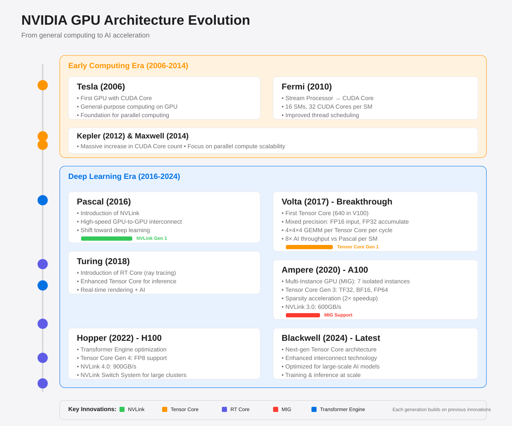
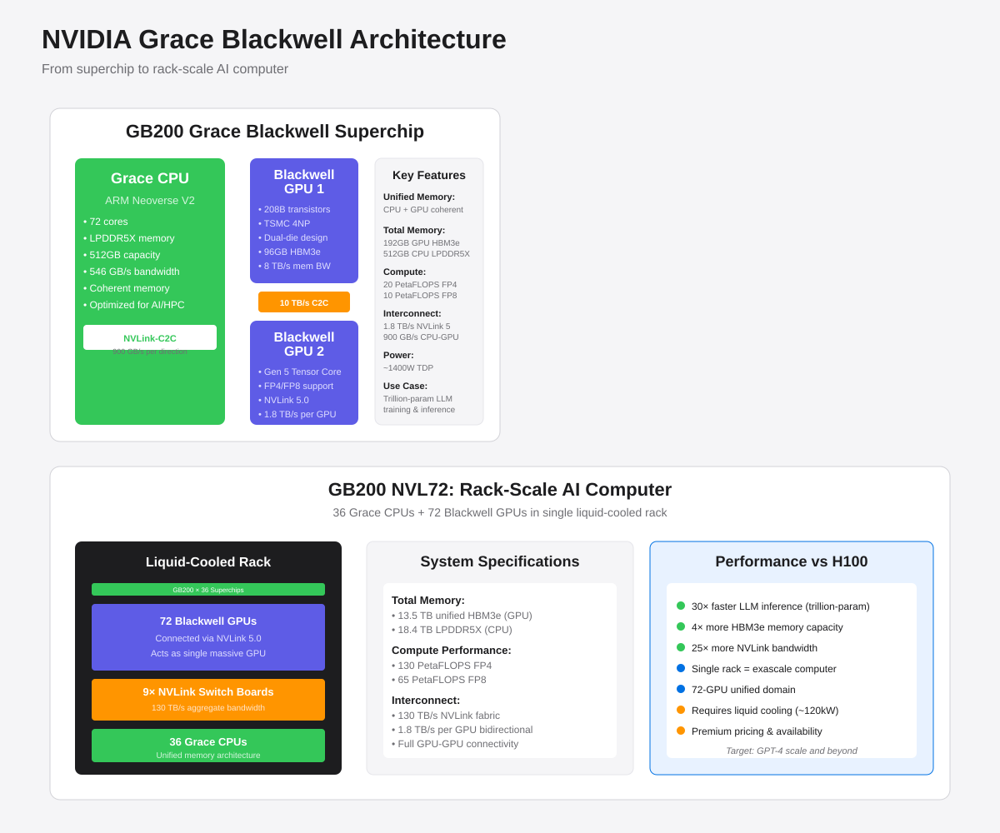
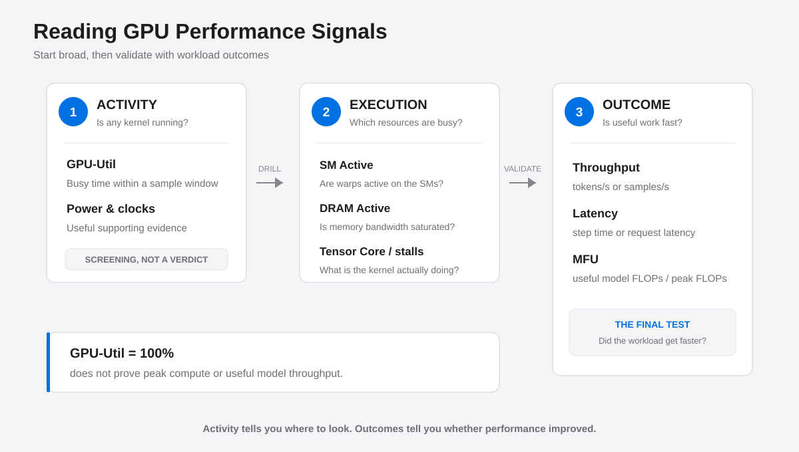
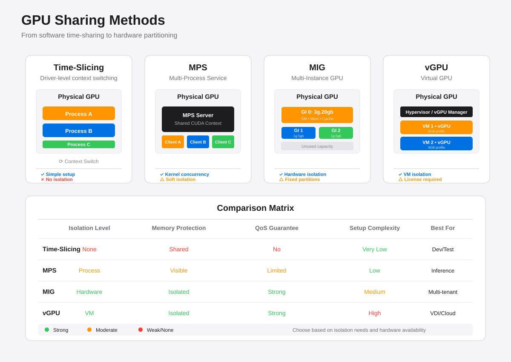
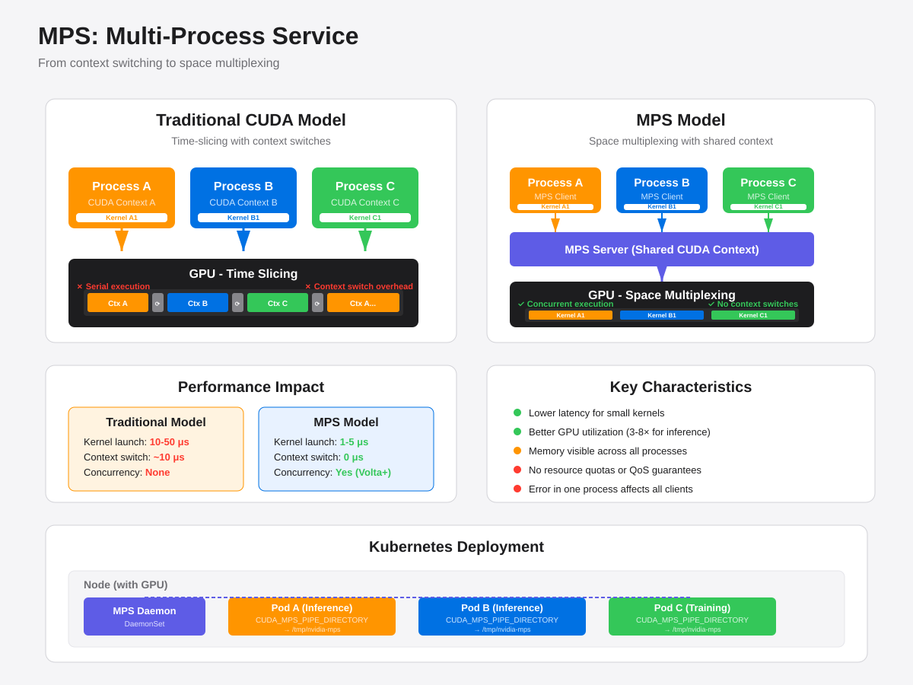
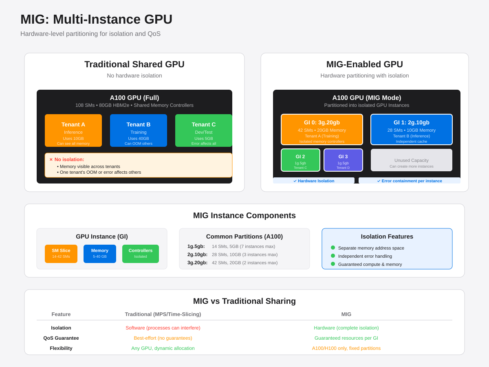

# GPU Performance, Communication & Scheduling

A GPU cluster cannot be evaluated by "how many cards" alone. Whether a single card truly delivers its compute power, which communication path multi-GPU traffic takes, and whether the scheduler assigns GPUs in the right topology all directly impact training throughput. Analysis follows three layers: **is compute saturated → is communication constrained → does scheduling break the ideal topology**.

## NVIDIA GPU Architecture Evolution



### Early Architectures (2006-2014)

**Tesla Architecture (2006)**: NVIDIA first introduced the Tesla architecture, marking the beginning of all GPUs equipped with CUDA Cores, opening a new era for general-purpose computing. CUDA (Compute Unified Device Architecture) was first released in 2006, enabling GPUs to be used for general parallel computing rather than just graphics rendering.

- **Representative Products**: GeForce 8800 GTX (consumer), Tesla C870 (compute card)

**Fermi Architecture (2010)**: Before this, GPU processing cores were called Stream Processors (SP). Fermi architecture made significant improvements to processing cores, introducing better thread scheduling and management mechanisms, more efficient memory access patterns, ECC memory support, and a unified L2 cache. Processing cores were officially renamed CUDA Cores to emphasize tight integration with the CUDA programming model. Fermi's GF100 chip contained 16 SMs (Streaming Multiprocessors), each with 32 CUDA Cores. Each CUDA Core consisted of one floating-point unit (FPU) and one integer unit (ALU).

- **Representative Products**: GeForce GTX 480 (consumer), Tesla C2050/C2070 (compute card)

**Kepler Architecture (2012)** and **Maxwell Architecture (2014)**: These two generations continued Fermi's design philosophy, mainly improving performance by optimizing SM structure and significantly increasing CUDA Core count. Kepler introduced dynamic parallelism and Hyper-Q technology, while Maxwell focused on energy efficiency improvements. Logically speaking, more CUDA Cores mean greater compute power due to parallel execution.

- **Kepler Representative Products**: GeForce GTX 680/TITAN (consumer), Tesla K20/K40/K80 (compute card)
- **Maxwell Representative Products**: GeForce GTX 980/TITAN X (consumer), Tesla M40/M60 (compute card)

### Deep Learning Era (2016-Present)

**Pascal Architecture (2016)**: A turning point for NVIDIA GPUs evolving toward deep learning. Pascal introduced NVLink 1.0 high-speed interconnect technology, providing 160 GB/s bidirectional bandwidth, laying the foundation for multi-GPU communication. Pascal also introduced HBM2 (High Bandwidth Memory) and optimized FP16 half-precision performance. The P100 was the first data center GPU designed specifically for deep learning.

- **Representative Products**: GeForce GTX 1080/TITAN X (consumer), Tesla P100 (data center), Quadro P6000 (professional)

**Volta Architecture (2017)**: Marked a major breakthrough in deep learning optimization. Volta first introduced **Tensor Cores**, programmable matrix multiply-accumulate units designed specifically for AI training and inference. The V100 GPU contained 640 Tensor Cores, with 8 per SM. Each Tensor Core could execute 4×4×4 matrix multiplication per clock cycle, performing 64 floating-point multiply-accumulate (FMA) operations. Tensor Cores use fused multiply-add (FMA) to accept two 4×4 FP16 input matrices, perform matrix multiplication, then add a third matrix (FP16 or FP32), with output in FP16 or FP32 precision. This enabled mixed-precision computing at the hardware level—FP16 inputs reduce compute resources and memory bandwidth, while FP32 accumulation and output ensure precision and numerical stability. V100 achieved 8× higher deep learning throughput per SM and 12× overall performance improvement compared to Pascal P100. Volta also upgraded NVLink to 2.0, increasing bandwidth to 300 GB/s.

- **Representative Products**: Tesla V100 (data center, 16GB/32GB HBM2), Quadro GV100 (professional), TITAN V (high-end consumer)

**Turing Architecture (2018)**: Building on Tensor Cores, Turing first introduced **RT Cores** (ray tracing cores), expanding GPU applications to real-time ray tracing and hybrid rendering. Turing's Tensor Cores support INT8 and INT4 precision, optimized for inference scenarios with multi-precision support to improve inference performance and efficiency.

- **Representative Products**: GeForce RTX 2080/2080 Ti (consumer), Tesla T4 (inference-focused), Quadro RTX 6000/8000 (professional)

**Ampere Architecture (2020)**: Represented by the A100. Ampere features third-generation Tensor Cores supporting multiple data types (including TF32, BF16, FP64, INT8), and introduced structured sparsity acceleration achieving 2× speedup on specific sparse patterns. A100 supports **Multi-Instance GPU (MIG)** functionality, partitioning a single GPU into up to 7 independent instances, each with dedicated SMs, memory, memory controllers, and L2 cache for hardware-level isolation. A100's NVLink upgraded to 3.0 with 600 GB/s bandwidth. This enables A100 to support both large-scale training and efficient multi-tenant inference scenarios.

- **Representative Products**: GeForce RTX 3090 (consumer), A100 (data center, 40GB/80GB HBM2e, PCIe/SXM), A10/A30/A40 (specialized for different scenarios)

**Hopper Architecture (2022)**: Represented by the H100. Hopper features fourth-generation Tensor Cores and introduced the **Transformer Engine**, using dynamic FP8 and FP16 mixed precision specifically optimized for Transformer models, achieving up to 9× training acceleration and 30× inference acceleration (compared to A100). H100's NVLink upgraded to fourth generation with 900 GB/s per GPU bandwidth, supporting **NVLink Switch System** to build up to 256-GPU non-blocking, fully-connected networks providing high-bandwidth, low-latency communication infrastructure for large-scale clusters. H100's Tensor Cores support FP8 (8-bit floating-point) precision, further improving performance while maintaining model accuracy.

- **Representative Products**: H100 (data center, 80GB HBM3, PCIe/SXM), H200 (data center, 141GB HBM3e), L40S (inference/graphics hybrid)

**Blackwell Architecture (2024)**: Represented by B100/B200/GB200. Blackwell is NVIDIA's latest generation architecture featuring fifth-generation Tensor Cores. Blackwell GPUs contain 208 billion transistors, manufactured using custom TSMC 4NP process. B200 uses a dual-die design, connecting two reticle-limited dies as a single logical GPU via 10TB/s chip-to-chip interconnect. Blackwell supports FP4 (4-bit floating-point) precision, optimized for large language models (LLMs) and generative AI. NVLink upgraded to fifth generation (NVLink 5.0), providing 1.8TB/s bidirectional interconnect bandwidth per GPU. Blackwell focuses on performance improvements for large-scale AI model training and inference, especially for trillion-parameter model training efficiency.



**GB200 Grace Blackwell Superchip**: A key innovation of the Blackwell architecture, deeply integrating CPU with GPU. The GB200 superchip uses NVLink-C2C interconnect technology to tightly connect 1 NVIDIA Grace CPU with 2 Blackwell GPUs. The Grace CPU is based on ARM Neoverse V2 architecture with 72 cores, optimized for AI and HPC workloads. NVLink-C2C provides 900GB/s CPU-GPU bandwidth, enabling unified memory access and eliminating traditional PCIe bottlenecks.

**GB200 NVL72 System**: A rack-scale massive AI system representing the ultimate form of Blackwell architecture. A single rack contains:
- 36 Grace CPUs and 72 Blackwell GPUs (36 GB200 superchips)
- Interconnected via NVLink Switch System, forming a 72-GPU NVLink domain operating as a single massive GPU
- Provides 130TB/s low-latency GPU-to-GPU communication bandwidth
- Unified 13.5TB HBM3e memory
- 130 PetaFLOPS FP4 compute
- Liquid cooling design with ~120kW rack power
- 30× faster real-time trillion-parameter LLM inference compared to H100 systems

GB200 NVL72 realizes the true "rack-scale GPU" concept, with 72 GPUs fully interconnected via NVLink 5.0. Any two GPUs have equal-distance, high-bandwidth connections, eliminating network bottlenecks in traditional multi-node systems. Nine dedicated NVLink Switch boards form a switching fabric enabling non-blocking GPU-to-GPU communication.

- **Representative Products**:
  - B100 (data center single card)
  - B200 (data center single card, 192GB HBM3e)
  - GB200 (Grace-Blackwell superchip, CPU+2×GPU)
  - GB200 NVL72 (rack-scale system, 36×CPU + 72×GPU)
  - DGX GB200 (complete liquid-cooled rack solution)

**References**:
- [NVIDIA DGX GB200](https://www.nvidia.com/en-us/data-center/dgx-gb200/)
- [GB200 NVL72 System](https://www.nvidia.com/en-us/data-center/gb200-nvl72/)
- [GB200 Multi-Node Tuning Guide](https://docs.nvidia.com/multi-node-nvlink-systems/multi-node-tuning-guide/overview.html)

### Tensor Core and Mixed Precision Training

The introduction of Tensor Cores changed the way deep learning training works. Mixed precision training is not simply using FP16 and FP32 together in a model, but rather using half-precision (FP16) for input and output at the hardware operator level, while using full-precision (FP32) for intermediate calculations, significantly improving performance without losing too much precision.

Mixed precision training workflow:

1. **Weight conversion**: Convert FP32 weights to FP16 for forward propagation, while keeping FP32 copies for parameter updates
2. **Forward propagation**: Use FP16 activations and weights for computation, obtaining FP16 loss
3. **Loss Scaling**: Scale FP16 loss by several times to avoid gradient underflow from values too small
4. **Backward propagation**: Calculate gradients using scaled loss, obtaining scaled FP16 gradients
5. **Gradient Unscaling**: Convert FP16 gradients to FP32 and unscale to get actual gradient values
6. **Parameter update**: Use FP32 gradients to update FP32 weight copies

This mechanism requires hardware support. Tensor Cores are specifically designed to accelerate FP16 computation while maintaining FP32 accumulation precision, making mixed precision training possible. Frameworks like PyTorch and TensorFlow provide automated support for mixed precision training.

### Tensor Core and CUDA Programming

In CUDA programming, developers control parallel execution through Warps (typically containing 32 threads). Threads within a Warp execute synchronously, leveraging GPU parallel computing capabilities. A single Tensor Core executes 4×4×4 operations per cycle, but CUDA packages multiple Tensor Cores via Warp, exposing 16×16×16 GEMM operation APIs (`wmma::mma_sync`).

Convolution operations are converted to matrix multiplication (GEMM) via the Im2Col algorithm, fully utilizing Tensor Core compute capabilities. Im2Col rearranges input data into large matrices, and convolution kernels are also converted to matrices, transforming the original convolution operation into matrix multiplication. This transformed GEMM can leverage Tensor Core's powerful compute capabilities for efficient acceleration.

In actual execution, large-scale matrices (such as 2048×2048 inputs in Transformers) are decomposed into Fragments, organized for execution through Thread Blocks. Thread Blocks further extract data to form Warp-level computation, ultimately mapping to Tensor Core's 4×4×4 input scale, achieving efficient mapping from application layer to hardware layer.

## GPU Performance Metrics

### GPU Runtime Performance

`GPU-Util` in `nvidia-smi` answers "was the GPU working during the sampling period", not "how much of the GPU's compute capacity was used". It measures the percentage of time one or more kernels were executing on the GPU during the sampling period; even if a kernel uses only a few execution units or mainly moves data, this value can approach 100%.

When judging runtime performance, observe metrics at different levels in combination:



| Metric | What it answers | Main limitation |
| --- | --- | --- |
| `GPU-Util` | Was the GPU executing kernels during the sample period | Doesn't indicate SM, Tensor Core, or FLOPS utilization |
| SM Active / SM Efficiency | How many cycles had active warps | SM activity ≠ all execution units fully utilized |
| SM Occupancy | Ratio of active warps the SM can hold | High occupancy doesn't guarantee faster kernels or high compute throughput |
| DRAM Active / Memory Utilization | How busy the memory controller or bandwidth is | High values only indicate busy data movement, not effective compute |
| Tensor Core utilization | Whether matrix compute units are being used | Only applies to operations that map to Tensor Cores |
| MFU (Model FLOPs Utilization) | Model effective FLOPS as a fraction of hardware theoretical peak | Depends on model FLOPS estimation, precision, and hardware peak; can't be sampled per-kernel |
| Throughput & Latency | tokens/samples per second, or request duration | Final result metric, doesn't isolate bottleneck location |

MFU is commonly defined as:

$$
\mathrm{MFU} =
\frac{\text{Model theoretical FLOPs per step} \times \text{Training steps per second}}
{\text{Number of GPUs} \times \text{Per-GPU peak FLOPS at precision}}
$$

MFU is closer to training efficiency than `GPU-Util`, but different sources may count model FLOPS, sparse computation, and recomputation differently, so only compare when the methodology is consistent.

#### Using Metric Combinations to Diagnose Bottlenecks

| Observation | Likely state | Next step |
| --- | --- | --- |
| `GPU-Util` high, SM Active high, throughput stable | GPU is continuously computing | Check Tensor Core, instruction throughput, and kernel efficiency |
| `GPU-Util` high, SM Active low, DRAM Active high | memory-bound or frequent data movement | Check arithmetic intensity, kernel fusion, data layout, and H2D copies |
| SM Active high, but MFU low | kernels running continuously but little effective model compute | Check small kernels, non-Tensor-Core ops, communication kernels, and synchronization waits |
| GPU metrics show periodic valleys | CPU/DataLoader or communication undersupply | Cross-reference CPU, disk, network, and NCCL timeline |
| Power or clocks hit limit, performance stops growing | power wall, thermal wall, or frequency limit | Check clocks, power limit, temperature, and throttling reason |

For quick observation, command-line tools can view device-level utilization, memory bandwidth, power, and clocks.
These tools are mainly for quick triage. To accurately distinguish compute, memory, and stall causes, use DCGM Profiling 
Metrics, Nsight Systems, Nsight Compute, or framework profilers. The optimization sequence is typically: confirm gap 
with throughput/MFU, use timeline to find wait intervals, then drill into specific kernels; don't tune around a single 
utilization number.

## GPU Communication

Effective GPU-to-GPU communication performance is determined by **physical links, topology distance, message size, and collective algorithms**. NCCL reads system topology and selects communication paths for AllReduce, AllGather, ReduceScatter, etc., but automatic selection cannot fix incorrect wiring, disabled P2P, or unreasonable GPU assignments.

Command-line tools can inspect the machine topology instead of guessing from GPU numbering. Common GPU-to-GPU identifiers 
in the topology output include `NV#` (through N NVLinks), `PIX` (same PCIe switch), `PXB` (through multiple PCIe bridges), 
`NODE` (same NUMA node), and `SYS` (cross-NUMA/socket). Specific identifiers vary with driver and hardware versions; 
use the current machine output as reference.

### NVLink

NVLink is high-speed point-to-point interconnect between GPUs. NVSwitch connects multiple GPUs into a switching fabric, enabling high-bandwidth, low-latency interconnection within an NVSwitch domain. They suit tensor parallelism (TP) and other workloads with frequent communication and sensitivity to both latency and bandwidth.

Three concepts to distinguish:

- **NVLink count and generation** determine single-link and aggregate theoretical peak;
- **Whether in the same NVSwitch domain** determines if any GPU pair can take equivalent high-speed paths;
- **NCCL measured bandwidth** is the result of algorithm, message size, and links combined, not directly equal to vendor-labeled link peak.

Within the same NVSwitch domain, even if GPUs are under different CPU NUMA nodes, GPU-to-GPU data may transit entirely through NVSwitch, so NUMA has little impact on this path. However, CPU-to-GPU and NIC-to-GPU paths are still affected by NUMA/PCIe affinity, so NUMA configuration cannot be entirely ignored.

### PCIe

PCIe is the universal interconnect between GPU and CPU, NIC, and other devices, and can also carry GPU P2P when the platform supports it. Compared to NVLink, it typically has lower bandwidth, more topology layers, and may traverse PCIe switches, Host Bridges, or cross-CPU socket links.

Common paths from best to worst roughly:


```text
Same-domain NVLink/NVSwitch
  → GPU P2P on same PCIe switch
  → Same NUMA node via Host Bridge
  → Cross CPU socket
  → GPU → CPU memory → GPU P2P fallback
```

Whether PCIe P2P is available depends on GPU, motherboard topology, IOMMU/ACS, and driver configuration. When P2P is 
unavailable or disabled, data may need to stage through CPU memory, incurring two PCIe transfers and extra copying. 
Cross-node GPUDirect RDMA allows NICs to directly access GPU memory, reducing CPU memory staging; in this case, 
prioritize GPUs using NICs on the same PCIe switch or same NUMA node.

### How to Measure Communication Performance

Communication tests must fix GPU combination, message size, collective operation, and NCCL configuration. Common test 
tools report:

- `algbw`: algorithmic bandwidth calculated from data volume and operation time;
- `busbw`: bus bandwidth scaled by the actual transfer volume of the collective, suitable for comparing hardware path utilization.

For Ring AllReduce with $N$ ranks, NCCL uses the scaling:

$$
\mathrm{busbw} = \mathrm{algbw} \times \frac{2(N-1)}{N}
$$

Small messages are dominated by launch latency; large messages gradually approach link bandwidth. Therefore, comparing 
two topologies cannot rely on testing a very small tensor. Establish a baseline with same-NVLink-domain first, then 
test cross-domain or cross-NUMA GPU pairs, and confirm the actual communication path NCCL selects (P2P, SHM, IB, or Socket).

## GPU Scheduling

### Scheduling Problems

Kubernetes treats `nvidia.com/gpu` as an indivisible scalar extended resource by default. It can determine if a node has 4 GPUs left, but doesn't know if those 4 GPUs are connected via NVLink or PCIe, nor if all workers of a distributed job must start simultaneously. This produces several typical problems:

1. **Resource fragmentation**: After single-GPU tasks scatter across GPUs, the remaining count may be sufficient but cannot form a GPU group meeting TP communication requirements. The key isn't whether numbering is consecutive, but whether remaining GPUs are in the same high-speed interconnect domain.
2. **Topology-unaware**: Scheduling success doesn't equal reasonable performance. Cross-NVSwitch domain, cross-socket, or binding to distant NICs can all cause communication to fall back to slower paths.
3. **Missing Gang Scheduling**: Distributed training requires all ranks ready. If only partial workers are scheduled, already-started workers hold GPUs waiting for NCCL initialization, forming resource idling.
4. **Training vs inference goal conflict**: Single-GPU inference prefers higher packing density; multi-GPU training prefers preserving complete high-speed interconnect domains. When both workload types share deployment, quotas, priorities, or dedicated node pools are needed to control fragmentation.

Corresponding governance includes topology-aware Filter/Score, Gang Scheduling/coscheduling from schedulers like Volcano, queues and priorities, low-priority task preemption/rescheduling, and partitioning node pools by NVSwitch domain. Gang Scheduling solves "can all Pods run together", topology-awareness solves "where they run"; the two cannot replace each other.

### Topology Awareness

Topology-aware scheduling divides into three layers:


| Layer | What the scheduler must ensure | Applicable scenario | Common strategy |
| --- | --- | --- | --- |
| GPU fabric | TP groups prioritize same NVLink/NVSwitch domain | TP, frequent collectives | Hard constraint Filter, plus topology Score |
| CPU/memory NUMA | CPU, memory, GPU, and NIC prefer same NUMA node | DataLoader, H2D, GPUDirect RDMA | Kubelet Topology Manager |
| Node/network | TP groups don't cross nodes; DP groups use suitable IB/RoCE network | Multi-node hybrid parallelism | PodGroup, node affinity, and rank mapping |

Three parallelism types have different topology sensitivity:

- **Tensor parallelism (TP)**: may communicate every layer; should place a TP group on same node, same NVSwitch domain;
- **Pipeline parallelism (PP)**: mainly communicates at stage boundaries; can trade off bandwidth vs memory capacity;
- **Data parallelism (DP)**: naturally does gradient sync across nodes; focus is IB/RoCE bandwidth, NIC affinity, and overlapping communication with backward compute.

Kubelet's Topology Manager can coordinate NUMA hints from CPU Manager, Memory Manager, and Device Plugin. Policy 
strictness should match workload: regular inference can use relaxed policy; training sensitive to H2D or RDMA can 
consider strict policy; the strictest single-NUMA-node policy ensures optimal affinity but more easily blocks Pod 
scheduling due to local resource shortage. When GPU-to-GPU is already fully connected through a single NVSwitch domain, 
don't sacrifice schedulability for NUMA alignment unnecessarily.

Scheduling policies must ultimately be validated with actual workloads: record assigned GPU UUIDs, save topology 
information, run NCCL benchmarks for the corresponding GPU combination, and compare end-to-end tokens/s or samples/s. 
Only when **schedulable, correct communication path, and overall throughput improvement** are all met is the topology 
strategy truly effective.

## GPU Sharing Scheduling

Kubernetes allocates GPUs as whole-card resources by default. This ensures performance isolation in training scenarios but wastes resources in inference, development/debugging, or small-scale tasks. GPU sharing scheduling allows multiple containers or processes to share one GPU, improving utilization while requiring trade-offs among isolation, QoS, and scheduling complexity.

### Why GPU Sharing is Needed

| Scenario | Problem | Value of sharing |
| --- | --- | --- |
| Inference services | Single model inference typically doesn't fill a whole GPU but still monopolizes one | Multiple inference services share, improving throughput and utilization |
| Development/debugging | Developers need GPU environment but not full compute power | Multiple dev containers share, reducing wait time |
| Small-scale training/fine-tuning | Small models or small batch training use little memory and compute | Multiple training tasks share, accelerating experiment iteration |
| Heterogeneous workloads | Training, inference, data processing mixed deployment | Allocate compute and memory on demand, improving overall cluster efficiency |

Whole-card scheduling suits large-scale training and online inference with strict latency/throughput requirements; GPU sharing suits scenarios with unsaturated resource needs or tolerance for some performance variation. The two aren't replacements but complements for different workloads.

### Technical Implementations of GPU Sharing

GPU sharing can be implemented at **hardware, driver, runtime, and scheduler** levels, with different capabilities and costs:



#### 1. Time-Slicing

NVIDIA GPU driver supports time-slice scheduling among multiple CUDA contexts. Tasks from multiple processes submitted to the same GPU are serialized, with the OS or driver switching by time slice.

- **Pros**: No application modification needed, transparent to any CUDA program; simple configuration.
- **Cons**: No hardware isolation, processes interfere with each other; OOM when memory oversubscribed; no QoS guarantee; context switch brings latency jitter.
- **Implementation**: Device Plugin configuration virtualizes physical GPU into multiple logical GPUs; scheduler can assign multiple Pods to the same physical card.
- **Applicable scenarios**: Dev/test, low-load inference, batch tasks tolerant of jitter.

#### 2. MPS (Multi-Process Service)

MPS is a runtime-layer sharing solution provided by NVIDIA. It starts an MPS server; multiple client processes connect to the same CUDA context through MPS client. MPS spatially multiplexes kernels from different processes on SMs and memory, rather than simple time-slicing.



##### How MPS Works

Under the traditional CUDA model, each process creates an independent CUDA context. When multiple processes use the GPU simultaneously:

- GPU performs **time-slice switching** (context switch) between different contexts;
- Each switch must save/restore registers, TLB, cache state, incurring significant overhead (microseconds to milliseconds);
- Even if multiple processes' kernels are all small (can't fill the GPU), they can't execute concurrently at the same moment.

MPS changes this model by introducing an intermediate layer:

```text
Traditional model:
Process A → CUDA Context A ┐
Process B → CUDA Context B ├─→ GPU (time-slicing)
Process C → CUDA Context C ┘

MPS model:
Process A → MPS Client A ┐
Process B → MPS Client B ├─→ MPS Server → Single CUDA Context → GPU (space multiplexing)
Process C → MPS Client C ┘
```

**MPS Server** maintains a shared CUDA context; all client processes submit work through MPS Client (a stub library). MPS Server will:

1. **Merge submissions**: Submit kernels from different clients to the same CUDA stream queue;
2. **Space multiplexing**: Multiple small kernels can execute simultaneously on different SMs, rather than queuing;
3. **Reduce switching**: Avoid frequent context switches, lowering scheduling latency.

##### Performance Characteristics

| Dimension | Without MPS | With MPS | Explanation |
| --- | --- | --- | --- |
| Kernel launch latency | ~10-50 μs | ~1-5 μs | Reduced context switch overhead |
| Small kernel concurrency | Serial execution | Concurrent | Kernels from multiple processes can occupy different SMs simultaneously |
| Memory usage | Each process independent | Shared visible | No memory isolation between processes |
| Error isolation | Process-level isolation | No isolation | One process's GPU error affects all clients |

**Typical benefit scenarios**:

- **Inference services**: Single inference request batch small (e.g. batch=1), can't fill GPU. Through MPS, kernels from 10 concurrent inference processes can execute simultaneously, throughput improves 3-8×.
- **Small-scale training**: Multiple users training small models simultaneously, each model uses <20% compute. MPS lets them share GPU rather than queuing.
- **Pipeline parallelism**: One process handles embedding lookup, another handles transformer layers. MPS lets kernels from both stages run concurrently, reducing bubbles.

**Inapplicable scenarios**:

- Single process already fills GPU (e.g. large batch training)—MPS can't further improve, only adds overhead;
- Scenarios requiring hardware-level isolation or QoS guarantees—MPS can't limit a process's compute or memory usage.

##### Deployment

MPS requires starting an MPS daemon in the system as an intermediate layer. Client processes need no code modification; CUDA runtime automatically connects to MPS through environment variables. In Kubernetes, Device Plugin or DaemonSet typically starts MPS Server automatically for each GPU; Pods connect to MPS daemon through environment variables.

##### Limitations and Considerations

1. **Memory visibility**: All client processes can see each other's allocated memory addresses. A malicious or buggy process can read/write other processes' memory, causing data corruption or security issues. Production environments need to ensure processes are from trusted sources.

2. **No resource quotas**: MPS doesn't provide memory or compute quota mechanisms. A process can allocate all memory or continuously occupy all SMs, causing other processes to OOM or starve. Resource usage must be controlled at the application layer.

3. **Error propagation**: A GPU error triggered by one process (e.g. illegal memory access, kernel timeout) causes the entire MPS Server to reset, failing GPU operations for all client processes. Suitable for multiple replicas of the same application, not for multi-tenant scenarios.

4. **Version and compatibility**:
   - Pre-Volta GPUs (e.g. Pascal): MPS can only time-slice, doesn't support true spatial concurrency;
   - Volta and later (V100/A100/H100): Support Volta MPS, allowing kernels from multiple processes to truly execute concurrently on different SMs;
   - CUDA version needs ≥ 7.0; recommend latest driver for best performance.

5. **Streams and priorities**: MPS merges all clients' streams into an internal queue. Client-specified stream priorities may not be fully preserved. Latency-sensitive applications should verify P99 latency.

##### Monitoring and Tuning

MPS itself doesn't provide fine-grained per-client GPU usage statistics. Need to trace each client's behavior through DCGM or Nsight Systems combined with process PID.

**Performance tuning recommendations**:

- **Process count**: Sharing a GPU among 4-8 processes usually works best. Too many processes cause scheduling overhead to rise; too few can't fully utilize spatial concurrency.
- **Kernel size**: MPS benefits small to medium kernels significantly (execution time <1ms). Large kernels (already fill GPU) can't run concurrently; MPS degrades to queued execution.
- **Memory allocation**: Allocate required memory at process startup, avoid frequent malloc/free at runtime. Memory fragmentation affects all clients.
- **Error handling**: Implement GPU error detection and restart mechanisms at the application layer, avoiding one process's error affecting the entire MPS Server long-term.

**Comparison with Time-Slicing**:

| Feature | Time-Slicing | MPS |
| --- | --- | --- |
| Implementation level | Driver scheduling | User-space daemon |
| Kernel concurrency | No (serial) | Yes (Volta+ supports spatial concurrency) |
| Context switching | Frequent | None (shared context) |
| Launch latency | 10-50 μs | 1-5 μs |
| Configuration complexity | Low | Medium (need to start MPS daemon) |
| Isolation | Process isolation | No isolation |

Summary: MPS is an effective means to improve GPU utilization in **trusted environments**. It suits multiple replicas of the same application or small-scale multi-user development environments, not multi-tenant production environments requiring strong isolation. For the latter, use MIG.

**Applicable scenarios**: Inference services, small-scale parallel tasks, multiple stages sharing GPU in a pipeline, dev/test environments.

#### 3. MIG (Multi-Instance GPU)

MIG is hardware-level partitioning capability provided by A100/H100 and later Ampere-generation architectures. It partitions a physical GPU into multiple GPU Instances (GI), each GI has independent SMs, memory, memory controllers, and cache, completely isolated from each other.



- **Pros**: Hardware-level isolation, faults and OOM don't affect across instances; each instance has clear compute and memory limits; supports error isolation and QoS guarantees.
- **Cons**: Only supports specific GPU models; partition configurations fixed (e.g. 1g.5gb, 2g.10gb, 3g.20gb), can't fine-tune on demand; switching MIG configuration requires GPU reset; not suitable for training tasks needing large memory or full compute.
- **Implementation**: Enable MIG mode via nvidia-smi and create GPU Instances; Kubernetes exposes different MIG instance sizes through different resource names (e.g. `nvidia.com/mig-1g.5gb`).
- **Applicable scenarios**: Multi-tenant inference clusters, production environments needing hardware isolation, SLA-sensitive services.

#### 4. vGPU (Virtual GPU)

vGPU is a virtualization solution provided by NVIDIA vGPU software, mainly for virtual machine scenarios. Hypervisor partitions a physical GPU into multiple virtual GPUs; each VM sees an independent GPU device.

- **Pros**: VM-level isolation; supports dynamic migration and resource adjustment; suitable for VDI and multi-tenant cloud scenarios.
- **Cons**: Requires commercial license; performance overhead higher than bare metal; mainly for VMs, container scenarios typically use MIG or MPS.

**Applicable scenarios**: VM-based GPU cloud, VDI, compliance scenarios needing VM isolation.

### GPU Sharing Schedulers in Kubernetes

Beyond the above underlying technologies, scheduler-level support is also needed to let multiple Pods reasonably share GPUs and avoid oversubscription.


#### GPUShare (Alibaba Cloud/NVIDIA)

GPUShare implements fine-grained allocation of memory and compute through extended scheduler:

- Pods can request specific memory sizes (e.g. 4GB) rather than whole cards;
- Scheduler tallies each GPU's remaining memory and ensures no oversubscription;
- Injects memory limits through environment variables; applications need to cooperate to limit memory usage.

**Pros**: Memory-aware, avoids OOM; doesn't need MIG hardware support.  
**Cons**: Needs application cooperation to limit memory; no hardware isolation, compute can still contend; needs to replace default scheduler.

#### Volcano

Volcano is a CNCF batch scheduling project supporting Gang Scheduling and GPU topology awareness. In GPU sharing scenarios, it can work with Device Plugin to achieve:

- Coscheduling of multiple Pods sharing GPU;
- Managing GPU resource quotas by priority and queue;
- Combined with MPS/MIG, supports multi-tenant isolation.

#### GPU Operator + Time-Slicing

NVIDIA GPU Operator uniformly manages drivers, Device Plugin, and monitoring components. Through configuration, 
Time-Slicing can be quickly enabled for existing clusters.

### Best Practices

| Scenario | Recommended solution | Reason |
| --- | --- | --- |
| Production inference, needs SLA guarantees | MIG | Hardware isolation, fault containment, QoS controllable |
| Dev/test environment | Time-Slicing | Simple configuration, fully improves packing density |
| Small model inference, tolerates jitter | MPS | Better performance than Time-Slicing, suits kernel concurrency |
| Memory-constrained multi-task scenario | GPUShare (memory isolation) + MPS | Avoid OOM while improving compute utilization |
| Large-scale training | Don't share, use whole card + Gang Scheduling | Ensure performance and topology, avoid communication jitter |

**Monitoring and tuning**:

- Use DCGM or Prometheus to monitor each GPU's memory usage, SM utilization, and power;
- Compare throughput and P99 latency before/after sharing, confirm QoS acceptable;
- Time-Slicing replica count shouldn't be set too high, or context switch overhead negates gains;
- MIG partition scheme should match actual workload, prioritize using all GIs to avoid resource waste;
- Training and inference should separate to different node pools or use priority preemption, avoiding mutual interference.

GPU sharing isn't a "free" way to improve utilization. It introduces weakened isolation, performance jitter, and increased scheduling complexity. Only with clear scenarios, right technology choice, and continuous monitoring can a balance between utilization and stability be found.

## References

- [AI Cluster Operations and Communication](https://github.com/ForceInjection/AI-fundamentals/tree/main/03_ai_cluster_ops)
- [NVIDIA DCGM Profiling Metrics](https://docs.nvidia.com/datacenter/dcgm/latest/user-guide/feature-overview.html#profiling-metrics)
- [NVIDIA NCCL Tests](https://github.com/NVIDIA/nccl-tests)
- [NCCL User Guide](https://docs.nvidia.com/deeplearning/nccl/user-guide/docs/)
- [Kubernetes Topology Manager](https://kubernetes.io/docs/tasks/administer-cluster/topology-manager/)
