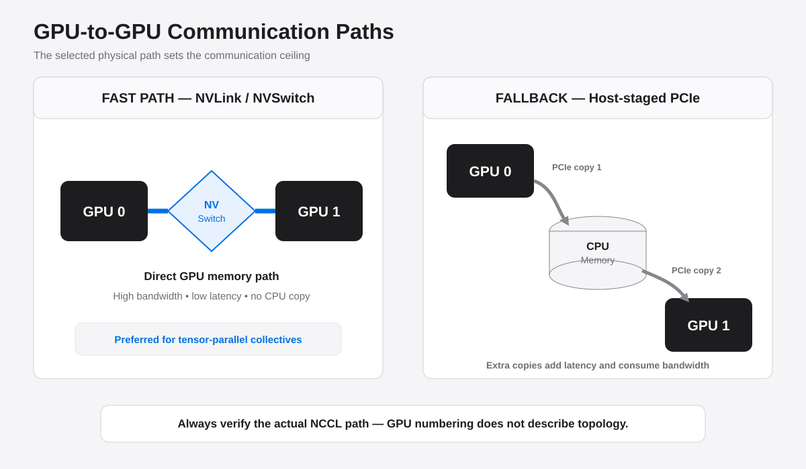
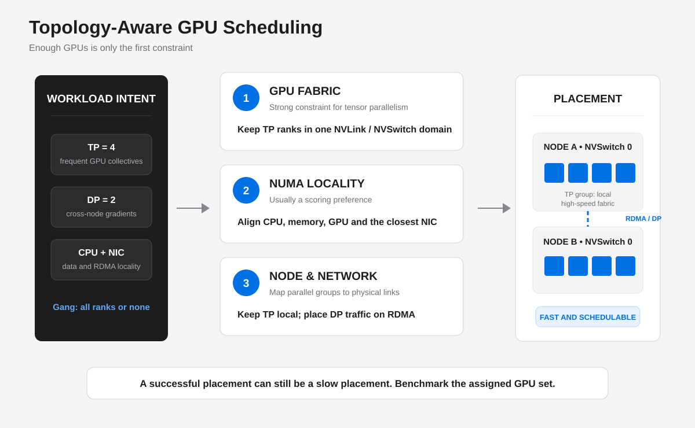
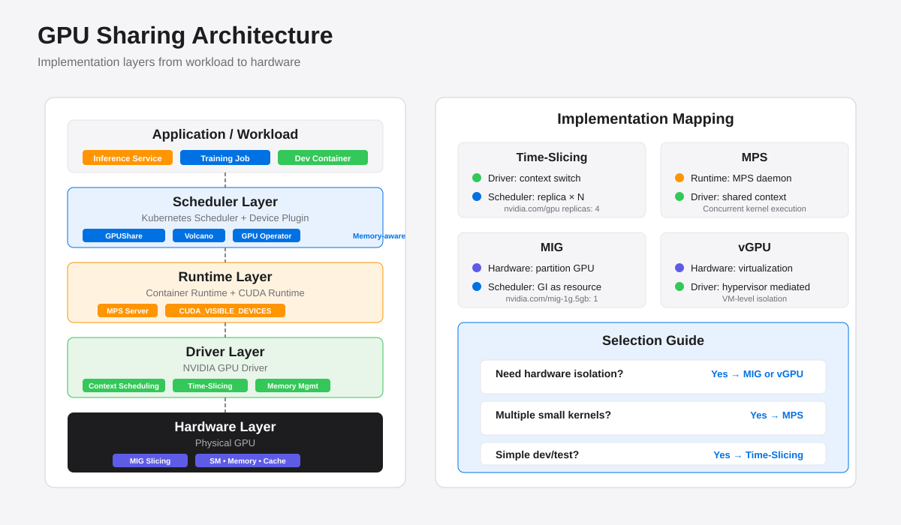

# GPU 性能、通信与调度

GPU 集群不能只看“有多少张卡”。单卡是否真正发挥算力、多卡之间走哪条通信路径、
调度器分配的 GPU 是否处在合适的拓扑中，都会直接影响训练吞吐。分析时可以按三层逐步
定位：**计算是否饱和 → 通信是否受限 → 调度是否破坏了理想拓扑**。

## GPU 的性能指标

### GPU 的运行性能

`nvidia-smi` 中的 `GPU-Util` 适合回答“采样周期内 GPU 是否有工作”，不适合回答
“GPU 的计算能力用了多少”。它统计采样周期内一个或多个 kernel 在 GPU 上执行的时间
占比；即使 kernel 只使用少量执行单元，或者主要在搬运数据，这个值也可能接近 100%。

判断运行性能时，需要组合观察不同层级的指标：


| 指标 | 回答的问题 | 主要局限 |
| --- | --- | --- |
| `GPU-Util` | GPU 在采样周期内是否在执行 kernel | 不表示用了多少 SM、Tensor Core 或 FLOPS |
| SM Active / SM Efficiency | SM 在多少周期内有活跃 warp | SM 活跃不等于所有执行单元都被充分利用 |
| SM Occupancy | SM 可容纳的活跃 warp 比例 | 高 occupancy 不保证 kernel 更快，也不等于计算吞吐高 |
| DRAM Active / Memory Utilization | 显存控制器或显存带宽有多忙 | 高值只说明数据搬运繁忙，不说明计算有效 |
| Tensor Core 利用率 | 矩阵计算单元是否被使用 | 只适用于能映射到 Tensor Core 的运算 |
| MFU（Model FLOPs Utilization） | 模型有效 FLOPS 占硬件理论峰值的比例 | 依赖模型 FLOPS 估算、精度与硬件峰值，不能直接逐 kernel 采样 |
| 吞吐与延迟 | 每秒处理多少 token/sample，或一次请求耗时多久 | 是最终结果指标，不能单独说明瓶颈位置 |

MFU 的常见定义为：

$$
\mathrm{MFU} =
\frac{\text{模型每步理论 FLOPs} \times \text{每秒完成的训练步数}}
{\text{GPU 数量} \times \text{单卡对应精度的峰值 FLOPS}}
$$

MFU 比 `GPU-Util` 更接近训练效率，但不同资料对模型 FLOPS、稀疏计算以及重计算的
计法可能不同，因此只应在口径一致时横向比较。

#### 用指标组合判断瓶颈

| 现象 | 可能的状态 | 下一步 |
| --- | --- | --- |
| `GPU-Util` 高，SM Active 高，吞吐稳定 | GPU 正在持续计算 | 再看 Tensor Core、指令吞吐和 kernel 效率 |
| `GPU-Util` 高，SM Active 低，DRAM Active 高 | memory-bound 或频繁搬运 | 检查算术强度、kernel fusion、数据布局和 H2D 拷贝 |
| SM Active 高，但 MFU 低 | kernel 持续运行但有效模型计算少 | 检查小 kernel、非 Tensor Core 算子、通信 kernel 和同步等待 |
| GPU 指标呈周期性低谷 | CPU/DataLoader 或通信供给不足 | 对照 CPU、磁盘、网络和 NCCL timeline |
| 功耗或时钟到达上限，性能不再增长 | 功耗墙、温度墙或频率限制 | 检查 clocks、power limit、temperature 和 throttling reason |

快速观察GPU状态时，可以使用命令行工具查看设备级利用率、显存带宽、功耗和时钟等指标。
这些工具主要用于快速筛查。需要准确区分计算、显存和 stall 原因时，应使用 DCGM Profiling 
Metrics、Nsight Systems、Nsight Compute 或框架 profiler。优化顺序通常是先以吞吐/MFU 
确认存在差距，再用 timeline 找等待区间，最后下钻到具体 kernel；不要只围绕一个利用率数字调参。

## GPU 间的通信

GPU 间通信的有效性能由**物理链路、拓扑距离、消息大小和集合通信算法**共同决定。
NCCL 会读取系统拓扑并为 AllReduce、AllGather、ReduceScatter 等操作选择通信路径，
但自动选择不能修复错误的布线、被禁用的 P2P 或不合理的 GPU 分配。

可以通过命令行工具查看 GPU 拓扑和 P2P 连接情况。`topo -m` 输出中常见的 GPU 间标识
包括 `NV#`（经过若干条 NVLink）、`PIX`（同一 PCIe switch）、`PXB`（经过多个 PCIe 
bridge）、`NODE`（同一 NUMA node）和 `SYS`（跨 NUMA/socket）。具体标识随驱动和
硬件变化，应以当前机器输出为准。

### NVLink

NVLink 是 GPU 之间的高速点对点互连。NVSwitch 则把多张 GPU 接入交换结构，使一个
NVSwitch 域内的 GPU 可以获得高带宽、低延迟的互连。它们适合张量并行（TP）这类
通信频繁、对延迟和带宽都敏感的工作负载。

需要区分三个概念：

- **NVLink 数量和代际**决定单条链路及聚合链路的理论峰值；
- **是否在同一 NVSwitch 域**决定任意 GPU pair 能否走等价的高速路径；
- **NCCL 实测带宽**是算法、消息大小和链路共同作用后的结果，不能直接等同于厂商标注
	的链路峰值。

同一 NVSwitch 域内，GPU 即使挂在不同 CPU NUMA node 下，GPU-to-GPU 数据仍可能完全
经 NVSwitch 传输，因此 NUMA 对这条路径影响很小。不过 CPU-to-GPU 和 NIC-to-GPU 的
路径仍受 NUMA/PCIe 亲和性影响，不能据此忽略所有 NUMA 配置。

### PCIe

PCIe 是 GPU 与 CPU、NIC 及其他设备之间的通用互连，也可在平台支持时承载 GPU P2P。
与 NVLink 相比，它通常带宽更低、拓扑层级更多，而且可能经过 PCIe switch、Host
Bridge 或 CPU socket 间链路。

常见路径从优到劣大致为：



```text
同域 NVLink/NVSwitch
	→ 同一 PCIe switch 的 GPU P2P
	→ 同一 NUMA node 内经 Host Bridge
	→ 跨 CPU socket
	→ GPU → CPU 内存 → GPU 的 P2P fallback
```

是否能够使用 PCIe P2P 取决于 GPU、主板拓扑、IOMMU/ACS 和驱动配置。P2P 不可用或被
禁用时，数据可能需要经 CPU 内存中转，产生两次 PCIe 传输和额外拷贝。跨节点的 
GPUDirect RDMA 则允许 NIC 直接访问 GPU 显存，减少 CPU 内存中转；此时应优先让 GPU 
使用同一 PCIe switch 或同一 NUMA node 下的 NIC。

### 如何测量通信性能

通信测试必须固定 GPU 组合、消息大小、集合操作和 NCCL 配置。常用的测试工具会给出：

- `algbw`：从数据量和操作耗时计算出的算法带宽；
- `busbw`：按集合通信的实际传输量折算的总线带宽，适合比较硬件路径利用程度。

对于 $N$ 个 rank 的 Ring AllReduce，NCCL 使用的折算关系为：

$$
\mathrm{busbw} = \mathrm{algbw} \times \frac{2(N-1)}{N}
$$

小消息通常由启动延迟主导，大消息才逐渐逼近链路带宽。因此比较两种拓扑时不能只测
一个很小的张量。建议先建立同 NVLink 域的基线，再测试跨域或跨 NUMA GPU pair，
确认 NCCL 实际选择的通信路径（P2P、SHM、IB 或 Socket）。

## GPU 调度

### 调度问题

Kubernetes 默认把 `nvidia.com/gpu` 当作不可分割的标量扩展资源。它能判断某节点是否
还有 4 张 GPU，却不知道这 4 张 GPU 之间是 NVLink 还是 PCIe，也不知道一个分布式作业
的所有 worker 是否必须同时启动。由此产生几个典型问题：

1. **资源碎片化**：单卡任务分散占用 GPU 后，剩余数量虽然足够，却无法组成满足 TP
	 通信要求的 GPU 组。重点不是编号是否连续，而是剩余 GPU 是否位于同一高速互连域。
2. **拓扑不感知**：调度成功不等于性能合理。跨 NVSwitch 域、跨 socket 或绑定远端 NIC
	 都可能让通信回退到较慢路径。
3. **缺少 Gang Scheduling**：分布式训练要求全部 rank 就绪。若只调度部分 worker，
	 已启动的 worker 会占着 GPU 等待 NCCL 初始化，形成资源空转。
4. **训练与推理目标冲突**：单卡推理偏好提高装箱率，多卡训练偏好保留完整的高速互连
	 域。两类负载混部时，需要配额、优先级或专用节点池来控制碎片。

对应的治理手段包括拓扑感知 Filter/Score、Volcano 等调度器的 coscheduling、队列与
优先级、低优先级任务抢占/重调度，以及按 NVSwitch 域划分节点池。Gang Scheduling
解决的是“所有 Pod 能否一起运行”，拓扑感知解决的是“它们运行在哪里”；两者不能互相
替代。

### 拓扑感知

拓扑感知调度可分为三层：



| 层级 | 调度器需要保证什么 | 适用场景 | 常见策略 |
| --- | --- | --- | --- |
| GPU 互连 | TP 组优先位于同一 NVLink/NVSwitch 域 | TP、频繁集合通信 | 强约束 Filter，加拓扑 Score |
| CPU/内存 NUMA | CPU、内存、GPU 和 NIC 尽量位于同一 NUMA node | DataLoader、H2D、GPUDirect RDMA | Kubelet Topology Manager |
| 节点/网络 | TP 组不跨节点，DP 组使用合适的 IB/RoCE 网络 | 多机混合并行 | PodGroup、节点亲和性和 rank 映射 |

三种并行方式对拓扑的敏感度不同：

- **张量并行**（TP每层都可能通信，应尽量把一个 TP 组放在同一节点、同一 NVSwitch
	域；
- **流水线并行**（PP主要在 stage 边界通信，可在带宽和显存容量之间权衡；
- **数据并行**（DP本来就常跨节点做梯度同步，重点是 IB/RoCE 带宽、NIC 亲和性和
	通信与反向计算重叠。

Kubelet 的 Topology Manager 可以协调 CPU Manager、Memory Manager 和 Device Plugin
给出的 NUMA hint。策略强度应按负载选择：普通推理可用宽松策略，对 H2D 或 RDMA
敏感的训练可考虑严格策略；最严格的单 NUMA 节点策略虽然能保证最优亲和性，但也更容易
因局部资源不足而使 Pod 无法调度。GPU-to-GPU 已经通过单一 NVSwitch 域全互联时，不应
为了 NUMA 对齐无谓牺牲可调度性。

调度策略最终必须用实际工作负载验证：记录分配到的 GPU UUID，保存拓扑信息，
运行对应 GPU 组合的 NCCL 基准，并比较端到端 tokens/s 或 samples/s。只有同时
满足**能调度、通信路径正确、整体吞吐提升**，拓扑策略才真正有效。

## GPU 共享调度

Kubernetes 默认把 GPU 作为整卡资源分配。这在训练场景中能保证性能独占，但在推理、
开发调试或小规模任务中会造成资源浪费。GPU 共享调度允许多个容器或进程共用一张 GPU，
提升利用率的同时需要在隔离性、QoS 和调度复杂度之间权衡。

### 为什么需要 GPU 共享

| 场景 | 问题 | 共享方式的意义 |
| --- | --- | --- |
| 推理服务 | 单个模型推理通常无法填满整张 GPU，但仍独占一张卡 | 多个推理服务共享，提升吞吐和利用率 |
| 开发调试 | 开发者需要 GPU 环境但不需要全部算力 | 让多个开发容器共享，降低等待时间 |
| 小规模训练/微调 | 小模型或小 batch 训练占用显存和算力都不多 | 多个训练任务共享，加快实验迭代 |
| 异构工作负载 | 训练、推理、数据处理混合部署 | 按需分配算力和显存，提高集群整体效率 |

整卡调度适合大规模训练和对延迟/吞吐有严格要求的在线推理；GPU 共享适合资源需求不饱和
或能容忍一定性能波动的场景。两者不是替代关系，而是对不同负载的补充。

### GPU 共享的技术实现

GPU 共享可以在**硬件、驱动、运行时和调度器**四个层级实现，能力和代价各不相同：


#### 1. 时间片轮转（Time-Slicing）

NVIDIA GPU 驱动支持在多个 CUDA context 之间进行时间片调度。多个进程提交到同一张 GPU
的任务会被串行化执行，操作系统或驱动按时间片切换。

- **优点**：不需要修改应用，对任何 CUDA 程序透明；配置简单。
- **缺点**：无硬件隔离，进程间会相互抢占；显存超用时会 OOM；无法保证 QoS；context
  切换带来延迟抖动。
- **实现方式**：通过 Device Plugin 配置将物理 GPU 虚拟为多个逻辑 GPU，调度器可以
  将多个 Pod 分配到同一张物理卡上。
- **适用场景**：开发测试、低负载推理、可容忍抖动的批处理任务。

#### 2. MPS（Multi-Process Service）

MPS 是 NVIDIA 提供的运行时层共享方案。它启动一个 MPS server，多个客户端进程通过
MPS client 连接到同一 CUDA context。MPS 会把来自不同进程的 kernel 在 SM 和显存
上进行空间复用，而不是简单的时间片切换。


##### MPS 的工作原理

传统 CUDA 模型下，每个进程创建独立的 CUDA context。当多个进程同时使用 GPU 时：

- GPU 在不同 context 之间进行**时间片切换**（context switch）；
- 每次切换需要保存/恢复寄存器、TLB、缓存状态，产生显著开销（微秒到毫秒级）；
- 即使多个进程的 kernel 都很小（无法填满 GPU），也无法在同一时刻并发执行。

MPS 通过引入一个中间层改变了这个模型：

```text
传统模型：
Process A → CUDA Context A ┐
Process B → CUDA Context B ├─→ GPU (时间片切换)
Process C → CUDA Context C ┘

MPS 模型：
Process A → MPS Client A ┐
Process B → MPS Client B ├─→ MPS Server → 单一 CUDA Context → GPU (空间复用)
Process C → MPS Client C ┘
```

**MPS Server** 维护一个共享的 CUDA context，所有客户端进程通过 MPS Client（一个
stub library）提交工作。MPS Server 会：

1. **合并提交**：把来自不同客户端的 kernel 提交到同一个 CUDA stream 队列；
2. **空间复用**：多个小 kernel 可以同时在不同的 SM 上执行，而不是排队等待；
3. **减少切换**：避免频繁的 context switch，降低调度延迟。

##### 性能特征

| 维度 | 无 MPS | 有 MPS | 说明 |
| --- | --- | --- | --- |
| Kernel 启动延迟 | ~10-50 μs | ~1-5 μs | 减少 context 切换开销 |
| 小 kernel 并发 | 串行执行 | 可并发 | 多个进程的 kernel 可同时占用不同 SM |
| 显存使用 | 每个进程独立 | 共享可见 | 进程间无显存隔离 |
| 错误隔离 | 进程级隔离 | 无隔离 | 一个进程的 GPU 错误会影响所有客户端 |

**典型收益场景**：

- **推理服务**：单个推理请求 batch 小（如 batch=1），无法填满 GPU。通过 MPS，10 个
  并发推理进程的 kernel 可以同时执行，吞吐提升 3-8 倍。
- **小规模训练**：多个用户同时训练小模型，每个模型占用 < 20% 算力。MPS 让它们共享
  GPU 而不是排队。
- **Pipeline 并行**：一个进程负责 embedding lookup，另一个负责 transformer layer。
  MPS 让两个 stage 的 kernel 并发，减少 bubble。

**不适用场景**：

- 单个进程已经能填满 GPU（如大 batch 训练）——MPS 无法进一步提升，反而增加开销；
- 需要硬件级隔离或 QoS 保障的场景——MPS 无法限制某个进程的算力或显存占用。

##### 部署方式

MPS 需要在系统中启动一个 MPS daemon 作为中间层。客户端进程无需修改代码，CUDA
运行时会通过环境变量自动连接到 MPS。在 Kubernetes 中，通常由 Device Plugin 或
DaemonSet 为每张 GPU 自动启动 MPS Server，Pod 通过环境变量连接到 MPS daemon。

##### 限制与注意事项

1. **显存可见性**：所有客户端进程可以看到彼此分配的显存地址。恶意或有 bug 的进程
   可以读写其他进程的显存，导致数据损坏或安全问题。生产环境需要确保进程来源可信。

2. **无资源限额**：MPS 不提供显存或算力配额机制。某个进程可以分配所有显存或持续
   占用所有 SM，导致其他进程 OOM 或饿死。需要在应用层控制资源使用。

3. **错误传播**：一个进程触发的 GPU 错误（如非法显存访问、kernel timeout）会导致
   整个 MPS Server 重置，所有客户端进程的 GPU 操作失败。适用于同一应用的多个副本，
   不适合多租户场景。

4. **版本与兼容性**：
   - Pre-Volta GPU（如 Pascal）：MPS 只能进行时间片复用，不支持真正的空间并发；
   - Volta 及之后（V100/A100/H100）：支持 Volta MPS，可以让多个进程的 kernel 真正
     并发执行在不同 SM；
   - CUDA 版本需要 ≥ 7.0，推荐使用最新驱动以获得最佳性能。

5. **Stream 和优先级**：MPS 会合并所有客户端的 stream 到内部队列。客户端指定的
   stream 优先级可能不会完全保留。对延迟敏感的应用应该验证 P99 延迟。

##### 监控与调优

MPS 本身不提供细粒度的每个客户端的 GPU 使用统计。需要通过 DCGM 或 Nsight Systems
结合进程 PID 追踪各客户端的行为。

**性能调优建议**：

- **进程数量**：一张 GPU 共享给 4-8 个进程通常效果最好。进程过多会导致调度开销
  上升，进程过少则无法充分利用空间并发。
- **Kernel 大小**：MPS 对小到中等 kernel 收益明显（执行时间 < 1ms）。大 kernel
  （已经填满 GPU）无法并发，MPS 退化为排队执行。
- **显存分配**：在进程启动时就分配所需显存，避免运行时频繁 malloc/free。显存碎片
  会影响所有客户端。
- **错误处理**：在应用层实现 GPU 错误检测和重启机制，避免一个进程的错误长时间
  影响整个 MPS Server。

**与 Time-Slicing 的对比**：

| 特性 | Time-Slicing | MPS |
| --- | --- | --- |
| 实现层级 | 驱动调度 | 用户态 daemon |
| Kernel 并发 | 否（串行） | 是（Volta+ 支持空间并发） |
| Context 切换 | 频繁 | 无（共享 context） |
| 启动延迟 | 10-50 μs | 1-5 μs |
| 配置复杂度 | 低 | 中（需启动 MPS daemon） |
| 隔离性 | 进程隔离 | 无隔离 |

总结：MPS 是在**信任环境**中提升 GPU 利用率的有效手段。它适合同一应用的多副本或
小规模多用户开发环境，不适合需要强隔离的多租户生产环境。对于后者，应该使用 MIG。

**适用场景**：推理服务、小规模并行任务、pipeline 中多个 stage 共享 GPU、开发测试环境。

#### 3. MIG（Multi-Instance GPU）

MIG 是 A100/H100 等 Ampere 及后续架构提供的硬件级分区能力。它把一张物理 GPU 切分为
多个 GPU Instance（GI），每个 GI 拥有独立的 SM、显存、memory controller 和
cache，彼此完全隔离。


- **优点**：硬件级隔离，故障和 OOM 不会跨实例影响；每个实例的显存和算力有明确上限；
  支持错误隔离和 QoS 保障。
- **缺点**：只支持特定型号 GPU；分区配置固定（如 1g.5gb、2g.10gb、3g.20gb），不能
  按需细粒度调整；切换 MIG 配置需要重置 GPU；不适合需要大显存或满算力的训练任务。
- **实现方式**：通过 nvidia-smi 启用 MIG 模式并创建 GPU Instance，Kubernetes 通过
  不同的资源名称（如 `nvidia.com/mig-1g.5gb`）暴露不同规格的 MIG 实例。
- **适用场景**：多租户推理集群、需要硬件隔离的生产环境、SLA 敏感服务。

#### 4. vGPU（Virtual GPU）

vGPU 是 NVIDIA vGPU 软件提供的虚拟化方案，主要用于虚拟机场景。Hypervisor 把物理 GPU
切分为多个虚拟 GPU，每个虚拟机看到独立的 GPU 设备。

- **优点**：虚拟机级隔离；支持动态迁移和资源调整；适合 VDI 和多租户云场景。
- **缺点**：需要商业许可证；性能开销比裸金属高；主要面向虚拟机，容器场景通常使用
  MIG 或 MPS。

**适用场景**：基于 VM 的 GPU 云、VDI、需要虚拟机隔离的合规场景。

### Kubernetes 中的 GPU 共享调度器

除了上述底层技术，还需要调度器层面的支持，才能让多个 Pod 合理共享 GPU 并避免超用。




## 参考资料

- [AI 集群运维与通信](https://github.com/ForceInjection/AI-fundamentals/tree/main/03_ai_cluster_ops)
- [NVIDIA DCGM Profiling Metrics](https://docs.nvidia.com/datacenter/dcgm/latest/user-guide/feature-overview.html#profiling-metrics)
- [NVIDIA NCCL Tests](https://github.com/NVIDIA/nccl-tests)
- [NCCL User Guide](https://docs.nvidia.com/deeplearning/nccl/user-guide/docs/)
- [Kubernetes Topology Manager](https://kubernetes.io/docs/tasks/administer-cluster/topology-manager/)