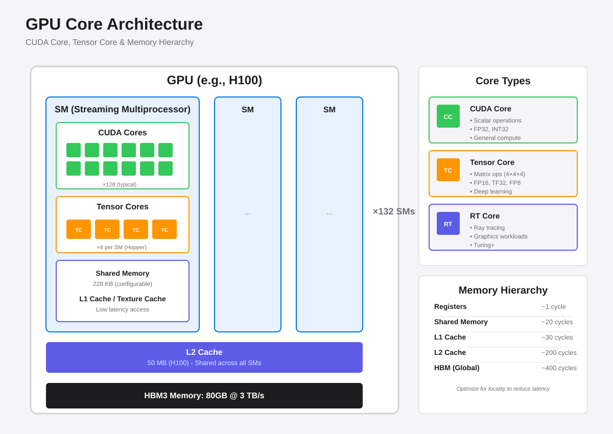
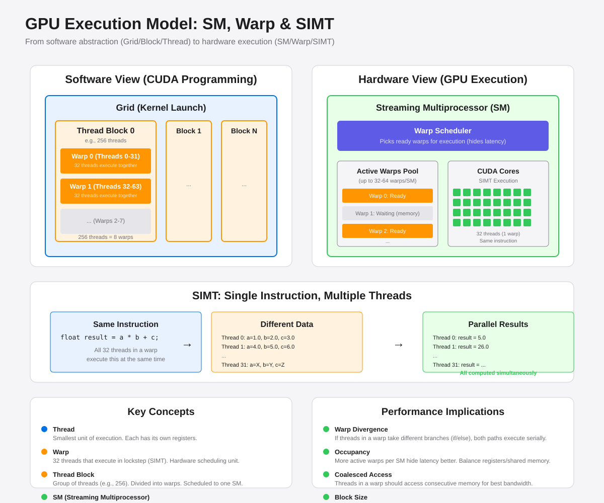
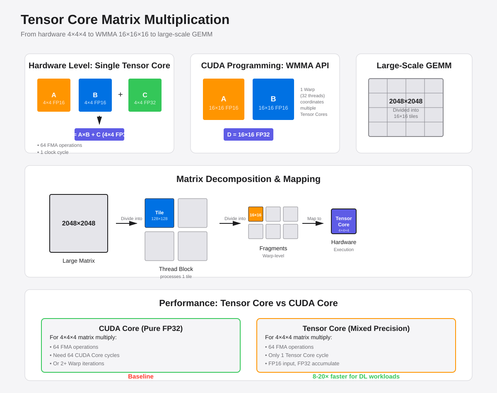
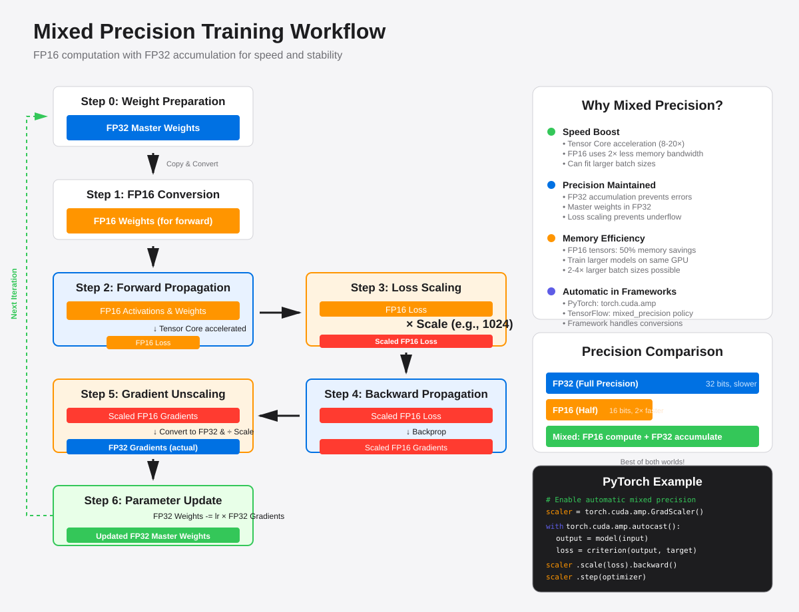
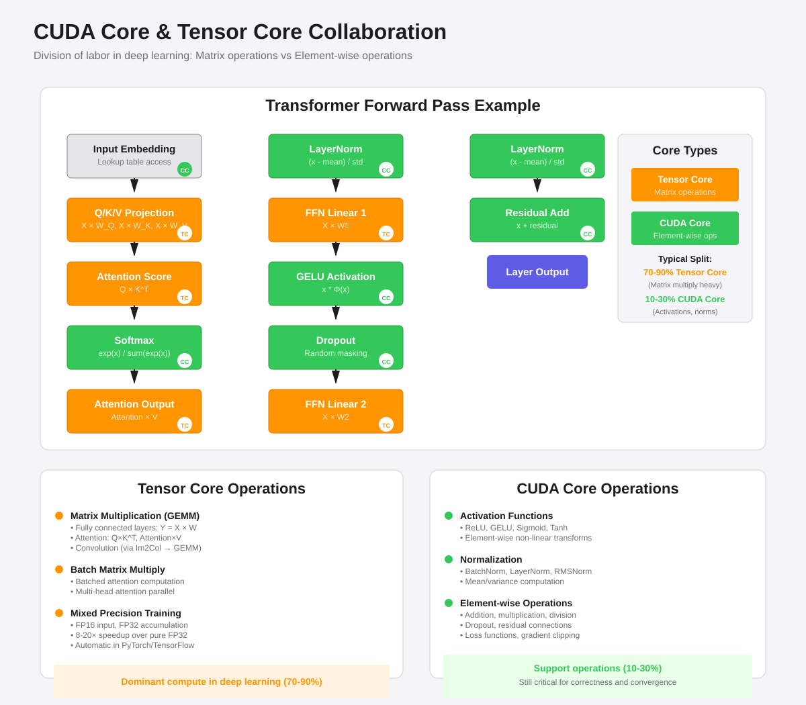

# CUDA Core & Tensor Core

NVIDIA's GPU architecture primarily features three types of cores: **CUDA Core**, **Tensor Core**, and **RT Core**. CUDA Cores are general-purpose compute units, Tensor Cores are specialized matrix operation accelerators designed for deep learning, and RT Cores focus on ray tracing. This document focuses on CUDA Core and Tensor Core architecture, principles, and their relationship.

## GPU Core Architecture Overview



## CUDA Core: General-Purpose Parallel Computing

### Evolution History

- **Stream Processor (pre-2006)**: Early parallel processing units
- **CUDA Core (2010 Fermi+)**: Introduced unified architecture emphasizing CUDA programming model integration
  - Each SM contains 32 CUDA Cores (Fermi)
  - Each CUDA Core = 1 FPU (Floating Point Unit) + 1 ALU (Arithmetic Logic Unit)

### Execution Model: SM, Warp & SIMT



CUDA Cores organize parallel execution through **Warps**:
- **1 Warp = 32 threads**: The basic unit of hardware scheduling on GPU
- **SIMT (Single Instruction, Multiple Threads) model**:
  - 32 threads in a warp execute the same instruction synchronously
  - Each thread operates on different data
  - All threads execute the same instruction in the same clock cycle

**Execution Hierarchy**:
```
Grid (entire Kernel)
├── Thread Block (e.g., 256 threads)
│   ├── Warp 0 (threads 0-31)
│   ├── Warp 1 (threads 32-63)
│   └── ... (8 warps total)
└── Mapped to SM for execution
```

**SM (Streaming Multiprocessor)**:
- Physical execution unit containing multiple CUDA Cores, Tensor Cores, shared memory, etc.
- One SM can manage multiple warps concurrently (e.g., 32-64 warps)
- Warp scheduler selects ready warps for execution, hiding memory latency

**Performance Considerations**:
- **Warp Divergence**: When threads within a warp take different branches, all paths execute serially
- **Occupancy**: More active warps on SM better hide latency
- **Block Size**: Should be multiples of 32 (common: 128, 256, 512)

### Use Cases

- General parallel computing, scientific simulation
- Graphics rendering, video encoding/decoding
- Non-matrix operations in deep learning (activation functions, normalization)

## Tensor Core: Deep Learning Accelerator



### Core Capability

Tensor Core performs fused matrix multiply-add (FMA) operations:

$$
D = A \times B + C
$$

- Single Tensor Core executes **4×4×4** matrix multiplication per cycle
- CUDA exposes **16×16×16** GEMM API via Warp
- Supports mixed precision: FP16 input, FP32 accumulation

### Evolution

| Generation | Architecture | Year | Key Features |
|------------|--------------|------|--------------|
| Gen 1 | Volta | 2017 | FP16 input, FP32 accumulate |
| Gen 2 | Turing | 2018 | Added INT8/INT4 support |
| Gen 3 | Ampere | 2020 | TF32, BF16, structured sparsity |
| Gen 4 | Hopper | 2022 | FP8, Transformer Engine |
| Gen 5 | Blackwell | 2024 | FP4, trillion-param optimization |

### Operating Principles

**Hardware Level**:
```
Single Tensor Core: 4×4×4 matrix multiplication
├── Input: A[4×4] (FP16), B[4×4] (FP16)
├── Accumulate: C[4×4] (FP32)
└── Output: D[4×4] = A×B + C (FP32)
```

**Programming Level**:
```
Warp Level: 16×16×16 GEMM
├── Called via WMMA API
├── One Warp (32 threads) executes cooperatively
└── Automatically distributed to multiple Tensor Cores
```

**Large-Scale Matrices**:
```
2048×2048 matrix
├── Decomposed into Tiles (128×128)
├── Tiles decomposed into Fragments (16×16)
└── Fragments mapped to Tensor Core (4×4×4)
```

## Mixed Precision Training



### Training Workflow

1. **Weight Conversion**: FP32 → FP16 (forward), keep FP32 copy (update)
2. **Forward Propagation**: FP16 computation, Tensor Core accelerated
3. **Loss Scaling**: Scale FP16 loss (avoid underflow)
4. **Backward Propagation**: Compute FP16 gradients using scaled loss
5. **Gradient Unscaling**: FP16 gradients → FP32, unscale
6. **Parameter Update**: Update FP32 weights using FP32 gradients

### Why Hardware Support Needed

- Tensor Cores specifically designed: FP16 compute + FP32 accumulation
- Achieve 8-20× performance boost while maintaining precision
- Reduce memory bandwidth requirements (FP16 vs FP32)

## CUDA Core & Tensor Core Relationship



### Position in GPU

```
GPU
├── SM (Streaming Multiprocessor) ×N
│   ├── CUDA Core ×M          # General compute
│   ├── Tensor Core ×K        # Matrix multiply (Volta+)
│   ├── RT Core ×L            # Ray tracing (Turing+)
│   ├── Shared Memory
│   ├── Register File
│   └── L1 Cache
├── L2 Cache
└── HBM/GDDR Memory
```

### Feature Comparison

| Feature | CUDA Core | Tensor Core |
|---------|-----------|-------------|
| **Introduced** | 2006 | 2017 |
| **Operation** | Scalar FMA | Matrix multiply (4×4×4) |
| **Precision** | FP32, FP64, INT32 | FP16, TF32, BF16, FP8, FP4 |
| **Performance** | Baseline | 8-30× (matrix ops) |
| **Use Case** | General compute | DL matrix operations |

### Collaboration

Division of labor in deep learning:

**Tensor Core Handles**:
- Fully connected layer matrix multiplication
- Convolution (via Im2Col → GEMM)
- Attention Q×K^T, Attention×V

**CUDA Core Handles**:
- Activation functions (ReLU, GELU, Sigmoid)
- Normalization (LayerNorm, BatchNorm)
- Element-wise operations
- Loss function computation

**Transformer Forward Pass Example**:
```
Input Embedding       → [CUDA Core]
Q/K/V = X × W        → [Tensor Core: GEMM]
Attention = Q × K^T  → [Tensor Core: GEMM]
Softmax              → [CUDA Core]
Output = Attn × V    → [Tensor Core: GEMM]
LayerNorm            → [CUDA Core]
FFN matrix multiply  → [Tensor Core: GEMM]
ReLU                 → [CUDA Core]
```

## Convolution & Tensor Core

### Im2Col: Convolution to Matrix Multiplication

Convolution is converted to matrix multiplication via **Im2Col** algorithm, enabling Tensor Core acceleration:

```
Original convolution: [N, C_in, H, W] ⊗ [C_out, C_in, K, K]

Im2Col transformation:
1. Unfold input: [N×H'×W', C_in×K×K]
2. Reshape kernel: [C_out, C_in×K×K]
3. Matrix multiply: [N×H'×W', C_out] = input_unfold × kernel^T
4. Reshape to output

→ Can use Tensor Core acceleration
```

## Programming Interface

### CUDA Core Programming

Standard CUDA:
```cuda
__global__ void vectorAdd(float* A, float* B, float* C, int N) {
    int i = blockIdx.x * blockDim.x + threadIdx.x;
    if (i < N) {
        C[i] = A[i] + B[i];  // CUDA Core
    }
}
```

### Tensor Core Programming

WMMA API:
```cuda
#include <mma.h>
using namespace nvcuda;

wmma::fragment<wmma::matrix_a, 16, 16, 16, half> a_frag;
wmma::fragment<wmma::matrix_b, 16, 16, 16, half> b_frag;
wmma::fragment<wmma::accumulator, 16, 16, 16, float> c_frag;

wmma::load_matrix_sync(a_frag, A, 16);
wmma::load_matrix_sync(b_frag, B, 16);
wmma::mma_sync(c_frag, a_frag, b_frag, c_frag);  // Tensor Core
wmma::store_matrix_sync(C, c_frag, 16);
```

### Framework Automatic Optimization

PyTorch mixed precision example:
```python
model = MyModel().cuda()
scaler = torch.cuda.amp.GradScaler()

with torch.cuda.amp.autocast():  # Auto use Tensor Core
    output = model(input)
    loss = criterion(output, target)

scaler.scale(loss).backward()
scaler.step(optimizer)
scaler.update()
```

## Performance Comparison

### Training Speedup (vs pure CUDA Core)

- **Volta (V100)**: 8-12× 
- **Ampere (A100)**: 15-20×
- **Hopper (H100)**: 25-30×

### Performance Gains From

1. Tensor Core acceleration for matrix multiplication (70-90% of DL compute)
2. Mixed precision reduces memory bandwidth (2× bandwidth savings)
3. Higher compute utilization

## Summary

| Dimension | CUDA Core | Tensor Core |
|-----------|-----------|-------------|
| **Nature** | General parallel compute | Specialized matrix multiply accelerator |
| **Function** | Scalar operations | 4×4×4 matrix multiply |
| **Available** | All CUDA GPUs (2006+) | Volta+ (2017+) |
| **Use Case** | General compute, non-matrix ops | DL matrix operations |
| **Relationship** | GPU foundation | Complements CUDA Core |

### Usage Recommendations

1. **DL Training**: Enable mixed precision (AMP), fully utilize Tensor Cores
2. **Inference**: Use INT8/FP8 quantization, leverage Tensor Core low-precision support
3. **General Compute**: Direct CUDA Core programming
4. **Mixed Workloads**: Identify matrix operations, let framework auto-schedule

## References

- [NVIDIA Tensor Core Architecture](https://www.nvidia.com/en-us/data-center/tensor-cores/)
- [CUDA C++ Programming Guide - WMMA](https://docs.nvidia.com/cuda/cuda-c-programming-guide/index.html#wmma)
- [Mixed Precision Training](https://arxiv.org/abs/1710.03740)
- [AI System: Tensor Core Fundamentals](https://infrasys-ai.github.io/aisystem-docs/02Hardware04NVIDIA/01BasicTC.html)
