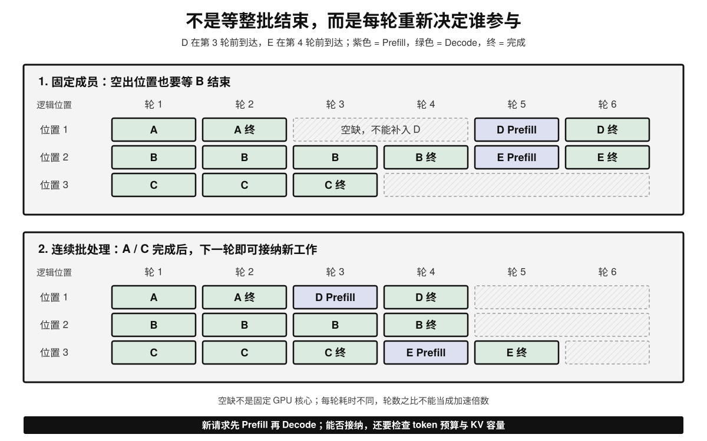
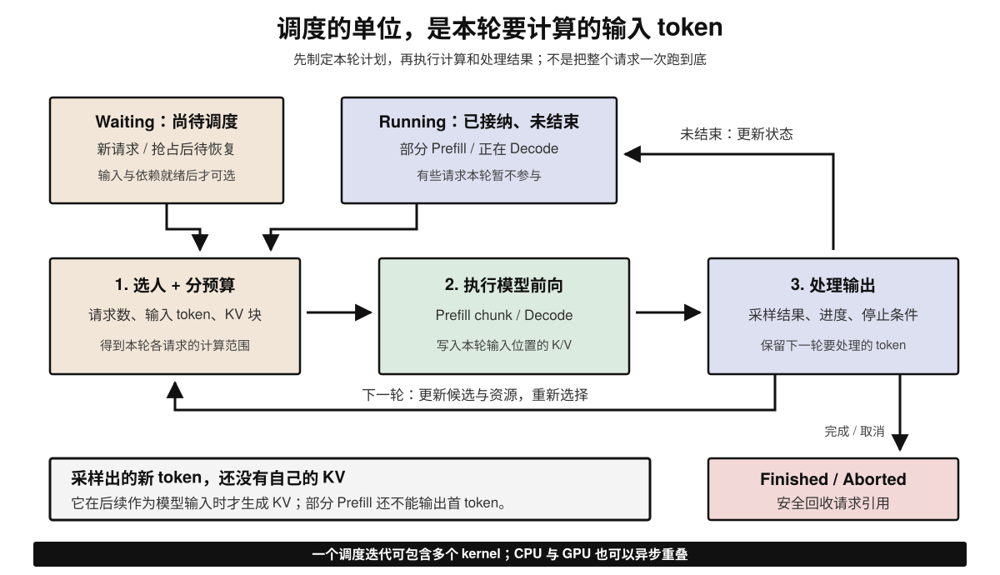
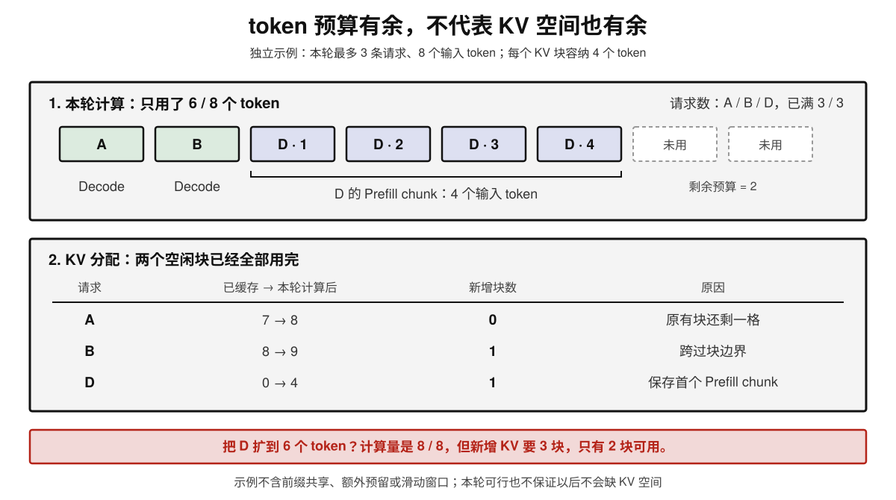
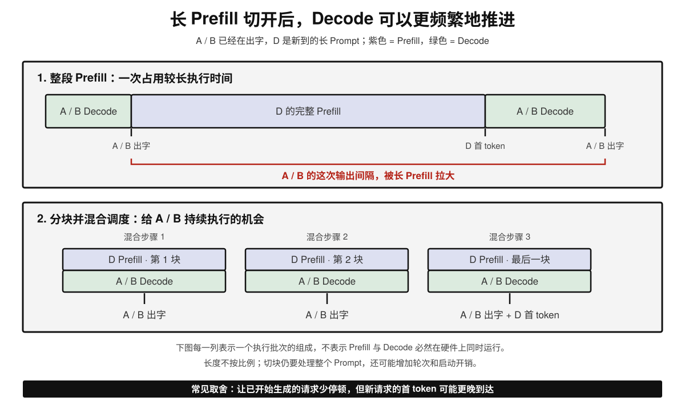
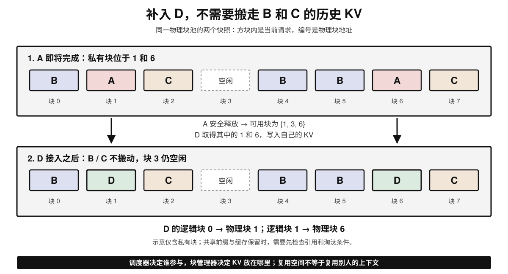

# Continuous Batching 原理简介

## 学习路径

1. 先看静态批次为什么留下空缺，理解“每轮重新组批”改变了什么；
2. 再跟随一轮调度，区分请求状态、当前计算的 token 与已经保存的 KV；
3. 用具体预算理解新请求何时能加入，以及 Chunked Prefill 如何缓解生成停顿；
4. 最后连接分页、抢占与性能指标，判断吞吐提升是否满足延迟要求。

---

## 1. Continuous Batching 优化的是什么

**KV Cache 避免重算历史，FlashAttention 减少 Attention 内部的数据搬运，Continuous Batching 决定本轮让哪些请求一起计算。** 三者处在不同层次，可以配合使用。

LLM 生成不是一次前向就完成请求。普通自回归生成中，一条请求先做 Prefill，再反复执行 Decode；不同请求的到达时间、Prompt 长度和输出长度都可能不同。

批处理把多个请求的工作合并执行，让矩阵运算有机会复用权重、摊薄启动和数据搬运开销。小 batch 的 Decode 常受权重或 KV 读取限制，适当增大 batch 可能提高算术强度与吞吐；但计算、KV 读取和临时空间也会增加，**不是多放几个请求就没有额外成本**。

Continuous Batching（连续批处理，也常称 In-flight Batching）的核心是：**在迭代边界重新选择参与者，完成的请求退出，有资源时让等待请求加入，不必等待旧批次全部结束。** 它不改变模型的注意力定义，也不让一条请求的后续 token 摆脱自回归依赖。

---

## 2. 从“等整批”到“每轮补位”

### 2.1 用同一组请求看差别

假设一次最多选入 3 条请求。A、B、C 已完成 Prefill，分别还需 2、4、3 轮 Decode；D 在第 3 轮前到达，E 在第 4 轮前到达。D、E 都先做一次能放入预算的短 Prefill，再做一次 Decode 后结束。

| 观察点 | 固定成员的静态批次 | Continuous Batching |
| --- | --- | --- |
| A 在第 2 轮结束后 | 不接纳新成员，D 仍需等待 | 第 3 轮可以接纳 D 的 Prefill |
| C 在第 3 轮结束后 | 继续等本批最晚结束的 B | 第 4 轮可以接纳 E 的 Prefill |
| 新请求什么时候 Decode | 自己的 Prefill 完成后 | 同样必须先完成自己的 Prefill |
| 批次成员何时可变 | 上一整批完成后 | 每个可用的调度边界 |

图中的“逻辑位置”只是排版，不是专属于某请求的 GPU 核心或固定显存槽位。空白表示不能补入新工作；某些静态实现会继续做 padding 或 masked 计算，另一些会跳过已完成项，不能一概认为 GPU 必然执行了无效计算。

同样，静态批处理也可以流式返回已生成的 token，**不接纳新成员不等于必须扣住短请求的输出**。图按迭代编号排列，Prefill 与 Decode 的单轮耗时不同，不能用轮数比例直接推算加速倍数。

### 2.2 三种 batching 不要混淆

| 方式 | 什么时候组批 | 能否在旧请求尚未完成时补入新请求 |
| --- | --- | --- |
| Static Batching | 预先选定一组，固定成员执行 | 通常不能 |
| 请求级 Dynamic Batching | 用等待窗口、批大小等条件收集到达的请求，再启动一批 | 仅有动态收集还不够，取决于执行器是否支持中途重组 |
| Continuous Batching | 每轮按剩余工作与资源重新选择请求 | 支持在调度边界接纳；不保证到达即执行 |

“Dynamic Batching”在不同框架中的含义并不完全一致。判断时应看：**新请求能否在旧批次结束前进入后续迭代**，而不是只看名称里有没有 dynamic。

---

## 3. 一轮调度里到底发生什么

### 3.1 请求状态与计算阶段是两回事

先用一个同步、单引擎的简化模型理解：

| 状态 | 保存什么 | 下一步可能做什么 |
| --- | --- | --- |
| Waiting | 新请求，或等待恢复的请求 | 等资源和依赖就绪后被接纳 |
| Running | 已接纳但未结束的请求及其进度 | 继续 Prefill、做 Decode，或本轮暂不参与 |
| Preempted | 被抢占但未完成的请求 | 等待重算或恢复所需 KV 后继续 |
| Finished / Aborted | 已触发停止条件或取消 | 结束输出，安全释放请求持有的资源 |

**Running 不等于 Decode，也不等于本轮一定被选中。** 分块 Prefill 可以连续多轮处于 Running；等待外部 KV、结构化输出准备等依赖的请求，也可能暂时无法计算。具体状态名和队列划分取决于引擎。

### 3.2 从候选请求到下一轮

1. **收集候选**：接收新请求和取消信号，结合已有请求的进度、优先级与依赖确定可选工作。
2. **制定本轮计划**：为每个选中请求决定计算多少个输入 token，检查请求数、token 预算和新增 KV 空间；放不下时延后、缩短 Prefill chunk，或按策略抢占。
3. **执行模型前向**：处理选中的输入位置，读取各请求自己的历史 KV，并写入本轮输入的 K/V。请求边界、位置与掩码保证不同请求不会相互关注。
4. **处理结果**：更新进度，有可用 logits 时采样并输出；检查 EOS、停止词、长度上限和取消。未完成的请求保留状态，完成的请求释放引用。
5. **进入下一轮**：根据新的资源和候选集合重新调度，不必等待其他请求全部结束。

这是逻辑顺序，不要求 CPU 与 GPU 每轮完全串行。真实引擎可采用异步调度和流水线；已经在执行的 GPU 工作不能因新请求到达而任意插入或覆盖，块的复用也必须等相关读写安全结束。

### 3.3 “生成一个 token”不等于“已缓存它的 KV”

把 `The cat` 暂时当作两个示意 token：

| 本轮输入 | 本轮写入的 KV | 本轮采样得到 |
| --- | --- | --- |
| Prefill：`The cat` | `The`、`cat` 的 K/V | `sat` 的 token ID |
| 下一轮 Decode：`sat` | `sat` 的 K/V | `down` 的 token ID |

新采样的 `sat` 要在下一次作为模型输入时才计算自己的 KV。若请求已经终止，就不需要为最后采样出的 token 再跑一次前向。

同样，**未完成的 Prefill chunk 通常不会产生可返回的首 token**；完整 Prompt 处理到末尾后才能开始采样。普通 Decode 每次推进一个输出 token，而推测解码可能一次接受多个，不能把“一轮”永久等同于“所有请求各出一个字”。

---

## 4. 空出一个位置，为什么还不一定能补人

### 4.1 三份不同的预算

| 预算 | 限制的是什么 | 不能与什么混淆 |
| --- | --- | --- |
| 请求 / 序列数 | 本轮或执行侧允许承载多少条序列 | 不是这些请求的总上下文长度 |
| Scheduled token 数 | 本轮新送入模型计算的输入位置数 | 不是输出 token 数，也不是全部历史 KV token 数 |
| KV 容量 | 已驻留 KV 与本轮新增分配需要的空间 | 请求本轮没算，不代表它的历史 KV 已释放 |

设本轮选中的请求集合为 $\mathcal R$，请求数上限为 $C$，token 预算为 $T$，可用 KV 块数为 $F$。在只按当前工作分配的简化模型中，需要同时满足：

$$
|\mathcal R|\le C,\qquad
\sum_{r\in\mathcal R}q_r\le T,\qquad
\sum_{r\in\mathcal R}\Delta b_r\le F
$$

其中 $q_r$ 是该请求本轮新计算的输入 token 数，$\Delta b_r$ 是新增 KV 块数。普通 Decode 通常取 $q_r=1$；Prefill 可以取一个 chunk 的长度。真实系统还会检查模型最大长度、预留空间、多模态输入、适配器等限制。

### 4.2 一个能手算的例子

另设一组独立的预算：最多 3 条请求、本轮最多计算 8 个 token；每个 KV 块存 4 个 token，当前只有 2 个空闲块。A、B 在 Decode，新请求 D 有 10 个 Prompt token，先分配 4 个：

| 请求 | 已缓存 token 数 $s_r$ | 本轮计算 $q_r$ | 新增 KV 块 $\Delta b_r$ |
| --- | --- | --- | --- |
| A | 7 | 1 | 0，原有块还有一个位置 |
| B | 8 | 1 | 1，跨过块边界 |
| D | 0 | 4 | 1，保存首个 Prefill chunk |
| 合计 | 15 | 6 | 2 |

还有 2 个 token 预算，却不能简单把 D 的 chunk 扩到 6：这时 D 需要 2 块，连同 B 的 1 块，总计需要 3 块，超过当前可用的 2 块。请求数也已经达到上限。

以上按不共享前缀、不额外预留、完整保留历史的普通 Attention 估算。块大小为 $b$ 时：

$$
\Delta b_r=
\left\lceil\frac{s_r+q_r}{b}\right\rceil-
\left\lceil\frac{s_r}{b}\right\rceil
$$

实际分配还可能受 prefix sharing、copy-on-write、滑动窗口、多组 KV 布局和后续增长预留影响。**能放下当前这轮，不保证未来每轮都不缺空间**；图中的小预算用于解释约束，不是推荐部署配置。

### 4.3 同样一个 token，成本也不同

一条 32K 上下文请求只 Decode 一个新 token，通常也只占一个本轮输入名额，但它仍要读取很长的历史 KV。另一条短上下文请求同样取 $q_r=1$，注意力读取成本可能小得多。

因此，token budget 是限制工作量的实用近似，**不是精确的 FLOPs、毫秒或带宽预算**。不能把 `max_num_batched_tokens` 理解成所有活动请求的历史长度之和，也不能据此认为相同预算必然产生相同单轮延迟。

---

## 5. Chunked Prefill：不要让长 Prompt 一次占满一轮

### 5.1 能补入请求，不代表补入后没有干扰

假设 A、B 正在逐步出字，新请求 D 带着很长的 Prompt 到达。若一次完成 D 的 Prefill，无论是单独插入一个长步骤，还是与 Decode 合在一个大步骤中，都可能拉长 A、B 两次输出之间的间隔。

**Continuous Batching 解决成员何时变化，Chunked Prefill 解决新请求一次推进多少。** 二者相关，但不是同一个开关。连续批处理也可以采用分开的 Prefill / Decode 执行步骤，不要求每轮一定混合两者。

### 5.2 先给 Decode 留预算，再推进部分 Prefill

一种常见策略是先安排可执行的 Decode，再用剩余预算推进 Prefill。沿用第 4 节的 token 示例，假设随后 KV 空间充足、A/B 仍未结束，并将 D 的 10 个 Prompt token 分成 $4+4+2$：

| 轮次 | A | B | D | D 能否返回首 token |
| --- | --- | --- | --- | --- |
| 1 | Decode 1 个输入 | Decode 1 个输入 | Prefill 第 1–4 个 token | 不能，Prompt 未处理完 |
| 2 | Decode 1 个输入 | Decode 1 个输入 | Prefill 第 5–8 个 token | 不能 |
| 3 | Decode 1 个输入 | Decode 1 个输入 | Prefill 第 9–10 个 token | 可以，已处理到 Prompt 末尾 |
| 4 | Decode 1 个输入 | Decode 1 个输入 | 首个输出 token 作为 Decode 输入 | 继续生成后续 token |

后面的 chunk 仍会关注同一请求已经缓存的前缀，位置与因果掩码也必须保持一致。**分块不是把每段当成互不相关的短 Prompt，更不是截掉历史。** 这里每块最多 4 个 token 只是便于演示，真实 chunk 大小受预算、块对齐和实现影响。

### 5.3 更平稳的 ITL，也需要付出代价

| 调整方向 | 可能获得的收益 | 需要付出的代价 |
| --- | --- | --- |
| Prefill chunk 更小 | 减少单次 Prefill 对 Decode 的长时间阻塞 | Prefill 要更多轮，调度和启动开销增加，D 的 TTFT 可能变长 |
| Prefill chunk 更大 | 新 Prompt 推进更快，更易形成较大的计算任务 | 同批或相邻 Decode 的输出间隔可能变长 |
| 更偏向在途 Decode | 已经开始流式输出的请求更稳定 | 新请求可能等待更久，需要防止 Prefill 饥饿 |

混合 Prefill 与 Decode 有机会提高资源利用率，但同一批也可能依次执行不同内核，不意味着两者必然在硬件上同时运行。图不代表固定毫秒数或通用加速比；要以目标负载下的 TTFT、ITL 和吞吐量共同判断。

---

## 6. PagedAttention：调度补位与显存复用怎样配合

### 6.1 谁参与计算，与 KV 存在哪里

Continuous Batching 决定本轮选中哪些请求；分页 KV 管理按需分配与回收块，PagedAttention 内核根据块表读取这些非连续位置上的 KV。

图中 A 的私有 KV 位于物理块 1、6。A 完成并安全释放后，D 可以取得这两块，把自己的逻辑块映射到 `[1, 6]`；B、C 的数据无需搬动。**复用的是存储空间，不是把 A 的上下文交给 D**，D 仍要计算并写入自己的 KV。

分页降低了连续大块分配带来的碎片和预留浪费，使不同长度请求的进出更容易管理。但 Continuous Batching 的定义是迭代级调度，**并不理论上依赖某一种 PagedAttention 实现**；其他支持动态分配与变长计算的内存方案也能配合它。

### 6.2 完成、暂停与保留前缀，不是同一种释放

| 事件 | KV 应如何理解 |
| --- | --- |
| 请求完成或取消 | 释放该请求的引用，确认在途读写结束后才可复用块 |
| 请求只是本轮没被调度 | 可能仍保留全部历史 KV，没有自动腾出空间 |
| 多个请求共享同一前缀 | 一个请求结束不代表共享块可以被覆盖，需要引用管理 |
| 开启前缀缓存 | 无活动引用的块也可能作为可淘汰缓存保留，供未来命中 |

通常“释放 KV”是把块归还给引擎内部的池，而不是把整个 CUDA 内存分配交还给操作系统。因此请求结束后，`nvidia-smi` 中的进程显存占用未必下降；应同时看引擎的可用块数、KV 使用率与缓存策略。

---

## 7. KV 不够时：延后、抢占与公平性

### 7.1 请求进来时够用，生成中途也可能不够

Decode 不断增长历史 KV。第 4 节里看似只需一个输入 token 的 B，恰好跨过块边界，就要再申请整块。调度器不能只在首次接纳时检查一次显存。

资源不足时，可以暂缓新请求、减小本轮 Prefill 工作，或抢占部分在途请求：

| 处理方式 | 保留什么 | 恢复成本 |
| --- | --- | --- |
| 本轮暂不选择，但保留 KV | 请求进度和驻留 KV | 不必重建 KV，但没有释放这部分空间 |
| Recompute 抢占 | 保留 Prompt 与已生成 token ID，释放可回收 KV | 恢复时从有效缓存前缀之后重算所需历史 |
| Swap / Offload | 将 KV 保存在其他存储层 | 需要传出和传回，受带宽、容量与实现支持限制 |

vLLM V1 官方调优文档描述的默认抢占恢复方式是 **Recompute**，不是简单地“KV 满了就换到 CPU”。不同版本和 offload 配置的行为应分别确认。

重算时使用已经保存的 token ID 重建上下文，**不是把已经返回给用户的文本重新随机生成一遍**。如果存在仍有效的前缀缓存，还可能跳过部分重算；频繁抢占仍会浪费计算并恶化尾延迟。

### 7.2 调度策略无法同时让所有人最先完成

| 策略倾向 | 想优化什么 | 风险 |
| --- | --- | --- |
| FCFS，优先较早到达 | 可解释的排队顺序 | 队首长请求或资源依赖可能阻塞后面请求 |
| 优先短任务 | 降低平均完成时间 | 输出长度往往事先未知，长任务可能饥饿 |
| 优先在途 Decode | 减少流式输出停顿 | 新 Prefill 等待时间可能上升 |
| 按优先级 / 截止时间 | 满足不同服务等级 | 低优先级请求需要老化、配额或等待上限保护 |

Continuous Batching 提供了频繁重新选择的机会，**不自动保证公平或延迟上限**。到达工作量长期高于服务能力时，队列仍会增长，需要接纳控制、限流、超时或扩容；不能只把 batch 上限不断调大。

---

## 小结

**Continuous Batching 的核心不是把 batch 永远塞满，而是让批次成员能随着生成进度持续变化。** 迭代级调度提供补位机会，token 与 KV 预算决定能补多少，Chunked Prefill 与优先级决定吞吐和延迟如何取舍。

| 技术 | 核心思想 | 主要解决的问题 | 不负责什么 |
| --- | --- | --- | --- |
| KV Cache | 保留每条请求已经计算的 K/V | 避免跨生成步重算历史 | 不决定下一轮选哪些请求 |
| PagedAttention / 分页 KV 管理 | 块表寻址、按需分配与安全回收 | 降低缓存分配与碎片成本 | 不自动决定调度公平性 |
| Continuous Batching | 在迭代边界重组参与请求 | 减少批次尾部无法补位的浪费与等待 | 不保证所有新请求立即执行 |
| Chunked Prefill | 把长 Prompt 分多轮推进 | 限制单轮 Prefill 对 Decode 的干扰 | 不减少原本需要处理的上下文 |
| FlashAttention | 分块、在线归一化与中间结果片上复用 | 减少 Attention 内部显存读写 | 不替代服务级请求调度 |

可以用三个问题自检：

- **A 完成后，D 一定马上开始 Decode 吗？** 不一定；要先通过资源和依赖检查，并处理自己的 Prefill。
- **本轮 token 预算还没用完，为什么不能再加请求？** 请求数、KV 块、后续预留或其他限制可能已达上限。
- **总 tokens/s 更高，就说明用户体验更好吗？** 不一定；必须同时检查 TTFT、ITL 与满足延迟目标的有效吞吐。
