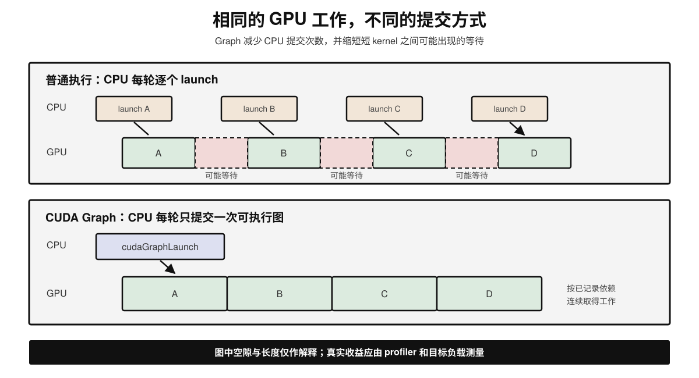
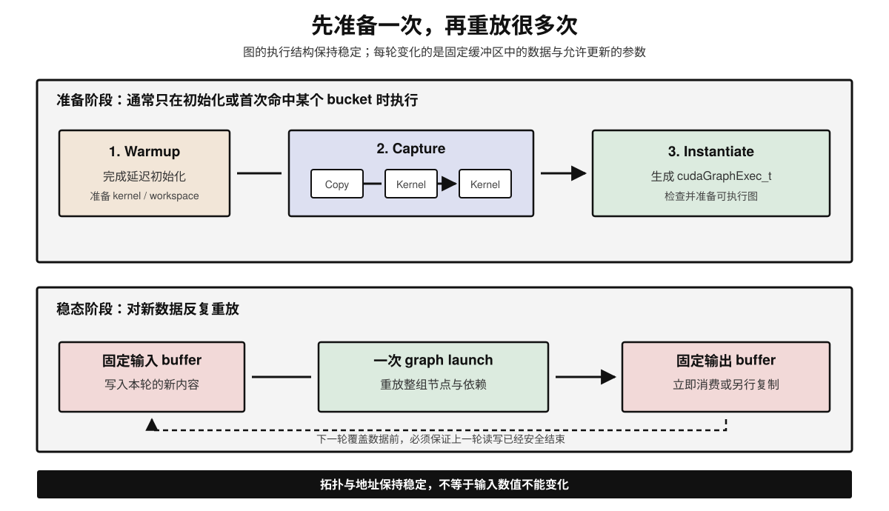

# CUDA Graph 原理简介

## 学习路径

1. 先从普通 CUDA 执行中的 CPU launch 开销出发，理解 CUDA Graph 要解决什么问题；
2. 再看捕获、实例化和重放三个阶段，理解它为什么能够减少提交次数；
3. 接着区分它能优化与不能优化的部分，并理解静态拓扑、内存地址和同步约束；
4. 最后连接到 LLM Decode、动态 batch 和 KV Cache，判断何时值得使用。

---

## 1. CUDA Graph 解决什么问题

### 1.1 GPU 很快，提交工作也需要时间

一次 GPU 计算并不是 CPU 调用函数后立刻完成。以普通的 eager 执行为例，CPU 通常要按顺序：

1. 准备 kernel 参数；
2. 向 CUDA stream 提交 kernel 或内存操作；
3. 由驱动与运行时处理这次 launch；
4. GPU 从 stream 中取得工作并执行。

单次 launch 的开销通常不大，但神经网络的一次前向可能包含大量短 kernel。若每个 kernel 的执行时间与 launch 开销处于相近量级，CPU 就可能来不及持续供给工作，GPU 时间线上会出现空隙。

这个问题在以下场景更明显：

- 同一组短 kernel 被高频重复执行；
- batch 较小，单个 kernel 很快；
- CPU 繁忙，或 CPU 与 GPU 之间的提交延迟较高；
- LLM Decode 每轮只处理少量新 token，但需要重复执行整套模型算子。

因此，这里的瓶颈不一定是 GPU 算得慢，而可能是 **CPU 一次次描述并提交相同工作，GPU 等待下一项工作到达**。

### 1.2 核心作用：一次定义，多次重放

CUDA Graph 把一组 GPU 操作及其依赖关系记录为图。应用先捕获并实例化这张图，之后只需发起一次 graph launch，CUDA 就能重放整组操作，不必由 CPU 每轮逐个提交所有节点。



可以把两种路径概括为：

```text
普通执行：每一轮都提交 kernel A → B → C → D
Graph：   首次记录 A → B → C → D；之后每轮只提交「重放整张图」
```

CUDA Graph 优化的是 **工作提交与调度开销**。它不会自动减少某个 kernel 内部的 FLOPs，也不会自动把低效 kernel 变成高效 kernel。

---

## 2. 基础原理：从操作序列到可执行图

### 2.1 图里有什么

CUDA Graph 由节点和依赖边组成。节点可以表示 kernel、内存复制、内存设置、事件操作等工作；边表示执行依赖。

例如，某次计算必须先复制输入，再执行两个 kernel，最后复制结果：

```text
H2D Copy → Kernel A → Kernel B → D2H Copy
```

普通 stream 通过提交顺序表达这些关系；Graph 则显式保存节点与依赖。没有依赖关系的分支可以并行，但 Graph 不会凭空创造并行性，实际并发仍取决于节点关系、stream 语义、资源和硬件能力。

### 2.2 三个阶段

#### 阶段一：Capture（捕获）

程序执行一次代表性的工作流，CUDA 记录操作和依赖，不把它仅仅当作一串每轮都要重新提交的临时命令。

常见方式有两类：

- **Stream Capture**：让现有 CUDA 代码在捕获区间内照常发起操作，由运行时生成图；适合已有程序。
- **显式 Graph API**：直接创建节点并添加依赖；控制更细，但开发成本更高。

捕获期间的调用必须是 capture-safe。会引入无法记录的同步、使用不兼容 API，或依赖每轮 CPU 决策的逻辑，都可能让捕获失败或得到错误语义。

#### 阶段二：Instantiate（实例化）

捕获得到的 `cudaGraph_t` 是图的定义。运行时将它实例化为可执行对象 `cudaGraphExec_t`，在这一阶段完成必要的检查与执行准备。

实例化并非零成本，所以通常在初始化或 warmup 后做一次，而不是每个请求都重新实例化。

#### 阶段三：Replay（重放）

程序通过 `cudaGraphLaunch` 把可执行图提交到 stream。CPU 只发起一次 graph launch，图中的节点按已经记录的依赖执行。

重放可以发生很多次。只要重放次数足够，首次捕获和实例化的成本就能被后续节省的 launch 开销摊薄。



---

## 3. 为什么重放更快

假设一次迭代有 $N$ 个 kernel。为便于理解，把 CPU 逐个提交的成本记作 $t_{launch}$，一次 graph launch 的成本记作 $t_{graph}$：

```text
普通执行的 CPU 提交成本 ≈ N × t_launch
Graph 重放的 CPU 提交成本 ≈ t_graph
```

这只是解释方向的简化模型，不表示实际延迟一定线性，也不能用它直接预测加速比。驱动、依赖处理、异步提交与 CPU/GPU 重叠都会影响结果。

CUDA Graph 的收益主要来自：

1. **减少 CPU API 调用和 launch 次数**：一张图代替许多逐项提交；
2. **减少 kernel 之间的空隙**：GPU 更容易连续取得已经准备好的工作；
3. **降低提交抖动**：重放路径更固定，CPU 调度波动对每轮时间线的影响通常更小；
4. **释放 CPU 时间**：CPU 可以处理调度、网络、采样或其他请求。

### 3.1 收益取决于谁是瓶颈

| 场景 | 预期收益 | 原因 |
| --- | --- | --- |
| 大量短 kernel，重复路径稳定 | 通常更明显 | launch 开销在总时间中占比较高 |
| 少量长 kernel | 通常有限 | GPU 计算时间远大于提交开销 |
| 每轮拓扑和 shape 大幅变化 | 使用困难或命中率低 | 难以复用同一张图 |
| 首次只执行一两轮 | 可能不划算 | 捕获与实例化成本来不及摊薄 |
| CPU 已是繁忙的调度瓶颈 | 可能改善吞吐和尾延迟 | 减少每轮 CPU 提交工作 |

所以，判断是否需要 CUDA Graph，应该先用 profiler 看 CPU launch、GPU 空洞和 kernel 时长，而不是只看 GPU 利用率。

---

## 4. Graph 固定了什么

“重放同一张图”要求后续执行与捕获时足够相似。最重要的约束是 **拓扑稳定、参数可更新、地址可访问**，而不是简单地说所有数据都必须永远不变。

### 4.1 拓扑与控制流

图中有哪些节点、节点之间如何依赖，通常在实例化时已经确定。若 Python 或 C++ 控制流导致每轮执行完全不同的算子路径，一张图就难以覆盖所有情况。

常见做法是：

- 为少量常见 shape 或 batch size 分别捕获图；
- 将输入 padding 到预先支持的 bucket；
- 不稳定的部分继续 eager 执行，稳定子图使用 Graph；
- 对可更新的节点参数使用 Graph update 能力，但先确认变更满足更新限制。

Graph update 不是任意修改程序：允许更新的内容和兼容条件取决于节点类型与 CUDA 版本。如果拓扑变化不兼容，仍需要重新实例化或重新捕获。

### 4.2 内存地址与数据内容

捕获时使用的设备指针会成为节点参数的一部分。重放时可以改变这些地址中的**内容**，但不能假设任意换一块新地址后图会自动跟随。

一种常见模式是预先分配稳定的输入、输出和工作区：

```text
每轮开始：把新输入写入固定输入 buffer
Graph replay：从相同地址读取，写入固定输出 buffer
每轮结束：消费或复制输出内容
```

因此需要注意：

- 不要在 Graph 仍使用 buffer 时覆盖它；
- 重放得到的输出可能复用同一存储，若要长期保留应复制；
- 捕获区间内的动态内存分配必须由框架或分配器正确支持；
- 多个并发重放若共享输入或输出 buffer，需要独立缓冲区或严格同步。

### 4.3 Shape 与工作量

许多 kernel 的 grid、参数和内存布局由 tensor shape 决定。固定 shape 最容易重放；动态 shape 通常需要 bucketing、padding、多图缓存或局部捕获。

Padding 虽然能提高图复用率，却会引入额外计算。bucket 太少，padding 浪费较大；bucket 太多，捕获时间、图缓存和显存占用又会上升。这是工程上的直接权衡。

---

## 5. 它不能解决什么

### 5.1 不会优化 kernel 内部算法

若一个 GEMM 本身占 20 ms，Graph 仍然要执行这个 GEMM。想减少其计算或访存，应考虑更合适的 kernel、量化、算子融合、FlashAttention 或模型结构优化。

CUDA Graph 与 kernel fusion 也不是同一件事：

- **Graph**：减少一组操作从 CPU 提交到 GPU 的开销；
- **Fusion**：把多个操作合并进更少的 kernel，减少中间读写和 launch；
- 两者可以同时使用，融合后的重复工作流仍可被捕获。

### 5.2 不会减少模型语义上的工作量

Graph 不会：

- 避免历史 K/V 重算；这是 KV Cache 的作用；
- 改变 Attention 的复杂度；
- 自动提高 batch 利用率；这是调度和 Continuous Batching 关注的问题；
- 自动降低权重、KV Cache 或激活的容量需求。

### 5.3 不保证端到端延迟按 kernel 数量成比例下降

端到端请求还包括排队、tokenization、Prefill、采样、网络传输与同步。即使 Decode 的 GPU 时间缩短，TTFT 或客户端观测的 ITL 也不一定同比下降。

---

## 6. CUDA Graph 在 LLM 推理中的作用

### 6.1 为什么 Decode 很适合

自回归 Decode 每一轮只新增少量 token，却要依次执行模型各层。与大型 Prefill 相比，Decode 中单个算子的工作量往往较小，CPU launch 开销更容易占据可见比例；而模型层结构在各轮之间高度重复。

因此 CUDA Graph 常用于：

- 固定或分桶后的 Decode batch；
- 固定 tensor shape 的模型前向；
- 高频重复的采样前后 GPU 子流程；
- 一部分 shape 稳定、可独立捕获的执行路径。

### 6.2 动态 batch 为什么带来困难

Continuous Batching 会在迭代边界加入和移除请求，实际 batch size、序列状态和 slot 映射不断变化。若每一种组合都重新捕获，成本与图缓存会失控。

推理引擎通常采用一种或多种办法：

1. **Batch size 分桶**：为 1、2、4、8 等常用规模分别准备图，并将较小 batch padding 到可用桶；
2. **固定物理 shape，更新逻辑映射**：计算张量保持固定大小，通过 metadata 指明哪些 slot 有效；
3. **Graph 与 eager 混合**：常见 Decode 路径重放，罕见 shape、超长 Prefill 或不兼容操作回退到 eager；
4. **缓存多张图**：以 batch、shape 或其他执行条件作为 key，复用已经实例化的图。

这些方法让“请求集合动态变化”与“GPU 执行形状相对稳定”同时成立，但会增加 padding、静态 buffer 和图缓存开销。

### 6.3 与 KV Cache 的关系

KV Cache 的内容每轮都变，但其存储池地址可以保持稳定。调度器更新 token、position、slot mapping 和 block table 等输入内容，Graph 重放则在固定的执行框架中读取这些 metadata，并访问对应的 KV 块。

二者解决的问题不同：

| 技术 | 主要避免什么 | 主要代价 |
| --- | --- | --- |
| KV Cache | 重复计算历史 token 的 K/V | 持续占用显存并读取历史 K/V |
| PagedAttention | 连续预留和外部碎片 | 块表、间接寻址与管理开销 |
| Continuous Batching | 等待整批完成造成的空缺 | 更复杂的调度与延迟权衡 |
| CUDA Graph | 每轮逐个提交相同 GPU 操作 | 捕获、静态缓冲区、图缓存与灵活性成本 |

这些技术可以共同出现：调度器选出本轮请求，PagedAttention 提供 KV 地址映射，KV Cache 避免历史重算，CUDA Graph 减少这轮模型计算的提交开销。

---

## 小结

CUDA Graph 的核心不是让 GPU “算得更少”，而是让 CPU 不必反复逐项描述同一套 GPU 工作：

1. 普通 eager 执行每轮逐个提交 kernel，大量短 kernel 可能暴露 CPU launch 开销；
2. CUDA Graph 先捕获操作与依赖，再实例化为可执行图，后续用一次 graph launch 重放；
3. 它主要减少提交开销、kernel 间空隙和 CPU 抖动，不会自动优化 kernel 算法；
4. 复用依赖稳定的拓扑、地址与执行形状，动态 workload 通常需要分桶、多图缓存或 eager 回退；
5. LLM Decode 路径重复且 kernel 较碎，通常比大型 Prefill 更容易获益；
6. 是否值得使用，应以 profiler 中的 launch 空隙、稳态延迟、图命中率和额外显存共同判断。
