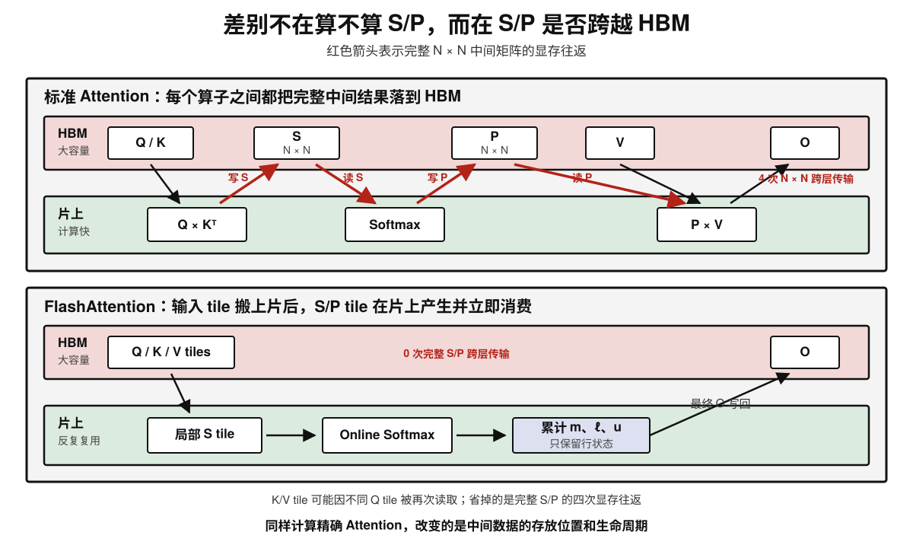
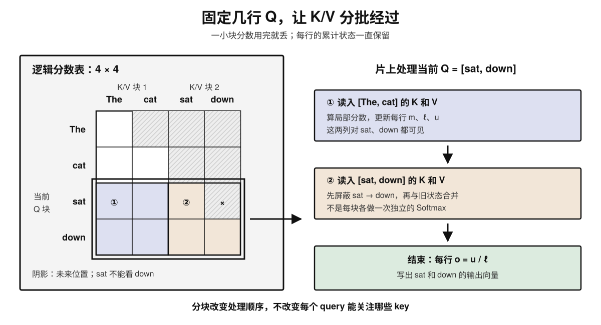
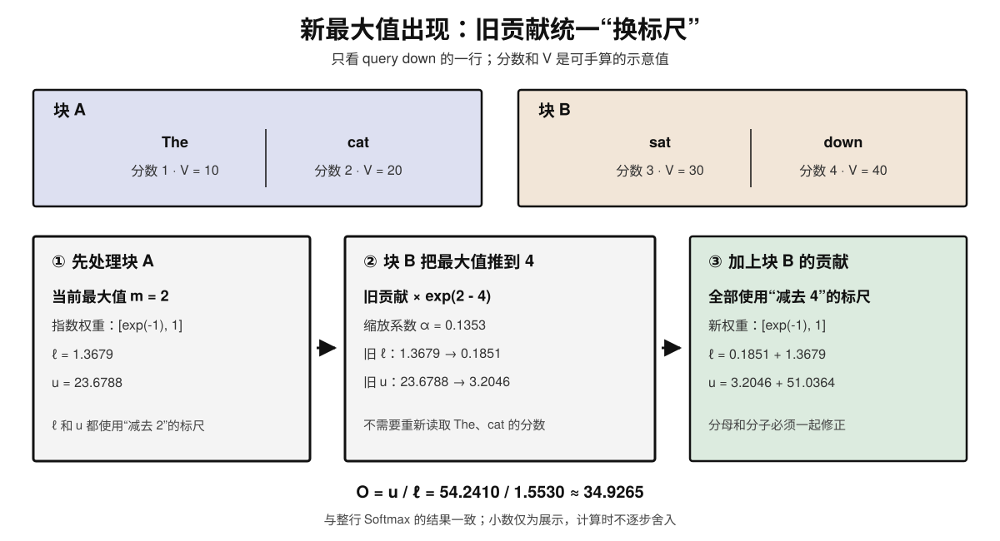
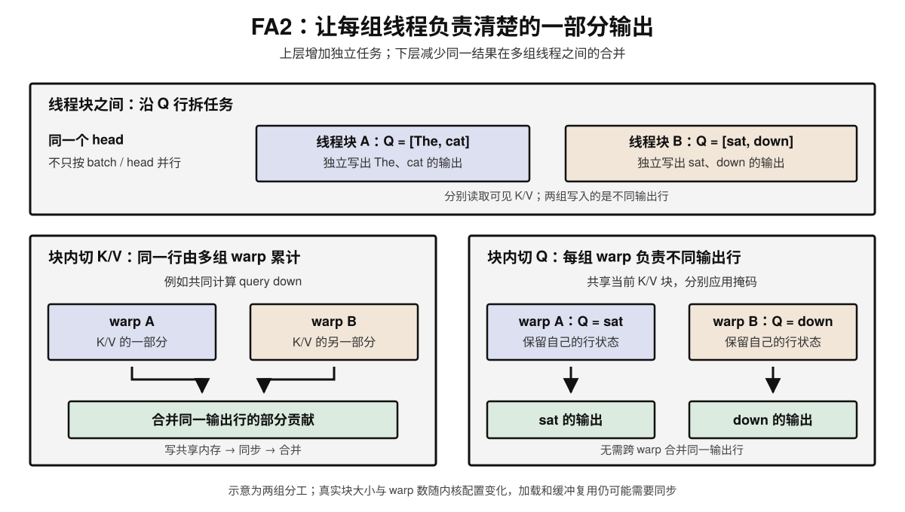
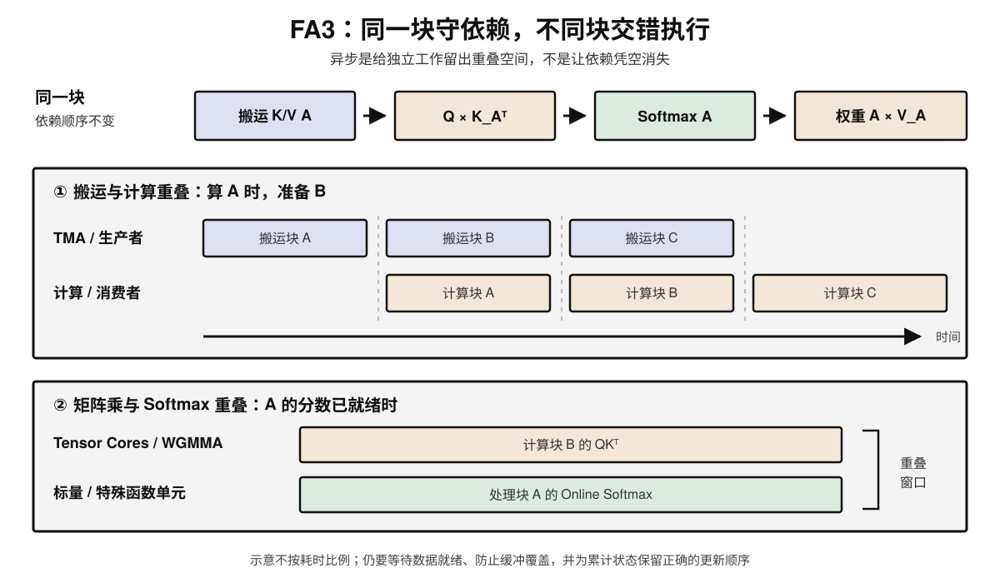
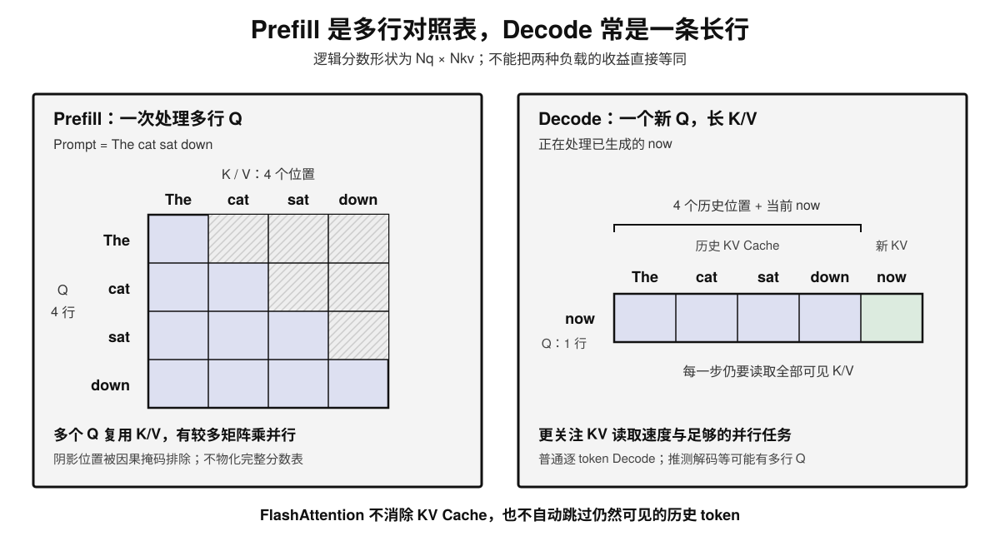

# FlashAttention 原理简介

## 学习路径

1. 先看标准 Attention 的中间矩阵为什么大，以及 GPU 把时间花在哪里；
2. 再用一个可手算的例子理解 Online Softmax，解决“分块后如何正确归一化”；
3. 把分块、统计量和输出累积串起来，理解前向计算与反向重算；
4. 接着学习 FlashAttention-2 的工作划分，以及 FlashAttention-3 的 Hopper 异步流水线；
5. 最后连接 KV Cache、Prefill/Decode 和实际后端，学习如何验证正确性与性能。

---

## 1. FlashAttention 优化的是什么

**KV Cache 避免跨生成步重算历史 K/V；FlashAttention 减少一次 Attention 内部的显存读写。** 两者解决不同问题，可以一起使用。

先只看一个 head、一个序列，不考虑 dropout。设序列长为 $N$，head dimension 为 $d$，且 V 的维度也取 $d$：

$$
S=\frac{QK^\top}{\sqrt d}+A,\qquad
P=\operatorname{softmax}_{\mathrm{row}}(S),\qquad
O=PV
$$

其中 $A$ 是注意力掩码：允许关注的位置加 0，禁止关注的位置加 $-\infty$。不使用掩码时可省略它。

| 张量 | 表示什么 | 形状 |
| --- | --- | --- |
| Q、K、V | 当前层的查询、键和值 | $N\times d$ |
| S | 每个 query 对各个 key 的分数 | $N\times N$ |
| P | 每行归一化后的注意力权重 | $N\times N$ |
| O | 对 V 加权求和后的输出 | $N\times d$ |

例如句子 `The cat sat down`，把这些词暂时当作四个示意 token。计算 `sat` 的输出时，它的 Q 与允许看见的 K 比较，得到一行分数，再用这一行的权重汇总 V。**需要交给下一层的是输出向量，不一定需要保存整张“谁关注谁”的表。** 实际 token 边界由 tokenizer 决定。

FlashAttention 保留上述注意力定义，改变分块、计算和存储的顺序。这里讨论的是精确的稠密/因果 Attention，不是稀疏近似；“精确”指数学上的等价，不保证不同浮点计算路径逐 bit 一致。

---

## 2. 标准 Attention 的显存读写成本

### 2.1 HBM 很大，片上工作空间很小

可以把 HBM 理解为所有 SM 都能访问的大容量存储区，把每个 SM 的 shared memory 和寄存器理解为就近的工作空间。前者能放下模型和长序列，后者适合反复使用正在计算的小块。

| 位置 | 主要职责 | 需要记住的限制 |
| --- | --- | --- |
| HBM / 显存 | 保存输入、输出、权重与 KV Cache | 带宽很高，但搬运仍有成本 |
| Shared memory | 在线程块内共享 Q/K/V 等数据块 | 每个 SM 的容量有限，不能当成全 GPU 共用的大池子 |
| 寄存器 | 保存线程使用的累加值与局部状态 | 用量过大会限制同时驻留的工作，甚至溢出到更慢的存储 |

后文的“片上”是对 shared memory、寄存器等工作空间的简化描述，不意味着所有中间量都存放在同一块 SRAM。真实 GPU 还有 L1/L2 缓存，这里先省略。

### 2.2 为什么完整 S、P 是额外负担

图中上半部分把矩阵乘、Softmax 和第二次矩阵乘作为分开的操作：写 S、读 S、写 P、读 P。下半部分在一个融合的计算流程中消费局部结果，避免完整 S、P 落入 HBM。这里比较的是**物化中间矩阵的朴素实现**，不是说所有框架默认都走上面的路径。

以 $N=8192$、$d=128$、每元素 2 bytes 为例：

$$
\begin{aligned}
\text{一张 S 或 P} &= 8192^2\times2 = 128\ \text{MiB} \\
\text{一张 Q、K、V 或 O} &=8192\times128\times2 = 2\ \text{MiB}
\end{aligned}
$$

单个 head 中，仅 S、P 各写一次再读一次，就有约 **512 MiB 的逻辑读写量**，还没有计入 Q/K/V/O。实际 HBM 流量受缓存命中、数据类型和算子实现影响，不能直接把这个数当成测量值。

### 2.3 算得多，不一定耗时更长

性能要同时考虑算术工作和数据搬运。一个粗略的下界是：

$$
t\gtrsim\max\left(
\frac{\text{FLOPs}}{\text{有效计算吞吐}},
\frac{\text{HBM bytes}}{\text{有效显存带宽}}
\right)
$$

它不是精确计时公式，还没有包含依赖、同步和 kernel 启动等开销。启发是：如果瓶颈在数据搬运，少写读一些中间结果，即使增加少量计算，也可能更快；优化之后，瓶颈还可能转移到计算或同步。不能简单把所有 Attention 都归为带宽受限。

---

## 3. Tiling：大表不落地，小块接着算

### 3.1 一次只搬当前能处理的部分

想象要处理一张很大的对照表，但桌面只能放几页。没有必要把整张表铺开：固定几行 query，把 K/V 一批批搬上来，每处理一批就更新这几行的结果。

把 Q 按 $B_r$ 行切块，把 K、V 按 $B_c$ 行切块。一次处理：

$$
Q_i\in\mathbb R^{B_r\times d},\quad
K_j,V_j\in\mathbb R^{B_c\times d},\quad
S_{ij}\in\mathbb R^{B_r\times B_c}
$$

这里的 $i,j$ 是块编号。下图仍用 `The cat sat down`，每块两行。固定 `sat`、`down` 的 Q，依次访问两块 K/V：

**因果掩码并没有消失**：`sat` 可以看 `The`、`cat` 和自己，不能看后面的 `down`。完全位于未来的块可以跳过，跨越对角线的块仍要逐元素应用掩码。这只是省掉原本就不允许的连接，不是引入稀疏近似。

### 3.2 为什么不能每块独立做 Softmax

分数可以分块算，但同一个 query 的所有可见 key 必须共用一个归一化分母。

例如 `down` 对四个词的分数为 $[1,2,3,4]$。分别对 $[1,2]$ 和 $[3,4]$ 做 Softmax，两块都会得到约 $[0.2689,0.7311]$：它们只知道块内高低，不知道第二块整体高了 2。

直接拼接，权重总和变成 2；再平均一下虽然总和回到 1，却错误地让两块各占一半权重。**真正需要保留的是每块在同一标尺下的总权重，以及对输出的贡献。**

---

## 4. Online Softmax：换标尺，不丢旧结果

### 4.1 减去最大值为什么不改变结果

对一行分数 $s$，稳定的 Softmax 写法是：

$$
p_j=\frac{e^{s_j-m}}{\sum_k e^{s_k-m}},\qquad m=\max_k s_k
$$

分子、分母都乘了同一个 $e^{-m}$，比例不变；同时所有指数的输入都不大于 0，避免对很大的正数直接求指数。减去最大值解决的是溢出风险，不意味着浮点舍入或极小项下溢都不存在。

困难在于：逐块扫描时，**后面可能遇到更大的分数**，所以最大值这把“标尺”也在变化。

### 4.2 每行带着三份状态向前走

对已经处理过的 key 集合 $\mathcal J$，保留：

$$
\begin{aligned}
m &= \max_{j\in\mathcal J}s_j \\
\ell &= \sum_{j\in\mathcal J}e^{s_j-m} \\
u &= \sum_{j\in\mathcal J}e^{s_j-m}v_j
\end{aligned}
$$

- **$m$：当前标尺**，已经看过的最大分数。
- **$\ell$：总权重**，还没有归一化的指数和，是一个标量。
- **$u$：内容累计值**，用同样权重加总 V，是一个 $d$ 维向量，不是完整权重表。

处理完所有可见 key 后，输出就是 $o=u/\ell$。因此 Attention 不必先把整行 P 输出出来，再乘 V；它可以直接累计最终需要的加权和。

新来一块 $\mathcal B$ 时，先求新标尺和旧状态的缩放系数：

$$
m'=\max\left(m,\max_{j\in\mathcal B}s_j\right),\qquad
\alpha=e^{m-m'}
$$

再把旧状态和新贡献放到同一标尺下：

$$
\begin{aligned}
\ell' &= \alpha\ell+\sum_{j\in\mathcal B}e^{s_j-m'} \\
u' &= \alpha u+\sum_{j\in\mathcal B}e^{s_j-m'}v_j
\end{aligned}
$$

为什么旧结果只需乘一次 $\alpha$？因为对每一个旧分数，都有：

$$
e^{s_j-m'}=e^{s_j-m}\,e^{m-m'}
$$

也就是**所有旧贡献都统一缩小相同倍数**，无须找回每个旧分数。若新块没有更大的分数，则 $m'=m$、$\alpha=1$，直接加入新贡献即可。

### 4.3 四个词，两块数据，手算一次

只看 query `down` 的一行。为了方便手算，假设分数已经包含 $1/\sqrt d$ 的缩放，并把每个 V 简化为一个数：

| Key 对应的词 | The | cat | sat | down |
| --- | --- | --- | --- | --- |
| 分数 $s$ | 1 | 2 | 3 | 4 |
| 值 $v$ | 10 | 20 | 30 | 40 |

这些是演示数据，不是真实模型测得的注意力。

第一块处理 `The`、`cat`，取 $m=2$：

$$
\ell=e^{-1}+1\approx1.3679,\qquad
u=10e^{-1}+20\approx23.6788
$$

第二块出现分数 4，标尺改成 $m'=4$，旧结果乘 $e^{-2}$：

$$
\begin{aligned}
\ell' &= e^{-2}(e^{-1}+1)+(e^{-1}+1)\approx1.5530 \\
u' &= e^{-2}(10e^{-1}+20)+(30e^{-1}+40)\approx54.2410 \\
o &= u'/\ell'\approx34.9265
\end{aligned}
$$

一次性计算整行 Softmax，权重约为 $[0.0321,0.0871,0.2369,0.6439]$，加权输出同样约为 **34.9265**。不是把两块结果平均，而是重新对齐它们的权重。图中小数仅用于展示，实际计算不在每一步提前四舍五入。

---

## 5. 把前向计算串起来

下面采用 **Q 块驻留、循环扫描 K/V 块、最后才除以分母**的写法，接近 FA2 的前向组织方式，用来解释 FlashAttention 的共同思想；不要把它当成 FA1 原论文的逐行伪代码。

对一个 Q 块，执行以下流程：

1. **加载 Q 块**到片上，为每行初始化 $m=-\infty$、$\ell=0$、$u=\mathbf 0$。
2. **加载当前 K/V 块**，计算 $S_{ij}=Q_iK_j^\top/\sqrt d$。
3. **应用掩码**，不可见位置的分数设为 $-\infty$，其指数贡献为 0。
4. **更新标尺** $m'$，计算每行的 $\alpha=e^{m-m'}$。
5. **累计分母和输出**，用上一节公式更新 $\ell$、$u$，并令 $m\leftarrow m'$。
6. **复用临时空间**，当前分数块和指数权重块用完即可丢弃，继续下一块 K/V。
7. **写出结果**，每行计算 $o=u/\ell$，组成这个 Q 块的输出 $O_i$；训练时还保存所需行统计量。

全掩码的块内行没有贡献，应跳过该行更新或使用等价保护，不能直接计算 $-\infty-(-\infty)$。整行都无有效 key 时，还需要按接口约定处理输出；上述普通因果自注意力包含对自身的关注，不会出现这种整行为空的情况。

**这里融合的不只是三个算子名称，而是中间数据的生命周期。** 局部 S 算出来就做指数和累积，局部权重用完就释放，始终不要求完整 $N\times N$ 中间矩阵同时存在。

对这个简化调度，一个 Q 块的输出可在循环结束后写回；FA1 的循环顺序、反向计算和其他内核可能有不同的部分结果读写。共同保证是“不物化完整 S/P”，不是“所有输入只读一次、所有版本只写一次”。

---

## 6. 到底省了什么：计算、存储与 IO 分开看

### 6.1 显存线性，不代表计算线性

仍按单个 head、等长自注意力讨论，忽略固定大小的片上工作空间：

| 比较项 | 物化 S/P 的朴素实现 | FlashAttention |
| --- | --- | --- |
| 稠密前向的主要计算量 | $\Theta(N^2d)$ | $\Theta(N^2d)$ |
| 完整 S/P 的显存存储 | $\Theta(N^2)$ | 不物化 |
| 输入、输出及所需中间状态 | $\Theta(Nd+N^2)$ | $\Theta(Nd+N)$ |
| 因果 Attention 的可见连接 | 下三角 | 同样是下三角 |

“线性显存”说的是这个 Attention 算子的存储随 $N$ 的增长，不是整个模型的全部显存，也不是 KV Cache 被消除了。所有允许的 query-key 对仍要参与计算；因果掩码省掉约一半连接，但不改变二次量级。

### 6.2 IO 公式里的 M 是什么

FA1 论文在两级存储模型中，令 $M$ 为快存储能容纳的**元素数**，在 $d\le M\le Nd$ 的分析范围内，有：

$$
\begin{aligned}
\mathrm{IO}_{\mathrm{standard}} &= \Theta(Nd+N^2) \\
\mathrm{IO}_{\mathrm{FA1}} &= \Theta\left(\frac{N^2d^2}{M}\right)
\end{aligned}
$$

可以用 FA1 原论文的“外层遍历 K/V 块”来理解第二个式子：

1. 一个 K/V 块能放的行数约与 $M/d$ 成正比。
2. 共有约 $Nd/M$ 个 K/V 块；每块都要扫描全部 Q 及相应输出状态。
3. 每轮搬运量约与 $Nd$ 成正比，相乘得到 $N^2d^2/M$。

这里忽略常数，只说明数据复用的趋势。**$M$ 越充裕，一次处理的块越大，重复扫描可以越少。** 当 $M$ 相对 $d^2$ 足够大时，IO 优势更明显；若固定 $M,d$ 而只增长 $N$，这个 IO 表达式仍然是二次的，不能称为线性 Attention。

公式计的是元素读写，不是 bytes，也不是毫秒。换成字节要考虑每类数据的实际精度；Q/K/V、累计值和统计量不一定用同一种类型。不能直接把显卡共享内存的字节容量代入 $M$，更不能把整个 GPU 的片上容量当成单个线程块都能使用的空间。

实际调优还受寄存器、共享内存、同时驻留的线程块数量和矩阵乘形状约束。块越大并非总是越快：资源占用太多，会降低并行度或导致寄存器溢出。

---

## 7. 反向传播：不留整张草稿，需要时重算一块

训练时，反向传播需要注意力权重 P 来计算 Q/K/V 的梯度。如果前向没有保存完整 P，反向怎么办？

**保存能重建它的输入和少量摘要，而不是保存整张表。** 除 Q/K/V 和输出 O 外，FA2 式实现为每个 query 行保存一个 LogSumExp。对第 $r$ 行：

$$
L_r=m_r+\log\ell_r
=\log\sum_c e^{s_{rc}}
$$

反向处理某个块时，从 Q/K 重算局部分数，再利用该行摘要重建局部概率：

$$
p_{rc}=e^{s_{rc}-L_r}
$$

这里 $r,c$ 是 token 位置，分数包含同样的缩放与掩码。**不是只凭一个 $L_r$ 就能恢复 P**：Q/K 决定分数，$L_r$ 提供整行的归一化分母。FA1 保存 $m,\ell$ 也能达到同样目的。

因此，反向流程是：读取输入块与行摘要，重算 S/P 块，累计梯度，然后复用片上空间。若训练使用 dropout，还要保留能重现同一 dropout 掩码的随机状态，而不是重新随机一份。

这是一种有针对性的重计算。它增加了 FLOPs，却减少了大矩阵的保存和读取，因此可能同时省显存、提速度；不能据此推断所有重计算都会更快。纯推理没有反向传播，不需要为此保留训练状态。

---

## 8. FlashAttention-2：搬得少之后，还要分工合理

FA1 解决了“大量中间结果进出 HBM”的问题，但剩下的工作不一定能把 GPU 用好。FA2 主要改进三件事：减少非矩阵乘工作、增加线程块并行、减少 warp 之间的通信。

先区分两个层级：**thread block（线程块）**由 GPU 调度到 SM 上执行；一个线程块中又有多个 **warp**，在 NVIDIA GPU 上每个 warp 是 32 个线程。线程块并行和块内 warp 分工不是同一件事。

### 8.1 把长序列拆成更多可独立执行的任务

如果只按 batch 和 head 分配任务，长序列、小 batch 时，任务数量可能不够。FA2 前向进一步按 Q 的行块并行：一个任务处理 `The, cat` 的输出，另一个处理 `sat, down` 的输出。

给定本层的 Q/K/V 后，**不同 query 行的输出可以独立计算**，只需各自遵守掩码；不是必须等前一行的 Attention 输出算完。多个 Q 块各自扫描可见 K/V，并写入不同输出行，不必把同一行的结果跨线程块合并。

这不意味着自回归生成的未来 token 可以提前计算：这里并行的是一次前向中已经有输入的 query 行。

### 8.2 块内切 Q，少合并同一行的部分结果

FA1 的一种块内分工把 K/V 分给多个 warp。同一 query 的结果因此分散在不同 warp，需要经共享内存交换、同步并合并部分贡献。

FA2 前向改为把 Q 行分给不同 warp，让它们共享当前 K/V 块。每个 warp 负责自己的输出行，因此省去这类跨 warp 的输出归约。**省掉的是特定的结果合并，不是所有同步**；数据加载、缓冲区复用等仍有协作需求。

### 8.3 少做不能高效使用 Tensor Cores 的工作

矩阵乘通常能利用 Tensor Cores，最大值、指数、归约、缩放等工作则走不同的执行路径。它们的 FLOPs 占比不大，也可能拖慢整个流程。

FA2 使用前文的未归一化累计值 $u$，把除以 $\ell$ 延迟到最后，减少循环内反复归一化的工作；同时优化掩码和边界处理。注意，**每当最大值改变，必要的 $\alpha$ 重缩放仍然要做**，不能一起省掉。

---

## 9. FlashAttention-3：让搬运和计算重叠起来

这一节聚焦 FA3 针对 Hopper（例如 H100）的设计，不是所有 GPU 都具有相同的指令和执行方式。算法仍然是分块、在线归一化和累计输出，进一步变化的是执行时间表。

### 9.1 TMA 搬运，WGMMA 计算

- **TMA（Tensor Memory Accelerator）**：执行 HBM 与 shared memory 间的异步张量搬运，减少线程亲自搬数据和处理地址的工作。
- **WGMMA（Warpgroup Matrix Multiply-Accumulate）**：以 warpgroup 协作发起异步矩阵乘累加；Hopper 的一个 warpgroup 包含 4 个 warp。
- **Warp specialization**：让一些 warp 负责发起搬运，另一些负责消费数据和计算，形成生产者与消费者分工。

可以把它想成备料与加工：算当前块时，下一块已经在搬运。但需要多个缓冲区轮换，**不能把还没算完的数据覆盖掉**；消费者也必须等数据就绪后才能读取。

### 9.2 同一块有依赖，不同块可以交错

对同一个分数块，仍然有 $QK^\top\rightarrow\text{Softmax}\rightarrow PV$ 的依赖。Softmax 不可能使用尚未算出的分数，PV 也不能提前使用尚未得到的权重。

但当块 A 的分数已经就绪，就可以安排 **A 的 Softmax 与 B 的矩阵乘**交错执行；也可以让两个 consumer warpgroup 交替使用不同执行单元。FA3 利用异步指令、流水线和同步机制，缩短某些单元等待其他工作的时间。

图中只是说明可重叠的工作，不是逐指令复现，也不是等比例的性能测量。异步不代表“没有等待”：依赖点、缓冲区容量、寄存器压力和执行单元竞争仍然存在。流水线加深还会多占资源，不一定更快。

### 9.3 FP8：吞吐更高，但精度需要单独处理

FA3 还研究了利用 FP8 Tensor Cores 加速矩阵乘。不能把它理解成“将所有数据转成 FP8 就结束”：异常大值、缩放、累计精度和数据布局都会影响结果。

论文中的两种精度处理思路是：

1. **分块量化**：每块使用自己的缩放尺度，避免整张张量被少数大值拉大范围。
2. **Incoherent processing**：在量化前，对 Q/K 施加同一个正交变换，把集中在少数维度的异常值分散开。若 $R R^\top=I$，则在精确算术下：

$$
(QR)(KR)^\top=QRR^\top K^\top=QK^\top
$$

变换本身保持点积，但后续 FP8 量化仍然有误差，需要评估。**精确注意力算法与低精度数值误差是两层问题**，不能用前者宣称后者无损。

另外，“内核有 FP8 计算路径”不等于“直接兼容任意框架的 FP8 KV Cache”。缓存布局、量化尺度、接口和具体版本都必须匹配。本文用 FA1、FA2、FA3 解释演进思路，最新实现与硬件支持以官方仓库为准。

---

## 10. 回到推理：Prefill 与 Decode 的形状不同

### 10.1 一张大表，和一条长行

前面为了讲清算法，用的是等长自注意力。更一般地，query 长度为 $N_q$，K/V 长度为 $N_{kv}$，逻辑分数矩阵是 $N_q\times N_{kv}$。

**Prefill** 同时处理许多已有 token，Q 行较多，一个 K/V 块可服务多行 query，适合发挥分块复用和矩阵乘并行。朴素实现的大中间矩阵也是主要负担之一。

**普通逐 token Decode** 中，每条请求通常只有一个新 query，$N_q=1$，但 $N_{kv}$ 已经很长。分数不再是完整 $N\times N$，而是一条 $1\times N_{kv}$ 的长行。优化重点常转向快速读取历史 KV、为 GPU 提供足够并行任务，以及减少小内核开销；并不保证任何形状都由同一种瓶颈主导。

图中 Prompt 是 `The cat sat down`，Decode 正在处理已生成的 `now`：先得到它的 Q/K/V，把新的 K/V 追加到历史缓存，再用 `now` 的 Q 关注全部五个可见位置。Attention 输出仍是向量，后续还要经过模型的其他计算才得到下一个 token。

### 10.2 Decode 为什么又可能沿 K/V 切分

长 K/V、很少 Q 时，仅沿 Q 分工可能没有足够任务。Flash-Decoding 一类方法会把长 K/V 分成多段，让多个线程块计算各段的局部状态，再合并输出。

合并仍遵循同一条规则：先找各段最大值中的最大值，把每段的 $\ell,u$ 乘以对应的指数缩放系数，最后加总并归一化。**可以合并这些摘要，不能直接平均各段已归一化的输出。**

这与 FA2 块内“切 Q、少归约”并不矛盾：一个是在已有线程块内部减少通信，另一个是在任务太少时，通过额外合并换取更多线程块并行。合并有成本，是否采用取决于 Q/KV 长度、batch、head 数和硬件。

### 10.3 三种“块”不是同一个概念

| 名称 | 切的是什么 | 主要解决什么 |
| --- | --- | --- |
| FlashAttention 的 tile | 一次内核中参与计算的 Q/K/V 小块 | 片上复用，减少中间结果读写 |
| PagedAttention 的 page / block | KV Cache 的逻辑与物理存储单元 | 分配、寻址、共享与回收缓存 |
| Chunked Prefill 的 chunk | 一轮调度处理的 Prompt 片段 | 分摊长 Prompt 工作，与其他请求交错 |

一个 Prefill chunk 可以在内核里拆成很多 tile；一个 tile 读取哪些 KV pages，由实现的寻址与布局决定。不能假设这三种块的大小必须一样。

因此，**KV Cache 留住历史，分页管理存放位置，FlashAttention 优化读取后的计算过程**。FlashAttention 官方实现也提供支持分页 KV 的接口，不能把“支持分页”当成其他内核库独有的性质。

FlashInfer 是面向推理的内核库，FlashMLA 则围绕 MLA 注意力提供优化实现；它们不是简单排列在 FA1、FA2、FA3 后面的下一代编号。选择后端要看具体工作负载与支持范围。

---

## 11. 如何验证用对了，也确实更快

1. **确认实际执行的后端。** 调用了高层 Attention API，不等于一定运行 FlashAttention。检查框架日志或 profiler，结合 GPU、dtype、head dimension、掩码、窗口、dropout 和缓存布局确认兼容性；不支持时可能回退或报错。
2. **先对齐语义，再比较数值。** 用小尺寸、较高精度的参考计算比对输出，训练还要比对梯度；用合理误差容限，不要求逐 bit 一致。特别检查 Q/KV 长度不同时的因果位置对齐，以及 padding、GQA、全掩码行等边界。
3. **分别测 Prefill 与 Decode。** 在预热后，用 CUDA events 或正确的 GPU 同步方式计时，不把异步提交时间当作执行时间。固定输入形状、精度和掩码，区分朴素基线与已经融合的基线；记录 Attention 耗时和峰值显存，再看整模型的首 token 延迟、后续 token 延迟与吞吐。
4. **把低精度作为独立变量。** FP8 的结果要与相应高精度路径比较，既看数值误差，也看实际任务质量；同时确认缓存量化尺度与内核约定一致。不能把低精度带来的加速全部归因于分块算法。

一个容易踩的坑：不同 API 对不等长 Q/KV 的因果对齐约定可能不同。标准 Decode 中，最新 query 应能看见全部历史和自身，不能机械套用 $1\times N$ 矩阵左上角对齐的三角掩码，只留下第一个 key。

另一个边界是“返回完整注意力权重”：如果调用者明确要求输出整个 $N\times N$ 的 P，这个输出本身就需要二次存储，已经不再满足“只需要 O”的前提。

---

## 小结

**FlashAttention 的核心，是把一张必须算完的表，变成不必完整保存的表。** Tiling 控制一次处理的数据量，Online Softmax 保证分块合并仍然正确，融合与反向重算减少显存往返；FA2 改善分工，FA3 利用异步执行进一步重叠工作。

判断自己是否理解，可以回答三个问题：

- **新块最大值更大时，旧结果怎么办？** 分母 $\ell$ 和加权和 $u$ 一起乘 $e^{m-m'}$。
- **不保存 P，为什么还能计算输出和梯度？** 前向直接累计 $u/\ell$；反向从输入和行摘要重建局部 P。
- **用了 FlashAttention，长上下文 Decode 就不用读历史 KV 吗？** 仍然要读；它没有改变可见 token 的集合，也没有自动压缩 KV Cache。

## 参考资料

1. [FlashAttention: Fast and Memory-Efficient Exact Attention with IO-Awareness](https://arxiv.org/abs/2205.14135)：分块、IO 分析与反向重算。
2. [Online normalizer calculation for softmax](https://arxiv.org/abs/1805.02867)：在线更新最大值与归一化分母。
3. [FlashAttention-2: Faster Attention with Better Parallelism and Work Partitioning](https://arxiv.org/abs/2307.08691)：延迟归一化、序列维度并行和 warp 分工。
4. [FlashAttention-3: Fast and Accurate Attention with Asynchrony and Low-precision](https://arxiv.org/abs/2407.08608)：Hopper 异步计算、流水线与 FP8。
5. [FlashAttention 官方实现](https://github.com/Dao-AILab/flash-attention)：接口、硬件限制、变长输入与 KV Cache 支持。
6. [FlashAttention 深度解析：从 IO-Aware Tiling 到 Hopper 异步计算](https://forceinjection.github.io/09_inference_system/vllm/module_analysis/flashattention_deep_dive.html)：本文参考的中文学习材料。