# KV Cache 原理简介

## 学习路径

1. 先理解自回归生成为什么会重复计算，以及 Prefill、Decode 和 KV Cache 的基本流程；
2. 再理解为什么只缓存 K/V，以及缓存容量如何随模型、上下文和并发增长；
3. 接着学习不同注意力架构如何压缩缓存，以及 PagedAttention 如何管理显存；
4. 然后学习 Chunked Prefill 与 RadixAttention 如何改善调度和前缀复用；
5. 最后扩展到分布式 KV Cache 与托管模型服务的缓存策略。

---

## 1. 背景：大模型推理的挑战

在大语言模型（LLM）的推理过程中，尤其是文本生成任务中，模型通常采用自回归（Autoregressive）的方式逐个生成 Token。这种生成机制如果不加以优化，会面临严重的计算效率问题，理解这一基础模式是后续探索性能优化手段的前提。

### 1.1 自回归生成模式

在自回归生成中，模型根据之前的上下文（Context）预测下一个 Token。例如，给定输入 "Hello"，模型预测 "World"；接着给定 "Hello World"，模型预测 "!"。在没有缓存时，模型必须将 "Hello" 等历史上下文重复编码。这意味着每生成一个新的 Token，模型都需要回顾并重新计算之前所有的 Token。

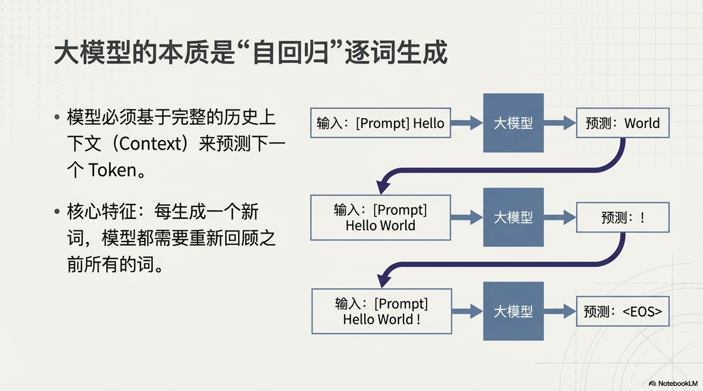

### 1.2 重复计算问题

如果不使用缓存机制，每生成一个新的 Token，模型都需要将之前所有 Token 重新输入模型，并重新计算它们的 Key (K) 和 Value (V) 矩阵。随着序列长度的增加，这种重复计算若仅看单步前向，无缓存时注意力计算量为 $O(N^2)$，其中 $N$ 为当前序列长度。若考虑从第 1 个 Token 生成到第 $L_{gen}$ 个 Token 的完整过程，累积计算量约为 $O(L_{gen}^3)$，延迟将随生成长度急剧恶化。

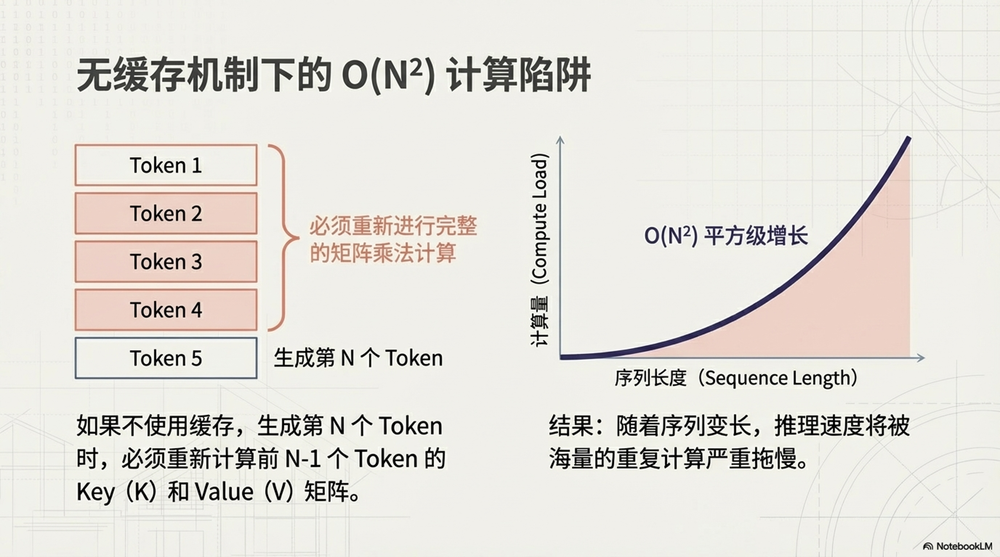

---

## 2. KV Cache 核心原理

为了解决自回归生成中的重复计算问题，KV Cache 技术通过“空间换时间”的策略，将已计算过的中间结果存储起来，从而避免了大量冗余的矩阵运算，直接降低了单步推理的计算复杂度。


### 2.1 什么是 KV Cache？

KV Cache 本质上是一种缓存机制，用于存储 Transformer 模型中 Attention 层的 Key 和 Value 矩阵。在推理过程中，模型只需要计算**当前新生成 Token** 的 Query (Q)、Key (K) 和 Value (V)，然后将新的 K 和 V 追加到缓存中。最后，利用当前的 Q 与**完整的缓存**（历史 K/V + 当前 K/V）进行注意力计算。


### 2.2 工作流程详解

KV Cache 的工作流程可以分为两个阶段：

1. **Prefill 阶段（首 Token 生成）**：
   - 模型接收完整的 Prompt 输入。
   - 计算所有输入 Token 的 K 和 V，并将它们存入 Cache。
   - 生成第一个输出 Token。
     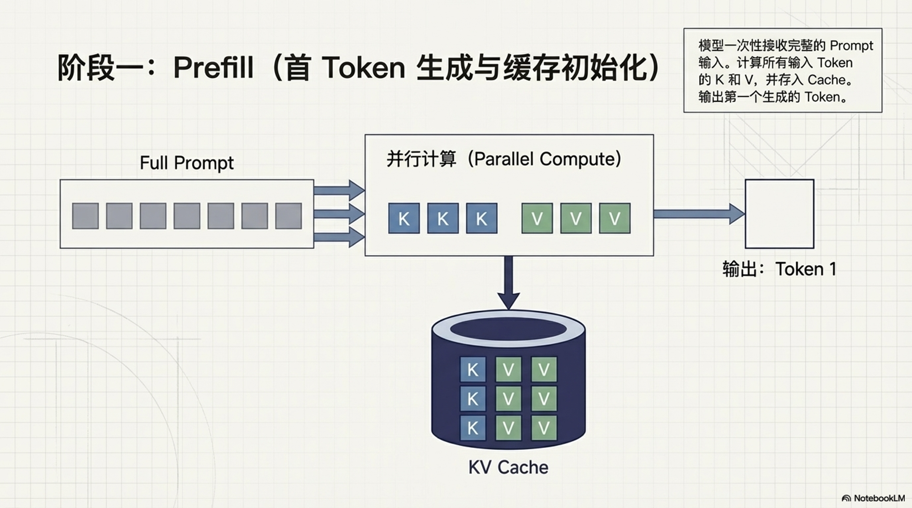

2. **Decode 阶段（后续 Token 生成）**：
   - 模型仅接收上一步生成的 Token。
   - 计算该 Token 的 Q、K、V。
   - 将新计算的 K、V 追加（Append）到 Cache 中。
   - 利用完整的 Cache (历史 K/V + 当前 K/V) 计算 Attention。
   - 生成下一个 Token，循环上述过程。
     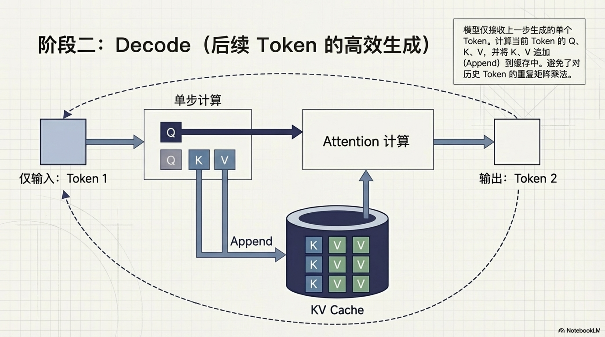


---

## 3. 为什么只缓存 K 和 V
缓存的判断标准不是“计算是否昂贵”，而是“以后是否还会读取”。

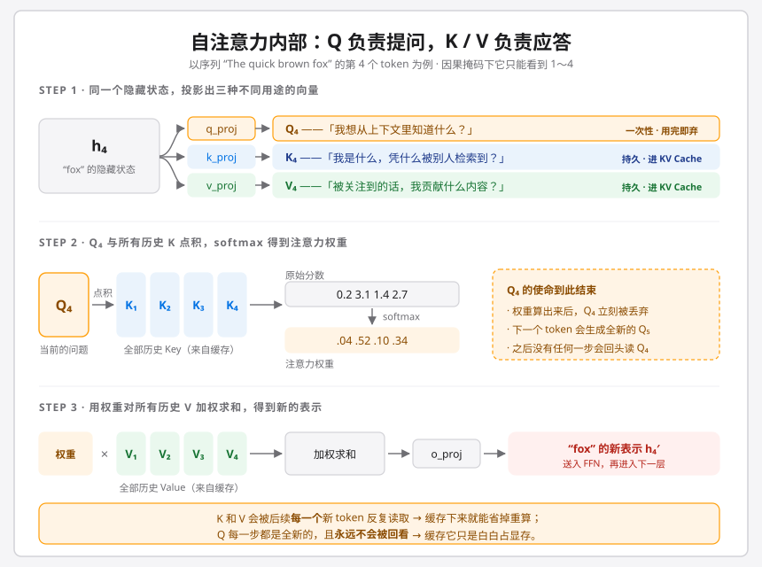

同一个隐藏状态经过 `q_proj`、`k_proj` 和 `v_proj` 得到三种用途不同的向量：

| 角色          | 含义                                                    | 生命周期                       |
| ------------- | ------------------------------------------------------- | ------------------------------ |
| **Q (Query)** | 当前 token 提出的「问题」——"我该关注哪些之前的 token？" | 一次性：提出并得到答案后即废弃 |
| **K (Key)**   | 每个 token 提供的「索引标签」——"我包含哪些信息？"       | 持久：后续每个 token 都要检索  |
| **V (Value)** | 每个 token 提供的内容摘要——"关注我的话，我贡献什么？"   | 持久：后续每个 token 都要读取  |

```text
Decode Step t:

  Q_t 需要查询: K_1, K_2, ..., K_t       ← 所有 Key（含自己）
  Q_t 需要读取: V_1, V_2, ..., V_t       ← 所有 Value（含自己）
  Q_t 不需要:   Q_1, Q_2, ..., Q_{t-1}   ← 过去的 Query 对当前 token 无意义
```

因果掩码使每个新 token 只查询自己和之前位置的 K/V。过去的 Q 不会再参与后续计算，因此
缓存它只会占用显存；历史 K/V 则会在每个 Decode step 被反复读取。

---

## 4. 显存占用与容量估算

虽然 KV Cache 极大地提升了推理速度，但这种”空间换时间”的做法也带来了显著的显存开销。随着并发请求数（Batch Size）和上下文序列长度的增加，动态增长的缓存数据会占用大量 GPU 显存，成为制约系统吞吐量的核心瓶颈。

### 3.1 显存占用的主要构成

在 LLM 推理中，显存主要被以下三部分占用：

1. **模型权重 (Model Weights)**：静态占用，取决于模型参数量和精度。
2. **KV Cache**：动态占用，随着序列长度和 Batch Size 线性增长。
3. **中间激活 (Intermediate Activations)**：推理时的临时计算缓冲区。

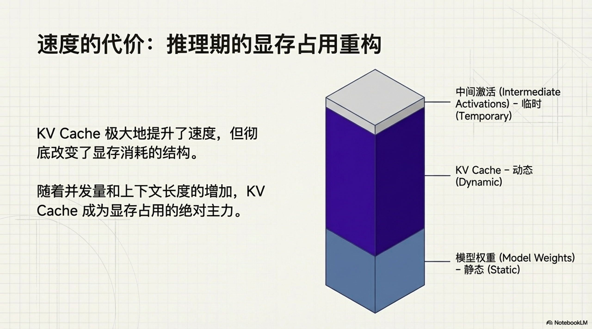

### 3.2 KV Cache 显存计算公式

KV Cache 的显存占用可以通过以下公式估算：

$$
\mathrm{Memory}_{KV} \approx 2 \times b_{kv} \times L \times B \times S \times N_{kv} \times d_{head}
$$

其中：

- $2$：同时缓存 Key 和 Value 矩阵。
- $b_{kv}$：数据精度（Bytes），如 FP16 为 2。
- $L$：模型层数 (Layers)。
- $B$：并发请求数 (Batch Size)。
- $S$：每个请求的平均序列长度（Prompt + 已生成 Token）。
- $N_{kv}$：每层实际生成并缓存的 KV Head 数量，即 `num_kv_heads`；它直接决定每个 Token 要保存多少组 K/V。
- $N_{attn}$：Query Head 数量，即 `num_attention_heads`；Query 不会写入 KV Cache，因此它不直接出现在公式中，而是决定多个 Query Head 如何共享 KV Head。
- $d_{head}$：单个 Attention Head 的维度，即 `head_dim`。

$N_{kv}/N_{attn}$ 表示 KV Head 的共享程度：MHA 中二者相等，每个 Query Head 使用独立的 KV Head；GQA 中多个 Query Head 共享一组 KV Head；MQA 中 $N_{kv}=1$，所有 Query Head 共享同一组 K/V。在其他条件不变时，GQA/MQA 的 KV Cache 大小约为 MHA 的 $N_{kv}/N_{attn}$。

**MHA（$N_{kv}=N_{attn}$）：**

$$
\mathrm{Memory}_{MHA} \approx 2 \times b_{kv} \times L \times B \times S \times N_{attn} \times d_{head}
$$

**GQA（$1<N_{kv}<N_{attn}$）：**

$$
\mathrm{Memory}_{GQA} \approx 2 \times b_{kv} \times L \times B \times S \times N_{kv} \times d_{head}
= \mathrm{Memory}_{MHA} \times \frac{N_{kv}}{N_{attn}}
$$

**MQA（$N_{kv}=1$）：**

$$
\mathrm{Memory}_{MQA} \approx 2 \times b_{kv} \times L \times B \times S \times d_{head}
= \frac{\mathrm{Memory}_{MHA}}{N_{attn}}
$$

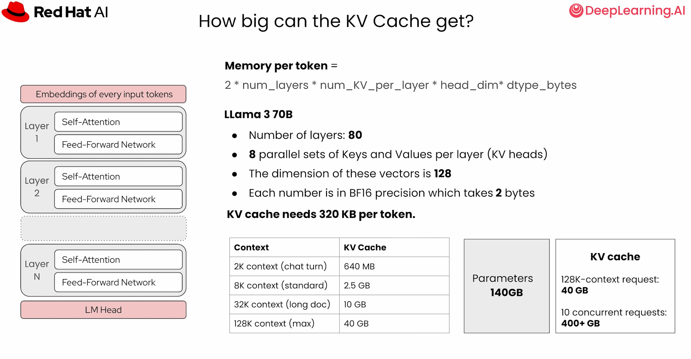

### 3.3 Batch Size 对 KV Cache 的影响

上面 $B$ 这个参数经常被初学者忽略——"我先算好 per-token 的 KV Cache，乘以序列长度，就得到显存占用了"。这个算法在 batch=1 时是对的，但在真实推理服务中，**多个请求是并发处理的**，每个请求都需要自己独立的 KV Cache。

**逐级展开公式：**

$$
\begin{aligned}
\mathrm{per token} &= 2 \times b_{kv} \times L \times N_{kv} \times d_{head} \\[4pt]
\mathrm{per sequence} &= \mathrm{per token} \times S \quad \text{(序列长度)} \\[4pt]
\text{total} &= \mathrm{per sequence} \times B \quad \text{(并发请求数)}
\end{aligned}
$$

**核心结论：**

1. **Batch Size 不是"免费"的**：b=1 时 KV Cache 占比很小，但 b=32 时长上下文场景 KV Cache 远超模型权重，成为显存的真正瓶颈。
2. **长上下文 + 大 batch = KV Cache 爆炸**：两者是乘法关系（$S \times B$），任何一项增大都会等比例放大显存压力。
3. **优化方向由此展开**：减少 per-token（量化、GQA/MLA）、减少并发 Cache（Offloading）、减少重复 Cache（Prefix Caching）——所有 KV Cache 优化策略都是为了在有限的 GPU 显存中容纳更多的 $S \times B$。


---

## 5. 速度与显存的权衡

| 特性           | 标准推理 (Standard Inference)     | KV Caching                      |
| :------------- | :-------------------------------- | :------------------------------ |
| **单步计算量** | 随序列长度平方级增长 ($O(N^2)$)   | 随序列长度线性增长 ($O(N)$)     |
| **显存占用**   | 较低，主要取决于模型权重          | 较高，随序列长度线性增加        |
| **推理速度**   | 随生成长度增加显著变慢 (计算瓶颈) | 速度快且相对稳定 (显存带宽瓶颈) |
| **适用场景**   | 短文本、显存极其受限的场景        | 长文本生成、高吞吐服务          |

---

## 6. 注意力架构决定缓存形态
KV Cache 存的是每一层每个 token 的 Key 和 Value。但 "Key" 和 "Value" 到底有几个？这取决于注意力类型——MHA 下 64 个 Q head 就有 64 组 K/V，GQA 下 64 个 Q head 可能只共享 8 组 K/V，MLA 下 K/V 干脆被压缩成了 latent vector。KV Cache 的物理大小直接由注意力架构决定。

---

### 一、MHA（多头注意力）：每个 Q head 配一组 K/V

标准 Transformer 的配置：Q head 数 = K head 数 = V head 数。

```text
LLaMA-2 70B 如果使用 MHA（实际使用 GQA，此处仅做假设）：
  num_q_heads = 64
  num_kv_heads = 64    ← 与 Q head 数相同
  head_dim = 128

单 token 单层的 KV Cache：
  K: (64, 128) = 8192 个 float16 = 16 KB
  V: (64, 128) = 8192 个 float16 = 16 KB
  合计：32 KB / token / layer

全模型（80 layers, seq_len=4096）：
  KV Cache = 2 × 80 × 64 × 128 × 4096 × 2 bytes ≈ 10 GB
```


MHA 的 KV Cache 最大，因为每个 Q head 都需要自己独立的 K 和 V。没有任何共享。

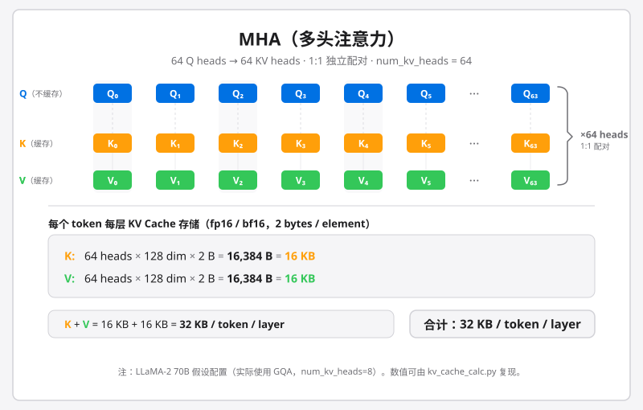

---

### 二、GQA（分组查询注意力）：多个 Q head 共享一组 K/V

这是当前最主流的方案。Q head 被分成若干组，每组内的所有 Q head 共享一组 K 和 V。

```text
LLaMA-2 70B（实际配置）：
  num_q_heads = 64
  num_kv_heads = 8      ← 8 组 K/V，每组服务 8 个 Q head
  head_dim = 128

Q head 到 KV head 的映射：
  Q head 0-7   → KV head 0
  Q head 8-15  → KV head 1
  ...
  Q head 56-63 → KV head 7

单 token 单层的 KV Cache：
  K: (8, 128) = 1024 个 float16 = 2 KB
  V: (8, 128) = 1024 个 float16 = 2 KB
  合计：4 KB / token / layer    ← 仅为 MHA 的 1/8

全模型（80 layers, seq_len=4096）：
  KV Cache = 2 × 80 × 8 × 128 × 4096 × 2 bytes ≈ 1.25 GB
```

GQA 是 `num_kv_heads` 和 `num_q_heads` 的比例决定了 KV Cache 的缩减倍数。LLaMA-2 70B 的比例是 8:1，所以 KV Cache 是 MHA 的 1/8。Qwen-2 同样使用 GQA，比例因模型大小而异。

**在 vLLM 中**：GQA 是默认支持最广泛的注意力类型——LLaMA-2、LLaMA-3、Qwen-2、Mistral 等主流模型全部使用 GQA。启动时 vLLM 自动从模型 config 读取 `num_key_value_heads`，无需用户干预。

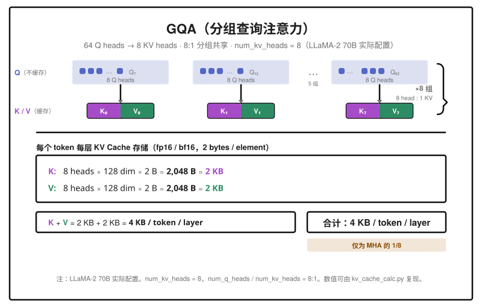

---

### 三、MQA（多查询注意力）：所有 Q head 共享唯一一组 K/V

GQA 的极端版本：只保留 1 组 K 和 V，所有 Q head 全部共享。

```text
假设 MQA 配置：
  num_q_heads = 32
  num_kv_heads = 1      ← 只有 1 组 KV
  head_dim = 128

单 token 单层的 KV Cache：
  K: (1, 128) = 128 个 float16 = 256 bytes
  V: (1, 128) = 128 个 float16 = 256 bytes
  合计：512 bytes / token / layer
```

MQA 的 KV Cache 极小，但代价是注意力质量下降——只有一组 K/V 意味着所有 Q head 从同一个视角观察输入，表达能力受限。PaLM 和 Falcon 使用了 MQA，但 GQA 出现后 MQA 基本被取代。

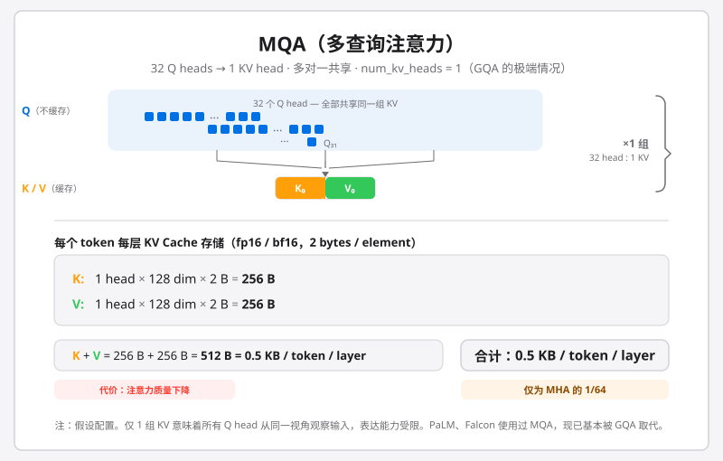

---

### 四、MLA（多头潜在注意力）：K/V 被压缩后再存储

MLA 不缓存完整的 K/V，而是缓存压缩后的内容向量和独立的位置向量；解码时再按需还原：

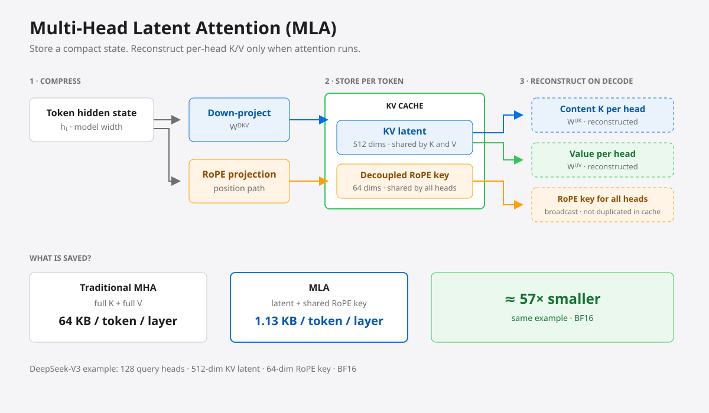

#### 什么是 RoPE

RoPE（Rotary Position Embedding，旋转位置编码）把向量的维度两两分组，再按照 Token 所在位置旋转不同角度。这样，Q 与 K 做点积时，不仅能判断内容是否相关，也能感知两个 Token 的相对距离。

- RoPE 只作用于 **Q 和 K**，因为位置会影响注意力分数；V 负责携带内容，不需要旋转。
- 图中的 `RoPE key` 不是位置编号，而是 **K 中经过 RoPE 旋转的位置分量**。
- MLA 将这部分从 Content K 中拆出，是为了在压缩 K/V 的同时保留位置信息。

#### 图中每一步

1. **输入隐藏状态**：每个 Token 在当前层先得到隐藏向量 $h_t$，它包含该 Token 的上下文信息。
2. **压缩内容信息**：$h_t$ 经下投影 $W^{DKV}$ 压缩为 `KV latent`。它不是完整的 K 或 V，而是能够同时还原 Content K 和 V 的紧凑表示。
3. **生成位置信息**：另一条分支从 $h_t$ 生成 Key 的位置分量并应用 RoPE，得到 `RoPE key`。
4. **写入 KV Cache**：每个历史 Token 只保存 512 维 `KV latent` 和 64 维 `RoPE key`，不保存展开后的多头 K/V。
5. **解码时读取**：处理新 Token 时，模型读取历史 Token 的 latent；通过 $W^{UK}$ 得到各 Head 的 Content K，通过 $W^{UV}$ 得到各 Head 的 V，并将共享的 `RoPE key` 提供给所有 Head。
6. **计算注意力**：当前 Token 的 Q 分别与历史 Token 的 Content K、RoPE key 计算内容相关性和位置相关性；合并得分后对 V 加权求和。

> 图中的“还原 K/V”是便于理解的逻辑过程。优化实现可以融合投影运算，避免真的在显存中展开并保存完整 K/V。

**空间收益**：以 DeepSeek-V3、BF16 为例，每 Token 每层约从 MHA 的 64 KB 降至 MLA 的 1.13 KB。

#### MLA 的缺陷

1. **压缩可能损失信息**：`KV latent` 是低秩瓶颈，维度越小越省显存，但越可能限制 K/V 的表达能力，需要在模型训练阶段寻找质量与容量的平衡。
2. **增加计算开销**：解码时需要额外的投影运算来使用 latent。经过算子融合和权重吸收后可以显著降低开销，但实现不佳时可能抵消显存带宽收益。
3. **实现更复杂**：MLA 的 Cache 同时包含 latent 和独立的 RoPE key，不能直接沿用普通 MHA/GQA 的张量布局，需要专用 Attention Kernel 和推理后端支持。
4. **不能直接改造现有模型**：投影矩阵和注意力结构属于模型参数，已有 MHA/GQA 模型不能只改推理配置就变成 MLA，通常需要从训练阶段采用 MLA 或重新训练。
5. **显存仍随上下文增长**：MLA 减少的是每个 Token 的缓存大小，但每个历史 Token 仍需一份缓存，因此空间复杂度仍为 $O(S)$；超长上下文还需要量化、稀疏注意力或缓存淘汰等方法。

---

### 五、CSA / HCA（压缩稀疏注意力 / 混合压缩注意力）：DeepSeek V4 的 KV 多级压缩

DeepSeek V4 在 MLA 的基础上引入了一个更激进的思路：**不仅压缩每个 token 的 K/V 维度，还压缩 token 的数量。** 这就是 CSA（Compressed Sparse Attention）和 HCA（Hybrid Compressed Attention）。

### 5.1 CSA：把连续多个 token 的 KV 合并为一个

不再给每个 token 都存一份 KV，而是跨 token 做加权合并。**c4a 确实将 8 个连续 Token 合并为 1 个摘要，窗口步长是 4**；名称中的 `4` 表示约 $4\times$ 的有效压缩率，不是窗口长度。c128a 则将 128 个 Token 合并为 1 个摘要，步长也是 128。

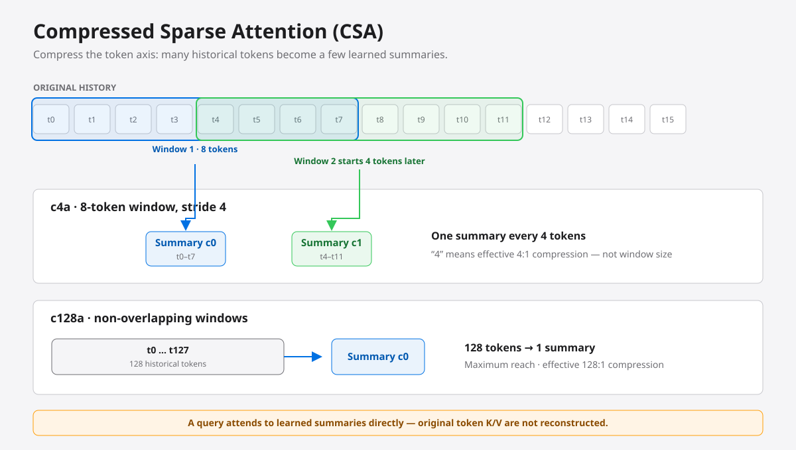

- **c4a**：窗口包含 8 个 Token，每隔 4 个 Token 生成一个摘要；相邻窗口重叠 4 个 Token，因此约保留原始 Token 数量的 $1/4$。
- **c128a**：名称中的 `128` 就是压缩倍率。窗口大小和步长都为 128，每 128 个 Token 生成一个不重叠的摘要，因此只保留原始 Token 数量的 $1/128$。这样 100 万 Token 最多只产生约 8192 个摘要，可以直接进行全注意力；最近 128 个 Token 的细节则由独立的 Sliding Window 保留。
- 摘要由可学习的权重生成，不是简单平均；Q 直接关注这些摘要，不需要先还原每个历史 Token。

#### 5.2 HCA：混合使用多种压缩策略

V4 的不同层使用不同的压缩策略——部分层使用温和的 c4a 保留更多细节，大部分层使用激进的 c128a 最大化压缩。所有层都附带 128-token sliding window 保留局部信息。这就是 HCA（Hybrid Compressed Attention）：

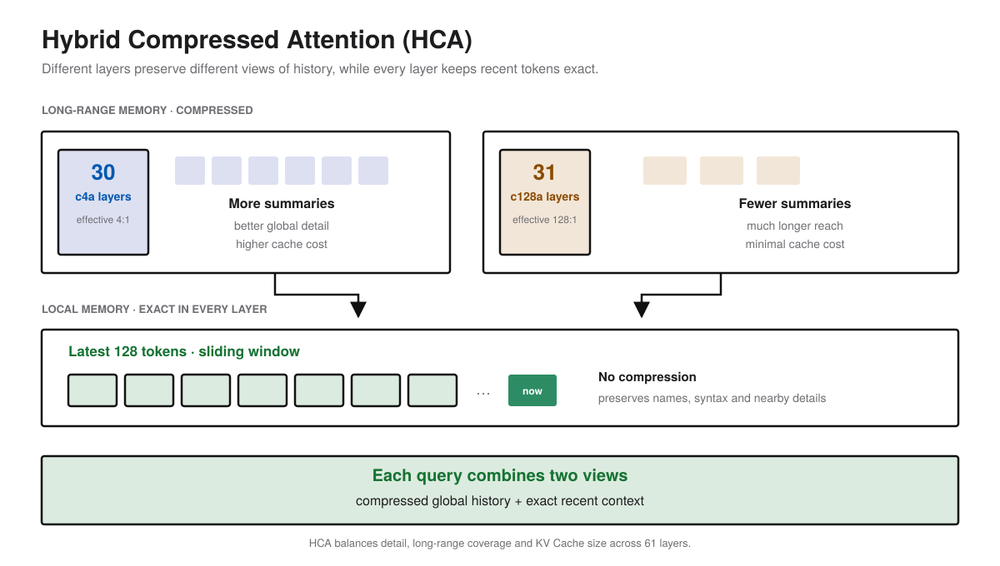

- **30 层 c4a**：保留较密集的全局摘要，细节更多，缓存也更大。
- **31 层 c128a**：用极少的摘要覆盖很长的历史，细节较少，但适合捕捉远距离信息。
- **所有层的局部窗口**：最近 128 个 Token 保持未压缩，弥补全局摘要丢失的局部细节。

#### 5.3 DeepSeek V4 的 KV Cache 形态

由于不同层使用不同压缩策略，V4 的 KV Cache 不再是一个统一的 `(layers, heads, seq, dim)` 张量，而是多种形态的混合：

| 层类型      | 存储内容 (per compressed entry) | 等效 per original token | 说明                      |
| ----------- | ------------------------------- | :---------------------: | ------------------------- |
| MLA 压缩    | 512 latent + 64 RoPE = 576 dim  |         ~1.1 KB         | 完整 MLA 存储             |
| c4a 压缩    | 64 B shared-KV + 8 B indexer    |          ~18 B          | 8-token 窗口，步长4 → 有效4:1 |
| c128a 压缩  | 64 B shared-KV                  |         ~0.5 B          | 128:1 压缩, 无重叠        |
| Sliding win | 未压缩 KV (仅 128 token)        |     128 token 窗口      | 局部窗口保留              |

---

### 六、五种注意力类型的横向对比


| 注意力类型  | 压缩维度                         | 单 token 等效 KV | vs MHA 缩减 | 代表模型          |
| ----------- | -------------------------------- | :--------------: | :---------: | ----------------- |
| MHA         | 无                               |      32 KB       |     1×      | 原始 Transformer  |
| GQA         | KV head 共享                     |       4 KB       |     8×      | LLaMA-2/3, Qwen-2 |
| MQA         | 极值 KV head 共享                |      0.5 KB      |     64×     | PaLM, Falcon      |
| MLA         | head 维压缩 (latent) + RoPE 共享 |     ~1.1 KB      |    ~29×     | DeepSeek V2/V3    |
| **CSA/HCA** | **head + token 双维压缩**        | **~0.17 KB**[^2] |  **~190×**  | **DeepSeek V4**   |

---


## 7. PagedAttention：分页管理 KV Cache
### 连续分配为什么浪费显存

假设模型最大上下文为 8192 token，请求 A 实际使用 300 token，请求 B 使用 5000 token。

一种简单做法是为每个请求预留 8192 个位置

这样地址计算简单，却把尚未使用、甚至永远不会使用的空间锁住了。

另一种做法是只分配当前需要的连续区间，并在序列增长时扩容。问题类似动态数组和堆内存：相邻位置可能已被别的请求占用，系统只能搬移已有缓存或寻找更大的空洞。请求持续到达和结束后，总空闲量可能足够，却找不到足够大的连续区间，这就是外部碎片。

LLM 请求有三个特征，让这个问题格外突出：

- 长度事先未知；
- 每个 decode step 都可能增长；
- 请求结束时间不同，分配和释放非常频繁。

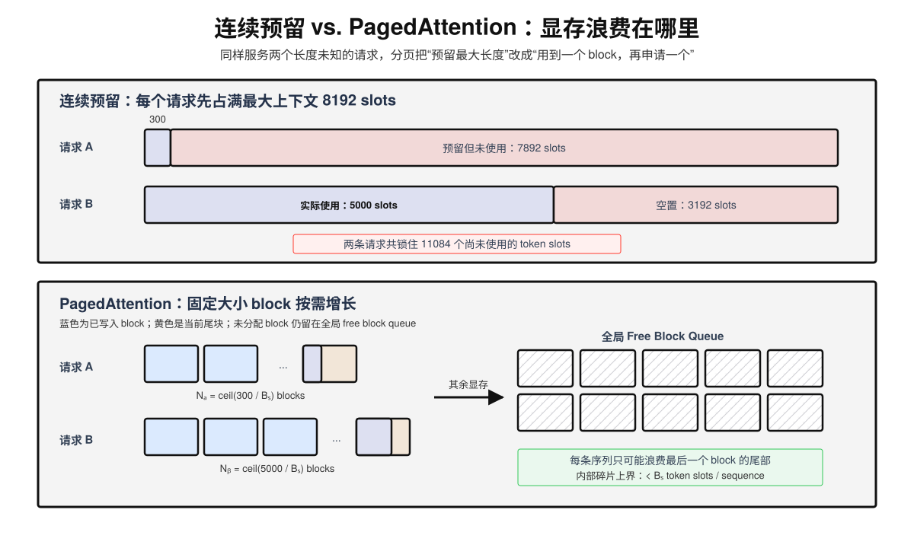

### 从 token 序列到固定大小 block

PagedAttention 把逻辑序列切成固定 token 数的块。假设每个 block 容纳 4 个 token，请求包含 10 个 token：

这三个逻辑块可以映射到任意空闲物理块，逻辑顺序由 block table 维护，而不要求物理块连续。

当请求继续生成第 11、12 个 token，只需填满物理块 3 的剩余槽位；生成第 13 个 token 时才申请一个新块。请求不必在开始时知道最终长度，也不要求下一块与当前块物理相邻。

最后一个块仍可能有空槽，所以分页不是绝对零浪费。若 block size 为 $B_s$，单条序列尾部最多浪费 $B_s-1$ 个 token slot；相较为最大长度预留，浪费被限制在一个 block 内。

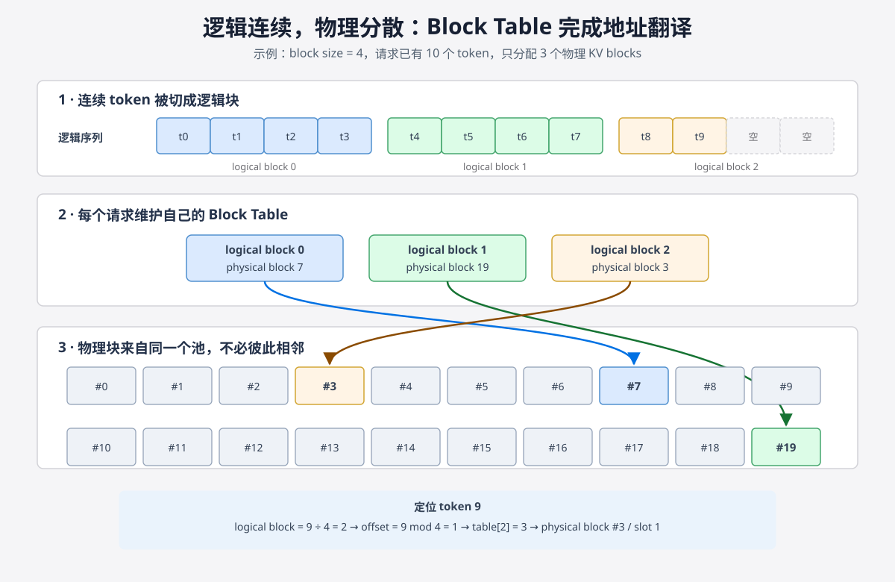

### Block 中实际保存什么

“每块 4 个 token”只是逻辑说法。物理 KV block 还包含所有相关层或某组层、K/V、KV heads 和 head dimension 对应的数据。不同引擎版本和 attention 类型可能采用不同布局。

可以把地址查找概括为：

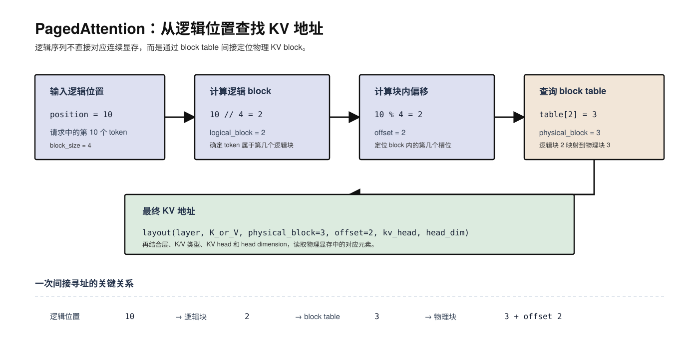

PagedAttention kernel 需要按 block table 收集 K/V。与连续张量相比，这增加了间接寻址和元数据处理；但换来了更高的有效缓存容量和动态分配能力。kernel 的任务就是让这层间接性不会抵消内存管理收益。

### 一条请求的完整生命周期

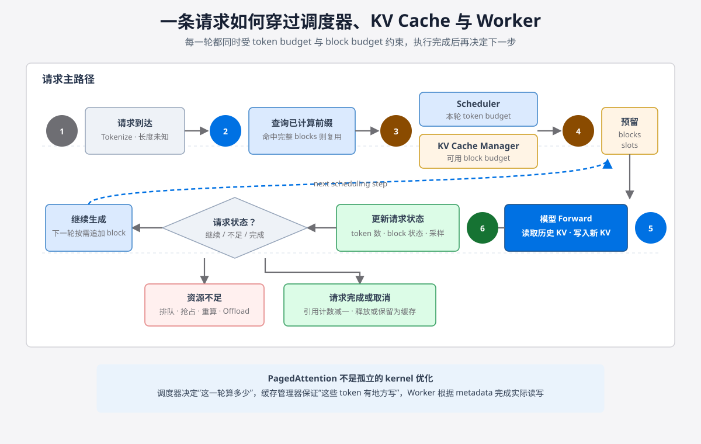

例如，设 `block_size=4`，请求的 prompt 有 10 个 token，前缀缓存命中了前 4 个 token：调度器复用命中的 block 7，再为剩余 6 个 token 分配物理 block 19 和 3，并生成对应的 block table `[7, 19, 3]`。本轮 worker 计算未命中的 6 个 token，将 K/V 写入 block 19 和 block 3 的前两个槽位；如果请求继续生成第 11、12 个 token，就继续写入 block 3 的剩余槽位，直到第 13 个 token 才需要申请新 block。

图中省略了部分实现细节：请求先由 tokenizer 生成 token IDs，调度器结合 token budget 和 block budget 决定本轮工作；命中的完整前缀 block 可以直接复用，未命中的 token 则由 worker 计算并写入新分配的 slot。请求继续时复用已有 block，资源不足时可能排队、抢占或重算；结束后，只有引用计数归零的 block 才能释放或保留为缓存。

### 分页与 continuous batching 的协同

Continuous batching 要解决的问题是：不同请求生成速度不同，有的提前结束，有的仍在 decode，还有新请求正在等待。为了不让 GPU 等到整批请求全部完成，调度器会在每个 step 重新组成 batch：移除已结束的请求，再从等待队列补入新请求。

例如，当前 batch 中有请求 A、B、C。A 在本轮结束后完成，下一轮调度器便移除 A，并加入等待中的请求 D。如果每个请求的 KV Cache 必须占据一段连续显存，A 退出和 D 加入可能需要寻找新的连续空间，甚至搬移 B、C 的缓存。PagedAttention 把缓存拆成独立 block 后，只需释放 A 的物理块，再把其中的空闲块分配给 D；B、C 的 block table 和已有 KV 都不用移动。

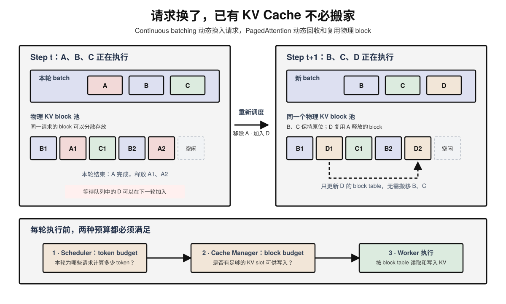

不过，“本轮想算多少”和“显存能否容纳”仍是两个约束：

- 调度器根据 token budget，选择本轮为哪些请求执行多少 prefill 或 decode token；
- cache manager 根据剩余 block 数，检查这些 token 是否都有可写入的 KV slot；
- 两项检查都通过后，worker 才根据 block table 和 slot mapping 执行读写。

因此，continuous batching 负责动态组合请求，PagedAttention 负责让这些请求的 KV Cache 能低成本地加入、增长和回收。两者协同，才能在 batch 持续变化时保持 GPU 忙碌，同时避免缓存搬移和过量分配。

### Automatic Prefix Caching 如何复用 block

很多请求会重复使用同一段 system prompt、工具定义或文档。由于相同前缀会产生相同的 K/V，新请求可以直接引用已经计算好的物理 block，跳过这部分 prefill。后续使用什么采样参数，不会改变这段前缀已经产生的 K/V。

缓存命中遵循一条关键规则：**从序列开头逐块比较，只复用连续命中且已经填满的 block；遇到第一个不同的 block 就停止。**

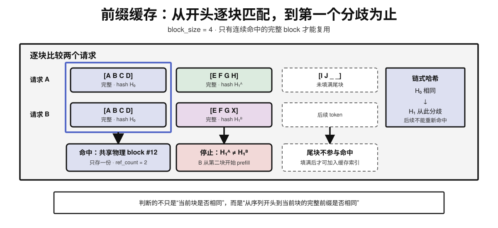

图中两个请求只能共享第一块 `[A B C D]`。第二块的最后一个 token 不同，命中在此停止，Request B 从第二块开始重新执行 prefill；A 尚未填满的尾块则要等到完整后，才可能加入缓存索引。

vLLM 用链式哈希实现这条规则。第 $i$ 个 block 的缓存身份可以理解为：

$$
H_i=\operatorname{hash}(H_{i-1},\ tokens_i,\ extra)
$$

其中，`tokens_i` 是当前 block 的 token，$H_{i-1}$ 代表它之前的全部完整前缀。因此，即使后面某个 block 的 token 恰好相同，只要前面已经发生分歧，它的哈希也会不同，不能错误地重新命中。`extra` 还会纳入会影响缓存身份或隔离范围的信息，例如 LoRA adapter、多模态输入哈希和 cache salt。

被命中的物理 block 不会复制，而是由多个请求共同引用。引用计数大于 0 时，它不能被释放或覆盖；引用归零后，它可以继续留在缓存中等待下次命中，也可以在显存不足时被淘汰。

#### 共享不应突破租户边界

跨请求前缀命中会造成时间差：命中者的 prefill 更快。多租户服务若无隔离，攻击者可能利用延迟推测某段前缀是否已缓存。官方设计提供 cache salt，将首块哈希与指定信任域绑定。缓存正确性不仅是“token 相同”，还包括模型状态一致与安全边界一致。

### Copy-on-Write 与分支解码

在 beam search 或并行采样中，多个候选序列起初共享相同前缀。物理复制全部 KV 会造成浪费，因此论文设计允许逻辑 block tables 指向相同物理块，并用引用计数管理。

当分支要修改共享尾块时，系统需要分配新块并复制必要内容，即 copy-on-write；已经填满且只读的历史块则可继续共享。具体实现会随引擎版本和解码路径演进，但不变量是：任何写入都不能破坏其他序列看到的历史 K/V。

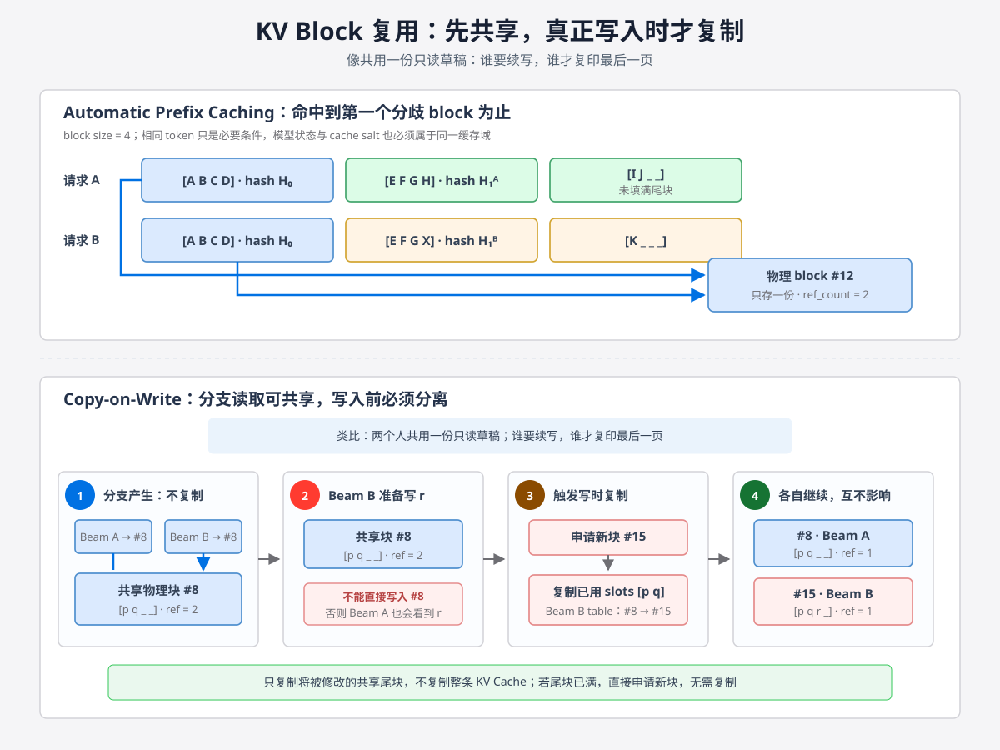

> “修改当前 block”通常指：向未填满的尾部 block 追加新 token 的 K/V，不是修改已有 token。

### Block size 是一组折中

block 越大：

- block table 更短，地址与元数据开销更小；
- kernel 访问可能更规整；
- 但每条请求最后一块的内部浪费更大；
- 前缀只有达到更粗粒度边界才能命中。

block 越小：

- 尾部浪费与前缀匹配粒度更小；
- 但 block 数、哈希、引用计数、调度 metadata 和间接寻址更多。

因此 block size 不是一个应盲目调到最小的旋钮。它还可能受具体 kernel、dtype、模型 head dimension 与硬件对齐约束。使用公开 serving 接口时，通常让引擎选择经过支持的配置比依赖内部类更稳妥。

### 缓存不足时会发生什么

当 free blocks 不足，系统不能继续给所有请求分配 slot。可选策略包括：

- 让新请求继续排队；
- 抢占正在运行的请求并释放其 blocks；
- 恢复时重新执行部分 prefill；
- 将缓存 offload 到 CPU 或外部层级，之后再取回；
- 在分布式 prefill/decode 架构中传输 KV。

这些方案是在容量、计算与传输之间交换成本。重计算浪费 GPU FLOPs，但 PCIe 或网络较慢时，可能比 swap 更合适；offload 保留计算结果，却可能增加尾延迟。监控中若只看 GPU 利用率，很难分辨请求是在有效 decode，还是因反复 preemption 重算 prompt。


## 8. Chunked Prefill：分块调度长 Prompt
Chunked Prefill 把长 prompt 分块计算，使 KV block 从一次性申请变为逐批增长。它同时影响
Prefix Caching、block 对齐和 Preemption 的触发时机。

---

### 一、一次算完的代价

#### 1.1 Prefill 的算力特性

Prefill 需要处理全部输入 token——序列长度 $S$ 的 prompt，每层 Attention 的计算量是 $O(S^2)$，全部层的总 FLOPs 与 $S^2$ 成正比。一个 32K token 的 prompt，Prefill 的算力开销约为 4K token 的 64 倍。

更重要的是，Prefill 是 **compute-bound**——GPU 的计算单元被占满，但显存带宽并未饱和。而 Decode 是 **memory-bound**——每步只算一个新 token，瓶颈在读 KV Cache 的带宽。

#### 1.2 传统 Prefill 对 KV Cache 的双重冲击

一次性 Prefill 意味着一次性为整个 prompt 的 **所有 token** 分配 KV Cache block：

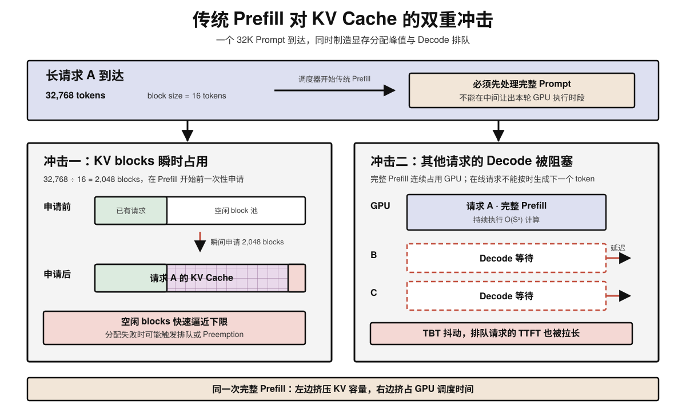

```text
传统 Prefill（无 Chunked）：
  请求到达（32K token prompt）
    ↓
  一次性分配所有 block：32K ÷ 16 = 2048 blocks
    ↓
  GPU 持续 O(S²) 计算，Decode 被阻塞
    ↓
  全部 Prefill 完成后，才开始第一个 token 的生成
```

两个问题同时出现：

- **Block 分配峰值高**：2048 个 block 瞬间被占用。如果此时 GPU 上还有其他请求正在 Decode，可能导致 block 池耗尽，触发 Preemption。
- **Decode 被阻塞**：用户感知的 TTFT（Time To First Token）等于整个 Prefill 的耗时。32K token 的 Prefill 可能需要数秒——用户盯着空白屏幕等第一个字。

#### 1.3 Chunked Prefill 的核心思路

Chunked Prefill 将长 Prompt 切成受 token budget 限制的多个小段。每完成一段，调度器都能重新组批，让其他请求的 Decode 穿插执行，同时只追加当前 chunk 所需的 KV blocks。[^1]

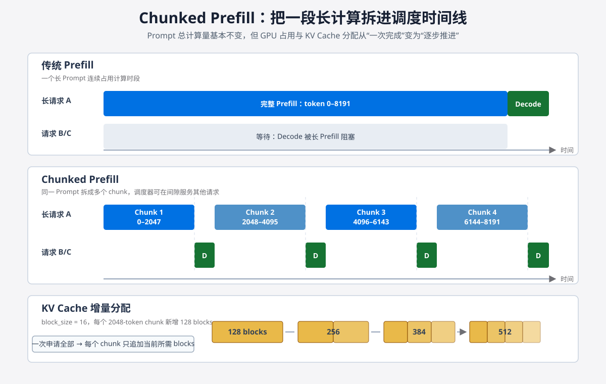

图中用一个 8192-token Prompt 简化说明：传统方式连续执行完整 Prefill，并在开始前申请 512 个 blocks，B、C 的 Decode 只能延后；Chunked Prefill 则将请求 A 拆成四个 2048-token chunk，绿色的 `D` 表示穿插在 chunk 之间的其他请求 Decode。

每完成一个 chunk，请求 A 的 KV Cache 依次增长为 128、256、384、512 blocks，而不是在开始时一次占满。分块没有减少 A 的总计算量，A 也必须完成四个 chunk 后才能进入 Decode；收益来自更平滑的 KV 分配，以及缩短其他在线请求的等待时间。

---

### 二、Chunked Prefill 对 KV Cache 的三个改变

#### 2.1 Block 分配：从一次性到增量式

无 Chunked Prefill 时，`allocate_slots()` 为整个 Prompt 一次性申请 KV blocks；启用后，每个调度步只追加当前 chunk 所需的 blocks。

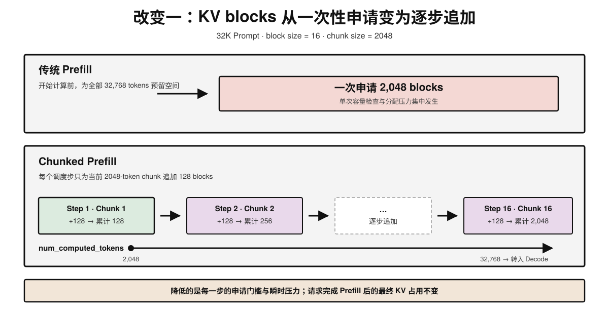

图中 32K Prompt 最终仍占用 2048 blocks，但单次申请从 2048 降为 128。`num_computed_tokens` 随每个 chunk 前移，既记录已计算 token 数，也指向下一段 Prefill 的起点；达到 32768 后，请求才转入 Decode。这样降低的是每轮容量检查和分配的门槛，并在 chunk 边界增加重新调度或处理 Preemption 的机会，而不是减少请求最终需要的 KV Cache。

#### 2.2 Prefix Caching：只在第一个 chunk 查找

vLLM 当前版本只在请求首次调度、即 `num_computed_tokens == 0` 时查询 Prefix Cache；后续 chunk 沿已经建立的 block table 继续追加，不再重新查找。

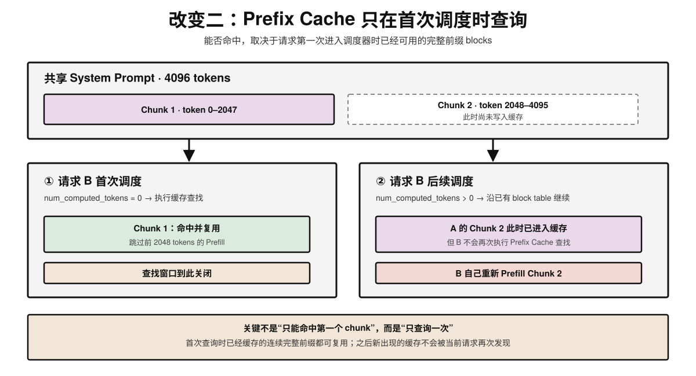

图中请求 B 首次调度时，缓存里只有 A 已完成的 Chunk 1，因此 B 命中并跳过前 2048 tokens。之后 A 的 Chunk 2 才进入缓存；等 B 处理 Chunk 2 时，查找窗口已经关闭，所以 B 仍需自行 Prefill。关键限制是**只查询一次**，并非固定只能命中一个 chunk：首次查询时已经存在的连续完整前缀都可以复用。

这一选择避免了后续 chunk 命中时重组 block table、处理已分配物理页冲突和缓存淘汰竞态，使请求状态机更可控。


#### 2.3 Block 对齐：chunk 大小必须是 block_size 的整数倍

Chunked Prefill 与 Prefix Caching 同时启用时，调度 token 数需要向下对齐到 `block_size` 的整数倍，因为只有填满的 block 才能形成稳定哈希并参与缓存匹配。

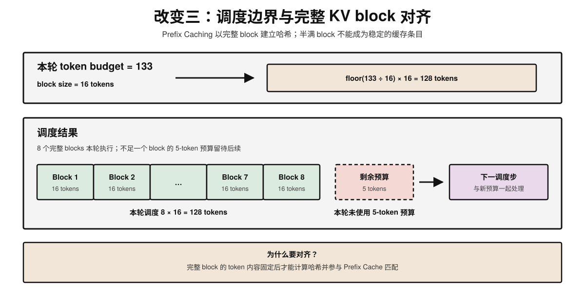

图中 `block_size=16`、`budget=133`，本轮可调度 $\lfloor 133/16\rfloor\times16=128$ 个 tokens，即 8 个完整 blocks；余下 5-token 预算不足以组成完整 block，留到后续调度步。代价是少量 token budget 可能暂时未被利用，收益是缓存边界始终明确，无需处理 partial block hashing。

---

### 三、三个派生问题

#### 3.1 第一个 chunk 的 hit 与后续 chunk 的 miss 并存

Prefix Cache 的内容会随着其他请求完成 Prefill 而增长，但当前请求的命中范围在首次查询时就已经确定。因此，同一共享前缀内可能同时出现前段命中、后段重算。

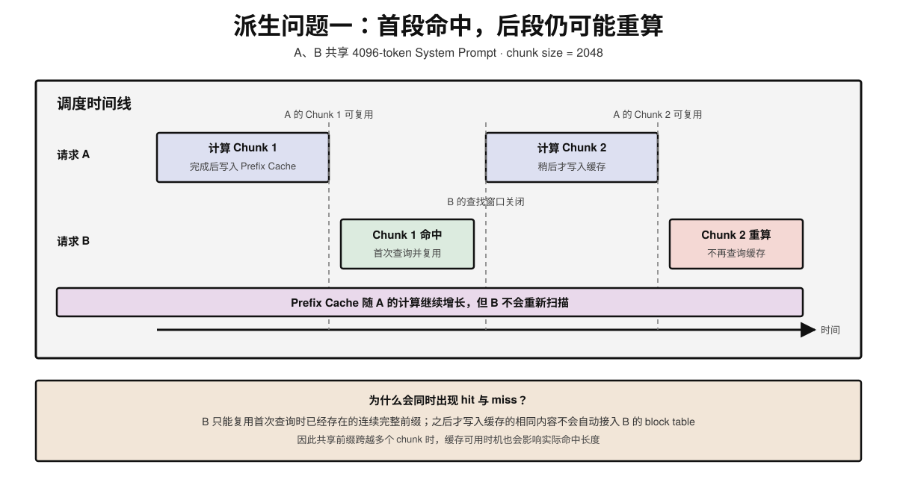

图中 B 首次调度时，A 的 Chunk 1 已可复用，Chunk 2 尚未完成；B 因而只命中前 2048 tokens。即使 A 随后把 Chunk 2 写入缓存，B 也不会重新扫描，而是自行 Prefill 这一段。这里浪费的不是所有后续缓存，而是**首次查询之后才变为可用、且 B 尚未计算的相同前缀**。

#### 3.2 Chunk 之间的 KV Cache 碎片

每个 chunk 都从当时的空闲池追加 blocks；在两次调度之间，其他请求也会申请和释放空间，所以同一请求的物理 blocks 往往不连续。

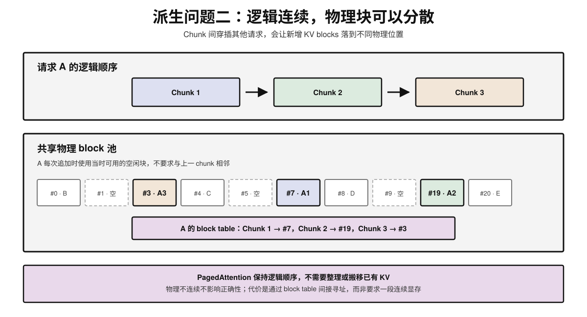

图中请求 A 的三个逻辑 chunk 依次映射到物理块 `#7`、`#19` 和 `#3`。PagedAttention 依靠 block table 保存逻辑顺序，Attention kernel 按映射读取 K/V，因此无需整理空洞或搬移已有缓存。这里的“碎片”主要是物理位置分散，不等同于传统连续分配中“总空闲量足够却找不到大块空间”的外部碎片。

#### 3.3 long_prefill_token_threshold：长 prompt 的特殊对待

vLLM 用 `long_prefill_token_threshold` 识别长 Prompt，并限制其每个调度步处理的 token 数，避免单个长请求持续占满 token budget。[^3]

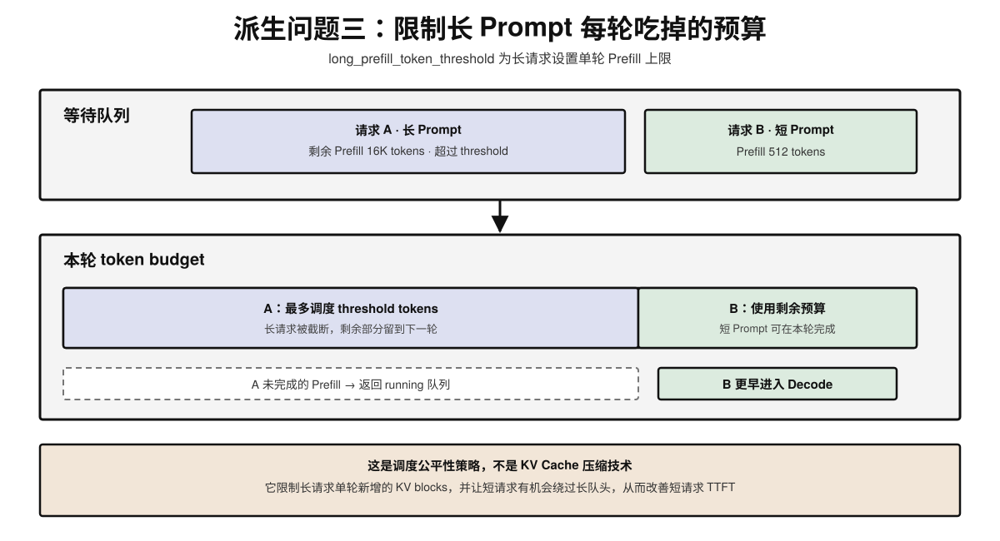

图中长请求 A 本轮只处理 threshold 范围内的 tokens，未完成部分留在 running 队列；短请求 B 可以利用可用预算更早完成 Prefill。配合 `max_num_partial_prefills` 与 `max_long_partial_prefills` 限制同时运行的长 partial prefill 数量时，短请求还可以绕过队首长请求，从而改善 TTFT。

这首先是调度公平性策略，而非新的 KV Cache 压缩方式；从缓存角度看，它只是进一步限制长请求每轮新增的 blocks，并让不同请求的物理分配更频繁地交错。

---


## 9. RadixAttention：自动复用共享前缀
System Prompt、多轮对话、Few-shot 示例和 RAG 文档经常形成共享前缀。相同 token 前缀产生
相同的 K/V，因此后续请求可以跳过已经缓存部分的 Prefill。RadixAttention 使用 Radix Tree
组织这些动态前缀，支持最长前缀匹配，同时避免完整序列哈希无法部分命中、静态缓存不够灵活，
以及逐 token 索引开销过大的问题。

---

### 2. RadixAttention 核心原理

RadixAttention 的核心创新在于使用 **Radix Tree（基数树）** 这一数据结构来组织和管理 token 序列与 KV Cache 的映射关系。本章将深入介绍 Radix Tree 的原理及其在 KV Cache 管理中的应用。

#### 2.1 Radix Tree 数据结构

本节将详细介绍 Radix Tree 数据结构的基本原理、核心特性以及时间复杂度分析。

##### 2.1.1 从 Trie 到 Radix Tree

**Trie（前缀树）** 是一种经典的树形数据结构，用于高效存储和检索字符串集合。在 Trie 中，每个节点代表一个字符，从根到叶子的路径表示一个完整的字符串。

```text
Trie 存储 ["hello", "help", "world"]：

        root
       /    \
      h      w
      |      |
      e      o
      |      |
      l      r
     / \     |
    l   p    l
    |        |
    o        d
```

Trie 的问题在于：当存在长的非分支路径时，会产生大量只有单个子节点的中间节点，浪费内存且增加遍历深度。

**Radix Tree（基数树）**，也称为 **压缩前缀树（Compressed Trie）** 或 **Patricia Tree**，通过**路径压缩**解决了这一问题。它将连续的、没有分支的节点合并为一个节点，存储整个字符串片段而非单个字符。

```text
Radix Tree 存储 ["hello", "help", "world"]：

        root
       /    \
    "hel"  "world"
     / \
   "lo" "p"

节点数：5（Trie 需要 11 个节点）
```

##### 2.1.2 Radix Tree 的核心特性

与传统 Trie 树相比，Radix Tree 具有以下几个核心特性，使其非常适合用于管理 KV Cache：

| 特性             | 说明                                   |
| ---------------- | -------------------------------------- |
| **路径压缩**     | 连续非分支节点合并，减少内存和遍历深度 |
| **前缀共享**     | 相同前缀自动合并到同一路径             |
| **动态更新**     | 支持高效的插入、删除和查找             |
| **最长前缀匹配** | 天然支持找到与查询序列匹配的最长前缀   |

##### 2.1.3 时间复杂度分析

设 $m$ 为查询/插入序列的长度， $k$ 为字符集大小（对于 token 序列， $k$ 为词表大小）：

| 操作         | 时间复杂度 | 说明                                   |
| ------------ | ---------- | -------------------------------------- |
| 查找         | $O(m)$[^1] | 与序列长度线性相关，与树中总节点数无关 |
| 插入         | $O(m)$     | 最坏情况需要分裂现有节点               |
| 删除         | $O(m)$     | 可能触发节点合并                       |
| 最长前缀匹配 | $O(m)$     | 遍历直到无法继续匹配                   |

[^1]: 注：在标准的 Radix Tree 中，如果考虑节点内部的字符串比较，最坏情况时间复杂度应为 $O(\min(m, k \cdot \log n))$。但在 LLM 推理场景中，由于 Token ID 是定长整数且比较极快，且分支因子（词表大小）很大但深度较浅，将其描述为与序列长度 $m$ 呈线性关系是工程上准确的简化。

#### 2.2 Token 序列到 KV Cache 的映射

在 RadixAttention 中，Radix Tree 的每个节点不仅存储 token 序列片段，还关联了对应的 **KV Cache Block**。

##### 2.2.1 节点结构设计

在 RadixAttention 的实现中，每个 Radix Tree 节点都需要保存 token 信息、关联的缓存块索引、子节点映射、引用计数和最后访问时间。

##### 2.2.2 树的构建过程

当新的 token 序列需要被缓存时，RadixAttention 执行以下步骤：

1. **从根节点开始匹配**：逐 token 比较，沿着匹配的路径向下遍历
2. **处理分歧点**：
   - 如果在某个节点内部出现不匹配，**分裂该节点**
   - 将公共部分保留，不同部分创建新的子节点
3. **创建新路径**：对于完全不匹配的后缀，创建新的节点链

```text
初始状态：树中已有序列 "hello world"

        root
          |
    "hello world"

插入序列 "hello vllm"：

步骤 1: 匹配 "hello " (6 tokens) ✓
步骤 2: 在 "world" 节点处发现不匹配（w vs v）
步骤 3: 分裂节点，创建分支

分裂后结果：父节点保留公共前缀，创建两个新子节点
        root
          |
      "hello "
        /    \
   "world"  "vllm"
```

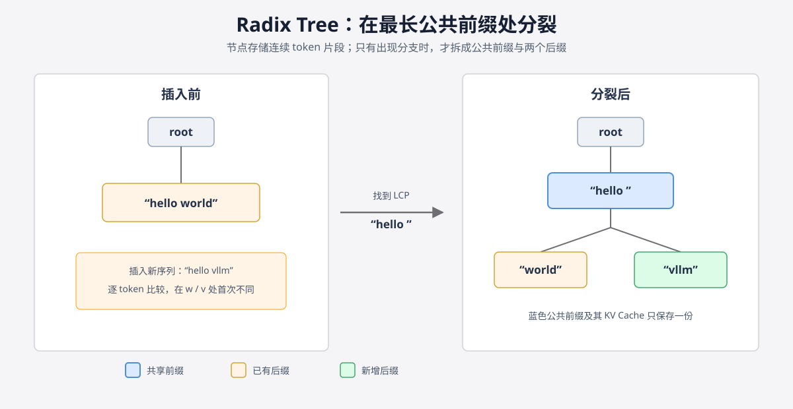

##### 2.2.3 前缀共享机制

Radix Tree 的结构天然支持前缀共享：**所有具有相同前缀的序列都会经过相同的节点路径**。这意味着：

- 相同前缀的 KV Cache 只存储一份。
- 新序列插入时自动识别并复用已有前缀。
- 无需显式的“注册”或“声明”共享关系。

```text
请求 A: [System Prompt] + [Query A] → 缓存 System Prompt
请求 B: [System Prompt] + [Query B] → 自动复用 System Prompt 的 KV Cache
请求 C: [System Prompt] + [Query A] + [Response A] + [Query C]
        → 复用 "System Prompt + Query A" 的全部 KV Cache
```

#### 2.3 前缀匹配与查找算法

前缀匹配是 RadixAttention 的核心操作，决定了能够复用多少已缓存的 KV Cache。本节介绍最长前缀匹配算法及其查找结果的处理方式。

##### 2.3.1 最长前缀匹配算法

当新请求到达时，RadixAttention 需要找到与请求 token 序列匹配的**最长前缀**，以最大化 KV Cache 复用。查找从根节点开始，根据下一个 token 选择子节点，再逐 token 比较节点内的压缩路径；节点完全匹配时继续向下，遇到节点内部不匹配或缺少对应子节点时停止。

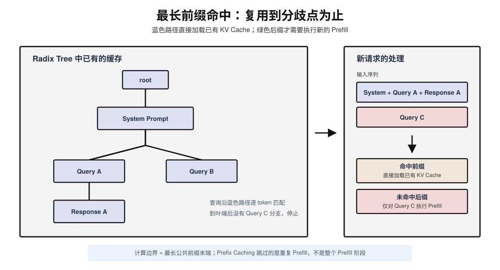

##### 2.3.2 查找结果的处理

前缀匹配的结果决定了推理引擎的后续行为：

| 匹配情况 | 处理方式                                            |
| -------- | --------------------------------------------------- |
| 完全匹配 | 直接复用全部 KV Cache，跳过 Prefill                 |
| 部分匹配 | 复用匹配部分的 KV Cache，仅对未匹配后缀执行 Prefill |
| 无匹配   | 从头执行完整 Prefill，并将结果缓存                  |

```text
查询序列: [T0, T1, T2, T3, T4, T5, T6, T7]
树中已有: [T0, T1, T2, T3] → KV Blocks [B0, B1]

匹配结果: 长度=4, Blocks=[B0, B1]

Prefill 执行:
- 位置 0-3: 跳过计算，加载 [B0, B1]
- 位置 4-7: 执行 Prefill，生成新的 KV Cache
```

#### 2.4 LRU 淘汰策略

GPU 显存有限，无法无限缓存 KV Cache。RadixAttention 采用 **LRU（Least Recently Used）** 策略进行缓存淘汰。

##### 2.4.1 引用计数机制

为了避免淘汰正在被使用的 KV Cache，每个节点维护一个**引用计数**：

- 当请求开始使用某节点的 KV Cache 时，`ref_count += 1`
- 当请求完成（生成结束或被取消）时，`ref_count -= 1`
- **只有 `ref_count == 0` 的节点才能被淘汰**

##### 2.4.2 淘汰算法

当显存不足时，RadixAttention 从**叶子节点**开始，按最后访问时间排序，淘汰最久未使用的节点，直到释放足够的 KV Cache Blocks。

##### 2.4.3 淘汰的级联效应

由于 Radix Tree 的前缀共享特性，淘汰需要谨慎处理：

- **只能从叶子节点开始淘汰**：中间节点被淘汰会导致所有后代节点失效。
- **淘汰后可能触发节点合并**：父节点只剩一个子节点时，可以合并以保持压缩特性。

```text
淘汰前：
    "hello "
     /    \
  "world" "vllm"

淘汰 "vllm" 后：
    "hello "
       |
    "world"

进一步压缩：
  "hello world"
```

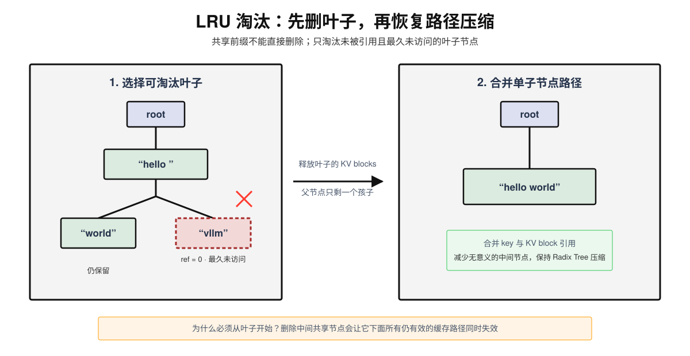

---

### 3. SGLang 中的实现

SGLang（Structured Generation Language）是由 UC Berkeley 团队开发的高效 LLM 推理系统，RadixAttention 正是其核心优化技术之一。本章将分析 RadixAttention 在 SGLang 中的具体实现。

#### 3.1 SGLang 系统架构简介

SGLang 的定位是**结构化语言模型程序的高效执行引擎**。它支持复杂的控制流（如循环、分支）、多次生成调用的复合任务，并通过 RadixAttention 实现跨调用的 KV Cache 自动复用。

```text
SGLang 架构概览：

┌───────────────────────────────────────────────────────────┐
│                     SGLang Frontend                       │
│       (Python DSL for structured LLM programs)            │
└───────────────────────────────────────────────────────────┘
                            │
                            ▼
┌───────────────────────────────────────────────────────────┐
│                     SGLang Runtime                        │
│  ┌─────────────┐  ┌─────────────────┐  ┌─────────────┐    │
│  │  Scheduler  │◄─┤   RadixCache    ├─►│   Executor  │    │
│  │             │  │ (RadixAttention)│  │             │    │
│  └─────────────┘  └─────────────────┘  └─────────────┘    │
└───────────────────────────────────────────────────────────┘
                            │
                            ▼
┌───────────────────────────────────────────────────────────┐
│                Model Execution Backend                    │
│           (CUDA Kernels, PagedAttention)                  │
└───────────────────────────────────────────────────────────┘
```

RadixAttention 位于 SGLang Runtime 的核心位置，负责：

1. 管理所有缓存的 token 序列与 KV Cache 的映射
2. 为每个请求提供前缀匹配查询
3. 协调 KV Cache Block 的分配与淘汰

#### 3.2 核心数据结构

SGLang 中的 RadixAttention 实现涉及三个核心数据结构：RadixCache 主类、TreeNode 节点结构以及内存池管理器。

##### 3.2.1 RadixCache 类

`RadixCache` 是 RadixAttention 的主类，持有 Radix Tree 根节点、Token Pool、KV Cache Pool 和缓存命中统计，并封装前缀匹配、序列插入与 LRU 淘汰操作。

##### 3.2.2 TreeNode 结构

每个 `TreeNode` 代表 Radix Tree 中的一个节点，保存子节点映射、父节点引用、压缩后的 token 路径、对应的 KV Cache Block 索引、引用计数和最后访问时间。

##### 3.2.3 内存池管理

SGLang 使用专门的内存池管理 KV Cache Blocks：

- **Token Pool**：管理 token 序列到物理位置的映射
- **KV Pool**：管理实际的 KV Cache 显存分配

#### 3.3 关键操作实现

本节详细分析 RadixCache 的四个关键操作：前缀匹配、插入、LRU 淘汰以及并发控制。

##### 3.3.1 前缀匹配：match_prefix()

前缀匹配是系统处理新请求时的首个操作。该方法从根节点开始遍历 Radix Tree，按 token 比较节点内的压缩路径，直到遇到不匹配位置，并返回最后匹配的节点和前缀长度。

##### 3.3.2 插入操作：insert()

当处理完未命中的前缀并生成新的 KV Cache 后，系统从最后匹配节点开始插入剩余 token。若新序列与现有子节点只部分匹配，则在最长公共前缀处拆分节点；若没有对应子节点，则直接为剩余后缀创建新节点。

##### 3.3.3 LRU 淘汰：evict()

当系统显存不足时，将触发 LRU 淘汰机制。系统按最后访问时间排序叶子节点，跳过仍被引用的节点，并持续释放最久未使用节点的 KV Cache，直到达到目标容量。

##### 3.3.4 并发控制

SGLang 使用**节点级锁**来支持并发访问。请求使用某个节点时，会沿父链增加引用计数；请求结束时沿相同路径减少引用计数，从而保护整条共享前缀路径不被淘汰。

##### 3.3.5 节点分裂的开销与优化

在实际运行中，动态负载下的前缀缓存管理不仅需要考虑查找效率，还需要评估树结构维护的代价。由于每次插入未匹配的新序列可能触发节点分裂（`_split_node`），这会涉及字典修改和锁持有。SGLang 通过节点内预留空间（Slack）或仅在 Prefill 阶段后批量插入来平摊此开销。

#### 3.4 与 PagedAttention 的集成

RadixAttention 与 PagedAttention 紧密集成，共同实现高效的 KV Cache 管理：

1. **Block 粒度对齐**：RadixCache 中的 value 存储的是 Block ID 而非原始显存地址。
2. **统一的内存池**：KV Cache Blocks 由 `TokenToKVPool` 统一管理。
3. **Block Table 更新**：Prefill 完成后，Block Table 自动更新以包含新生成的 KV Cache。

```text
请求处理流程：

1. match_prefix(tokens) → (node, prefix_len, block_ids)
2. 将 block_ids 加载到 Block Table 的前 prefix_len 位置
3. 仅对 tokens[prefix_len:] 执行 Prefill
4. 将新生成的 KV Cache 存入新分配的 Blocks
5. insert(node, tokens[prefix_len:], new_block_ids)
```

---

### 4. vLLM 的 Automatic Prefix Caching (APC) 对比

vLLM 从 v0.4.0 开始引入了 Automatic Prefix Caching (APC) 功能，实现了类似 RadixAttention 的前缀缓存能力，但采用了不同的技术方案。本章将对比分析两者的异同。

#### 4.1 vLLM 的技术选型：Hash Table vs Radix Tree

vLLM 的 APC 与 SGLang 的 RadixAttention 在功能上相似，但在底层数据结构上做出了不同的选择。本节分析 vLLM 选择哈希表的原因及其设计细节。

##### 4.1.1 为什么 vLLM 选择 Hash Table

vLLM 没有采用 Radix Tree，而是选择了**基于哈希表的增量哈希链**方案。主要考量包括：

1. **与 Block Manager 的集成**：vLLM 的 PagedAttention 已经以 Block 为粒度管理 KV Cache，哈希表可以直接以 Block Hash 为键。
2. **实现复杂度**：哈希表的实现比 Radix Tree 更简单，易于维护。
3. **内存开销**：哈希表的额外内存开销通常低于树结构。

##### 4.1.2 增量哈希链设计

vLLM 的 APC 使用**增量哈希**确保前缀依赖：

$$
H_0 = Hash(Chunk_0)
$$

$$
H_i = Hash(H_{i-1}, Chunk_i), \quad i > 0
$$

> 注：生产环境多使用 XXHash 等高性能哈希算法以避免 Python 对象开销。

这种设计保证了：

- 相同的前缀 → 相同的哈希链
- 不同的前缀 → 不同的哈希值（即使当前 Block 内容相同）

##### 4.1.3 缓存查找流程

vLLM 的缓存查找过程基于增量哈希链，按 Block 粒度逐个计算并查询哈希值；一旦某个 Block 未命中，由于后续哈希依赖当前哈希，查找即可提前终止。

#### 4.2 两种方案的对比分析

SGLang 的 RadixAttention 与 vLLM 的 APC 在设计理念和数据结构上各有侧重，以下是这两种方案在多个维度上的详细对比：

| 维度               | RadixAttention (SGLang)      | APC (vLLM)                                     |
| ------------------ | ---------------------------- | ---------------------------------------------- |
| **数据结构**       | Radix Tree（压缩前缀树）     | Hash Table（哈希表）                           |
| **索引粒度**       | Token 级别                   | Block 级别（16-32 tokens）                     |
| **查找方式**       | 树遍历，天然支持最长前缀匹配 | 逐 Block 哈希查找                              |
| **内存开销**       | 较高（树节点、指针）         | 较低（仅哈希表条目）                           |
| **动态前缀**       | 任意位置分支，灵活性高       | 需 Block 对齐，灵活性稍低                      |
| **内存碎片化倾向** | 低（Block 连续分配）         | 中（Block 离散分配，依赖 PagedAttention 回收） |
| **实现复杂度**     | 较高（节点分裂、合并）       | 较低（标准哈希表操作）                         |
| **并发支持**       | 需要细粒度锁                 | 通过引用计数管理                               |

##### 4.2.1 适用场景对比

根据两种方案的特性差异，它们在不同的业务场景中各有优势。以下是它们的主要适用场景对比：

**RadixAttention 更适合**：

- 高度动态的工作负载（前缀频繁变化）
- 需要细粒度（token 级）缓存控制的场景
- 复杂的结构化生成程序（SGLang 的核心用例）

**vLLM APC 更适合**：

- 前缀相对固定的场景（如固定 System Prompt）
- 追求实现简洁性和与现有系统集成
- Block 对齐不造成显著浪费的场景


### 5. 与推测解码协同

流程如下：

草稿模型快速预测多个 token。
目标大模型一次前向计算并行验证这些 token。
接受连续验证通过的 token。
从第一个未通过的位置重新采样，然后继续推测。  

推测执行需要为多个候选 token 序列准备 KV Cache。RadixAttention 可以：

- 缓存高概率分支的 KV Cache。
- 在验证阶段快速复用已计算的 KV Cache。
- 降低推测失败时的重算成本。

---

## 10. 分布式 KV Cache 与 Prefill-Decode 分离
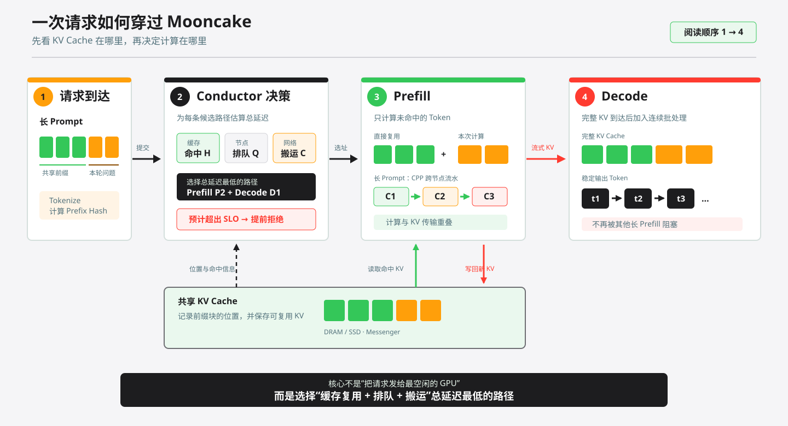

### 核心原理

Mooncake 的关键思想是：**KV Cache 不再是单个推理实例内部的临时数据，而是决定请求应去哪里计算的全局资源。**

传统架构在同一实例中执行 Prefill 和 Decode。长 Prompt 的 Prefill 是计算密集型任务，会抢占 GPU 并打断正在逐 Token 生成的 Decode，导致 TBT 抖动。Mooncake 将两者拆成独立资源池，再由全局调度器 **Conductor** 为每个请求选择一组 Prefill 节点和一个 Decode 节点。

对候选 Prefill 节点 $i$，Conductor 的决策可概括为：

$$
\widehat{T}_{\mathrm{TTFT}}(i)
= \widehat{T}_{\mathrm{queue}}(i)
+ \widehat{T}_{\mathrm{transfer}}(i)
+ \widehat{T}_{\mathrm{prefill}}(N-H_i)
$$

其中 $N$ 是 Prompt 长度，$H_i$ 是可复用的最长前缀。Conductor 同时考虑**缓存命中、KV 搬运成本和节点排队时间**，所以缓存命中最多的节点不一定最优：如果远端传输或排队更慢，在空闲节点重算一部分反而能更快得到首 Token。

请求随后按以下闭环执行：

1. **复用**：从分布式缓存池加载已命中的前缀 KV，只计算未命中的 Token；
2. **Prefill**：长 Prompt 被切成 Chunk，以 CPP 在多个 Prefill 节点上流水执行；
3. **传输**：Messenger 将每层新产生的 KV 异步流向 Decode 节点，使计算与 RDMA 传输重叠；
4. **Decode**：请求携带完整 KV 进入独立的 Continuous Batch，不再受其他长 Prefill 干扰；
5. **拒绝**：Conductor 在 Prefill 前预测请求完成时的 Decode 负载，若预计无法满足 TTFT/TBT SLO，就提前拒绝，避免白做 Prefill。

因此，Mooncake 的本质是一个以 KV Cache 为反馈信号的控制闭环：**用分层存储换取更少计算，用阶段分离隔离性能干扰，再用全局调度约束缓存搬运与排队成本。**

---

## 11. 托管模型服务的 Prompt Cache 策略
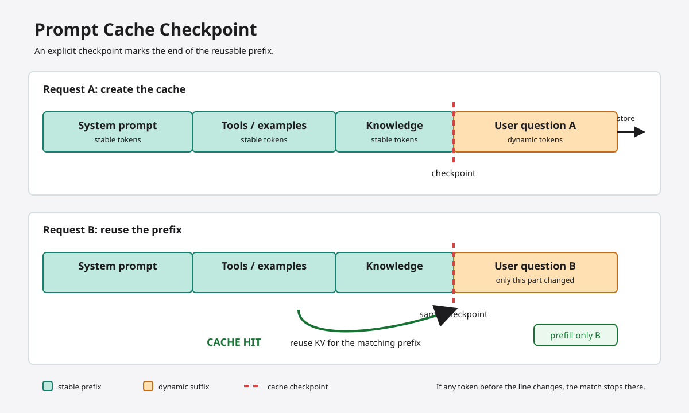

图中红色虚线表示缓存断点：断点之前的稳定前缀必须完整一致，才能复用已有 KV Cache；断点之后通常放置本次请求的动态内容。

这里的“推理引擎”指实际执行模型前向计算、批处理和 KV Cache 管理的软件运行时，不把 API 网关、云平台或 GPU/TPU/Trainium 硬件本身算作推理引擎。托管 API 未公开运行时名称时，不根据兼容接口或硬件反推为 vLLM、SGLang、TGI 等开源引擎。

| 平台 | 推理引擎 | 创建方式与命中规则 | 生命周期 | 可观测指标 | 多用户边界与控制 | 来源 |
| --- | --- | --- | --- | --- | --- | --- |
| **OpenAI API** | 未公开；OpenAI 仅披露自有托管基础设施的部分信息，没有确认 API 使用某个具名推理引擎 | 支持模型默认自动缓存；GPT-5.6+ 还支持显式断点。要求完整渲染前缀一致；GPT-5.6+ 最短 1,024 Token，旧模型通常 2,048 Token | GPT-5.6+ 至少 30 分钟；旧模型内存缓存通常空闲 5～10 分钟、最长约 1 小时，部分模型可选 24 小时 | `cached_tokens`、`cache_write_tokens` | 不跨 Organization，也不跨区域处理边界；`prompt_cache_key` 只帮助同类请求路由到同一缓存，不是权限边界 | [Prompt Caching](https://developers.openai.com/api/docs/guides/prompt-caching)、[Data Controls](https://developers.openai.com/api/docs/guides/your-data) |
| **Anthropic Claude API** | 未公开；属于 Anthropic 自研托管栈。官方披露与 AWS Neuron/Trainium 的底层协作，但未把它描述为 Claude API 的推理引擎 | 在稳定内容后放 `cache_control`；从断点向前寻找完全一致的前缀，最多 4 个断点，最短长度依模型而定 | 默认 5 分钟，可选 1 小时；命中会刷新 TTL | `cache_creation_input_tokens`、`cache_read_input_tokens` | 没有面向终端用户的 Cache ID 或 ACL；共享依赖同一 API 租户内的相同前缀，用户级隔离需应用自己完成 | [Prompt Caching](https://platform.claude.com/docs/en/build-with-claude/prompt-caching)、[AWS 合作说明](https://www.anthropic.com/news/anthropic-amazon-trainium) |
| **Gemini API** | 未公开；Google 没有确认 Gemini API/Vertex AI 的托管端使用 JetStream、vLLM 等对外可识别的引擎 | Gemini 2.5+ 默认隐式缓存；`generateContent` 还可创建显式 `CachedContent`。隐式缓存要求相似前缀，门槛依模型而定 | 显式缓存默认 1 小时，可更新 TTL | `total_cached_tokens` / `cachedContentTokenCount` | Gemini API 隐式缓存不提供用户级 namespace；在 Google Cloud 上，显式缓存是 `project + location` 下的具名资源，可由同项目后端复用 | [Gemini API](https://ai.google.dev/gemini-api/docs/caching)、[Google Cloud](https://docs.cloud.google.com/vertex-ai/generative-ai/docs/context-cache/context-cache-overview) |
| **Azure OpenAI** | 未公开；Microsoft 托管 OpenAI 模型，但服务文档没有给出底层具名推理引擎 | 自动缓存；新模型支持 `prompt_cache_key` 和显式断点。至少 1,024 Token 且开头完全一致 | 新模型至少 30 分钟；旧模型支持内存或最长 24 小时策略 | `cached_tokens`、新模型的 `cache_write_tokens` | 官方明确不跨 Azure Subscription 共享；Key 是路由提示，不是访问控制 | [Prompt Caching](https://learn.microsoft.com/en-us/azure/foundry/openai/how-to/prompt-caching) |
| **Amazon Bedrock** | 无单一引擎；Bedrock 是多模型托管层，底层运行时随模型供应商和硬件路径变化，官方缓存文档未公布各模型的具体引擎 | 是否隐式/显式取决于模型；显式模式用 Cache Checkpoint，静态前缀必须完全一致 | 多数模型默认 5 分钟，部分 Claude 模型支持 1 小时；命中刷新 TTL | `cacheReadInputTokens`、`cacheWriteInputTokens`、`cacheDetails` | 缓存 namespace 的精确粒度未公开；跨 Region 推理可能增加 Cache Write，不能把 Checkpoint 当作租户隔离机制 | [Prompt Caching](https://docs.aws.amazon.com/bedrock/latest/userguide/prompt-caching.html) |
| **阿里云百炼（千问）** | 未公开；百炼/DashScope 是托管服务层，官方未确认千问 API 底层使用 vLLM、SGLang 或其他具名引擎 | 支持模型默认启用且不能关闭隐式缓存；加入 `cache_control: {"type": "ephemeral"}` 则改用显式缓存。两种模式互斥，公共前缀通常至少 1,024 Token | 显式缓存 5 分钟，命中后续期；隐式缓存无固定 TTL，由系统清理 | `cached_tokens`、`cache_creation_input_tokens`；Anthropic 兼容接口另有 `cache_read_input_tokens` | 隐式与显式缓存均按账号隔离，且不同模型不共享；同账号内的终端用户隔离仍需应用完成 | [上下文缓存](https://help.aliyun.com/zh/model-studio/context-cache)、[显式缓存最佳实践](https://www.alibabacloud.com/help/zh/model-studio/explicit-cache-guide) |
| **DeepSeek API** | 自研推理框架（未公布正式名称）；DeepSeek-V3 报告披露 H800 上 Prefill/Decode 分离、定制通信内核和冗余专家部署。`HAI-LLM` 被明确称为训练框架，不能据此认定为 API 推理引擎 | 默认启用磁盘 Context Cache；在请求边界、公共前缀和固定 Token 间隔形成完整前缀单元 | Best effort，闲置后通常数小时至数天清理 | `prompt_cache_hit_tokens`、`prompt_cache_miss_tokens` | `user_id` 明确用于 KVCache 隔离；不同用户应使用不同 ID，但官方没有提供“公共层 + 用户私有层”双 namespace | [Context Caching](https://api-docs.deepseek.com/guides/kv_cache)、[`user_id` Isolation](https://api-docs.deepseek.com/quick_start/rate_limit#user_id-isolation)、[DeepSeek-V3 Technical Report §3.4](https://arxiv.org/html/2412.19437#S3.SS4) |
| **GitHub Copilot** | 无单一引擎；Copilot 是模型代理与路由层，推理运行时由 GitHub 或上游模型托管方决定，未向用户公开 | GitHub 明确表示 Claude、Gemini 托管路径会使用供应商侧 Prompt Cache | 未公开 | 未向用户暴露 | Copilot 是产品代理层，不提供 Cache Key、断点、TTL 或用户级共享 API；不能按直连 Claude/OpenAI 的规则推断其行为 | [Model Hosting](https://docs.github.com/en/copilot/reference/ai-models/model-hosting) |
