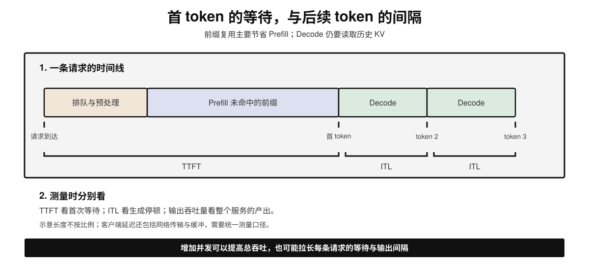
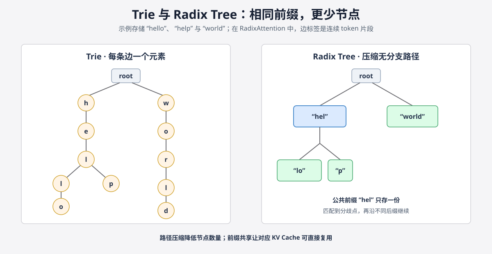
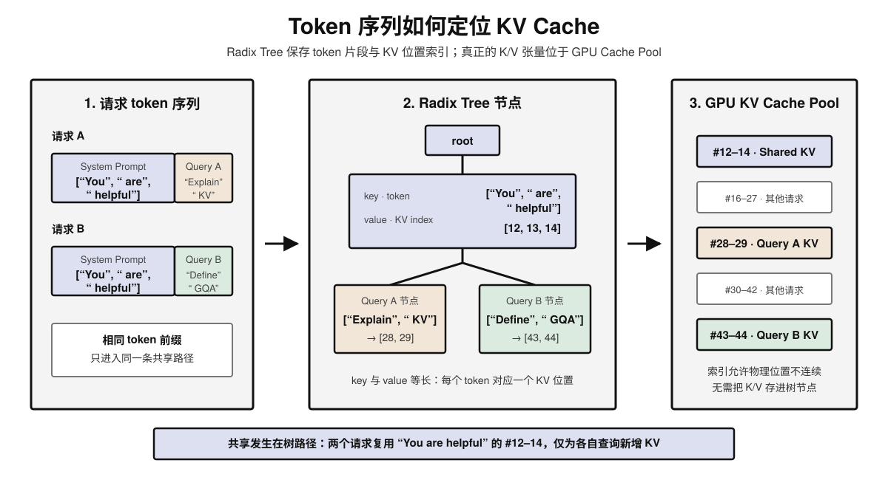
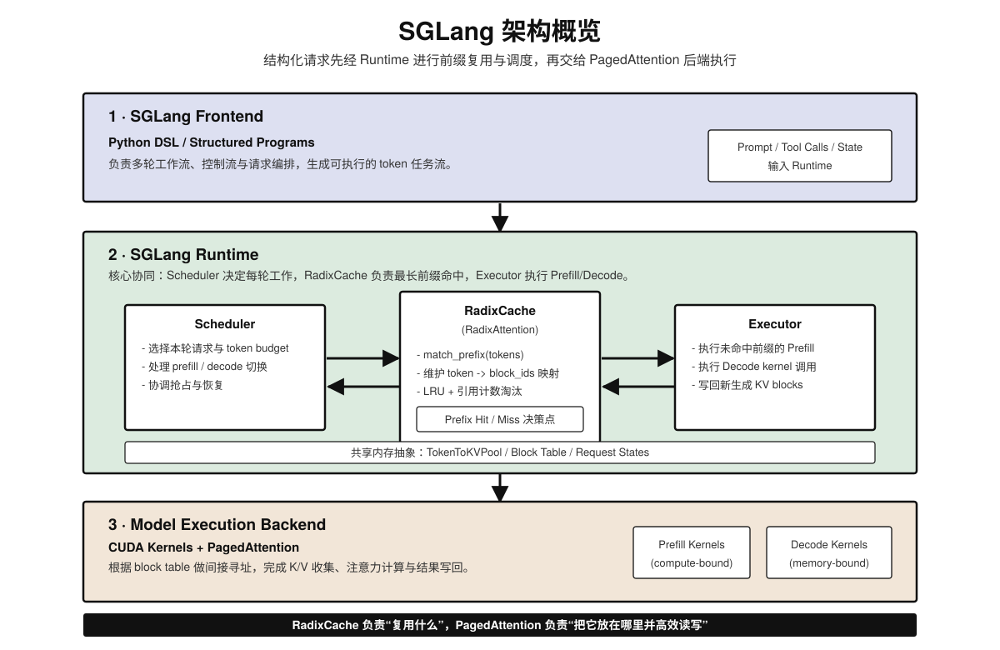
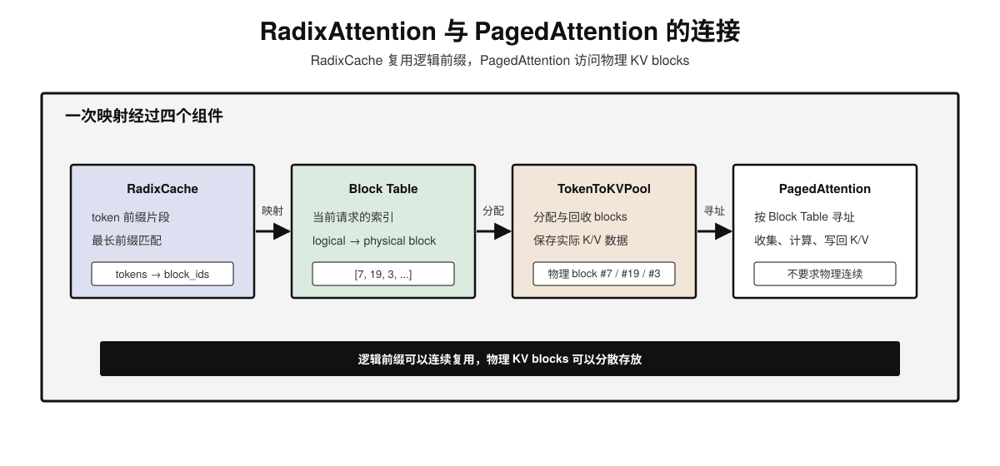
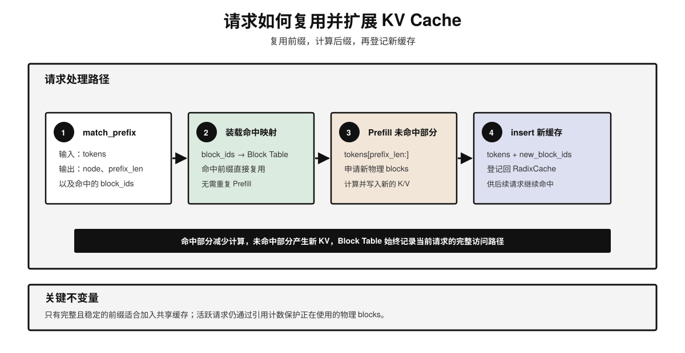
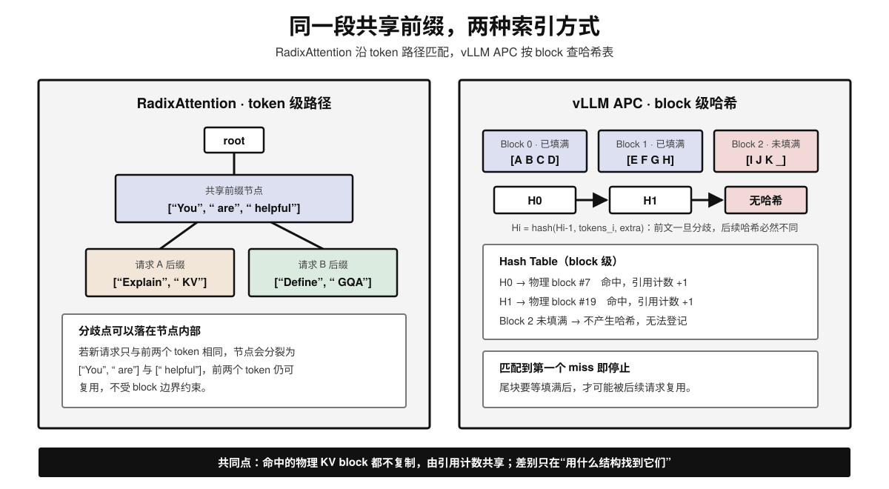
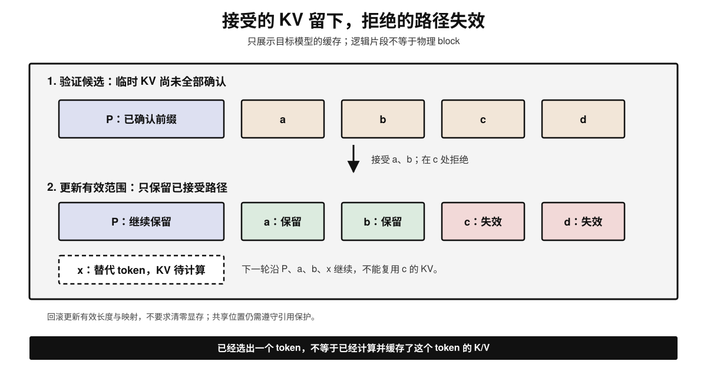

# KV Cache 原理简介

## 学习路径

1. 先理解自回归生成为什么会重复计算，以及 Prefill、Decode 和 KV Cache 的基本流程；
2. 再理解为什么只缓存 K/V，如何估算容量，以及如何区分首 token 延迟与生成速度；
3. 接着学习注意力架构与 KV 量化如何减少存储，分页如何管理显存，以及复用边界与常见排障方法；
4. 然后学习 Chunked Prefill 与 RadixAttention 如何改善调度和前缀复用，以及推测解码如何提交和回滚 KV；
5. 最后扩展到多卡分片、缓存搬运、Prefill-Decode 分离与托管模型服务的缓存策略。

---

## 1. 背景：大模型推理的挑战

大语言模型通常以自回归方式生成文本：根据已有内容预测下一个 token，再把它接到序列末尾，继续预测。

### 1.1 自回归生成模式

例如，输入 "Hello" 后生成 "World"，下一步根据 "Hello World" 生成 "!"。这里用单词示意，实际 token 可能是一个词、一个字，也可能只是词的一部分。


### 1.2 重复计算问题

最直接的实现会在每一步重新输入完整序列。这样，"Hello" 等历史内容虽然没有变化，其 Key（K）和 Value（V）仍被反复计算。序列越长，重复工作越多。


---

## 2. KV Cache 核心原理

### 2.1 什么是 KV Cache？

KV Cache 保存每层注意力中已经计算好的 K/V。后续生成时，模型读取这些历史结果，不再重新计算它们。这是一种“用显存换计算”的方法。

### 2.2 工作流程详解

KV Cache 的工作流程可以分为两个阶段：

1. **Prefill 阶段（首 Token 生成）**：
   - 模型接收完整的 Prompt 输入。
   - 计算所有输入 Token 的 K 和 V，并将它们存入 Cache。
   - 生成第一个输出 Token。
     

2. **Decode 阶段（后续 Token 生成）**：
   - 模型仅接收上一步生成的 Token。
   - 计算该 Token 的 Q、K、V。
   - 将新计算的 K、V 追加（Append）到 Cache 中。
   - 利用完整的 Cache (历史 K/V + 当前 K/V) 计算 Attention。
   - 生成下一个 Token，循环上述过程。
     

---

## 3. 为什么只缓存 K 和 V
缓存的判断标准不是“计算是否昂贵”，而是“以后是否还会读取”。


同一个隐藏状态经过 `q_proj`、`k_proj` 和 `v_proj` 得到三种用途不同的向量：

| 角色          | 含义                                                    | 生命周期                       |
| ------------- | ------------------------------------------------------- | ------------------------------ |
| **Q (Query)** | 当前 token 提出的「问题」——"我该关注哪些之前的 token？" | 一次性：提出并得到答案后即废弃 |
| **K (Key)**   | 每个 token 提供的「索引标签」——"我包含哪些信息？"       | 持久：后续每个 token 都要检索  |
| **V (Value)** | 每个 token 提供的内容摘要——"关注我的话，我贡献什么？"   | 持久：后续每个 token 都要读取  |

因果掩码使每个新 token 只查询自己和之前位置的 K/V。过去的 Q 不会再参与后续计算，因此
缓存它只会占用显存；历史 K/V 则会在每个 Decode step 被反复读取。

---

## 4. 显存占用与容量估算

每多保留一个 token，就需要保存它在相关层的 K/V。上下文越长、同时服务的请求越多，缓存占用通常越大。

### 4.1 显存占用的主要构成

在 LLM 推理中，显存主要被以下三部分占用：

1. **模型权重 (Model Weights)**：静态占用，取决于模型参数量和精度。
2. **KV Cache**：动态占用，随着序列长度和 Batch Size 线性增长。
3. **中间激活 (Intermediate Activations)**：推理时的临时计算缓冲区。


### 4.2 KV Cache 显存计算公式

对于各层配置相同的普通 MHA/GQA/MQA，先不考虑前缀共享、多卡分片和分页浪费，KV Cache 占用可估算为：

$$
\mathrm{Memory}_{KV} \approx 2 \times b_{kv} \times L \times B \times S \times N_{kv} \times d_{head}
$$

其中：

- $2$：同时缓存 Key 和 Value 矩阵。
- $b_{kv}$：数据精度（Bytes），如 FP16 为 2。
- $L$：模型层数 (Layers)。
- $B$：并发请求数 (Batch Size)。
- $S$：每个请求的平均序列长度（Prompt + 已生成 Token）。
- $N_{kv}$：每层实际生成并缓存的 KV Head 数量，即 `num_kv_heads`；它直接决定每个 Token 要保存多少组 K/V。
- $N_{attn}$：Query Head 数量，即 `num_attention_heads`；Query 不会写入 KV Cache，因此它不直接出现在公式中，而是决定多个 Query Head 如何共享 KV Head。
- $d_{head}$：单个 Attention Head 的维度，即 `head_dim`。

$N_{kv}/N_{attn}$ 表示 KV Head 的共享程度：MHA 中二者相等，每个 Query Head 使用独立的 KV Head；GQA 中多个 Query Head 共享一组 KV Head；MQA 中 $N_{kv}=1$，所有 Query Head 共享同一组 K/V。在其他条件不变时，GQA/MQA 的 KV Cache 大小约为 MHA 的 $N_{kv}/N_{attn}$。


### 4.3 Batch Size 对 KV Cache 的影响

单条请求的缓存大小，还不是整个服务的占用。没有前缀共享时，需要把所有保留 KV 的请求加起来；即使某条请求本轮没有参与计算，其缓存也可能仍在显存中。

**逐级展开公式：**

$$
\begin{aligned}
\mathrm{per token} &= 2 \times b_{kv} \times L \times N_{kv} \times d_{head} \\[4pt]
\mathrm{per sequence} &= \mathrm{per token} \times S \quad \text{(序列长度)} \\[4pt]
\text{total} &= \mathrm{per sequence} \times B \quad \text{(并发请求数)}
\end{aligned}
$$

因此，长上下文与高并发会相互放大显存压力。后文的优化分别从减少每 token 的存储、减少重复缓存、把暂时不用的缓存移出显存入手。

### 4.4 从显存预算反推能容纳多少请求

显卡标称容量不等于 KV Cache 的可用容量。要先扣除模型权重、运行时开销和计算峰值所需的空间，再给 KV Cache 分配预算。

例如，一张 24 GiB 显卡，权重占 14 GiB，运行时与激活峰值预算 4 GiB，另留 2 GiB 余量，就只剩 **4 GiB 的 KV 预算**。这里的数值仅用于演示，应以实际模型加载和压测结果替换。

假设模型有 32 层、8 个 KV heads、head dimension 为 128，KV 使用 BF16，则每个 token 的全模型缓存为：

$$
2 \times 2 \times 32 \times 8 \times 128 = 131072\ \text{bytes} = 128\ \text{KiB}
$$

4 GiB 约能容纳 32768 个 token 的 KV。若每条请求最终需要 4096 个 token 的缓存，理论上可放 8 条；这只是容量估算，尚未扣除分页尾部浪费，也不保证 8 条并发都满足延迟要求。

规划时按以下顺序进行：

1. **算缓存长度**：把 Prompt 和预计生成长度一起考虑，不能只按输入长度预算。
2. **算总 token 容量**：KV 预算除以每 token 缓存大小；不同长度的请求按各自长度求和，不要求它们一样长。
3. **留增长空间**：平均长度适合估算常态负载，长尾请求和 Decode 增长需要额外余量。
4. **用延迟压测收紧并发**：逐步提高并发，观察首 token 和后续 token 的延迟，取容量与延迟都能接受的范围。

前缀共享可以减少实际占用，但首次冷启动可能完全没有命中，因此不要把理想命中率当成容量保证。多卡部署也不能简单按卡数乘容量，后文会说明 KV 的分片与复制。

---

## 5. 速度与显存的权衡

| 特性           | 标准推理 (Standard Inference)     | KV Caching                      |
| :------------- | :-------------------------------- | :------------------------------ |
| **单步计算量** | 随序列长度平方级增长 ($O(N^2)$)   | 随序列长度线性增长 ($O(N)$)     |
| **显存占用**   | 较低，主要取决于模型权重          | 较高，随序列长度线性增加        |
| **推理速度**   | 历史内容反复重算，开销大 | 避免重算，但仍需读取历史 K/V |
| **适用场景**   | 短文本、显存极其受限的场景        | 长文本生成、高吞吐服务          |

### 5.1 缓存省掉的是重算，不是历史读取

使用 KV Cache 后，每个 Decode step 不必重新生成历史 K/V，但当前 Q 仍要读取可见的历史 K/V。对于全注意力，上下文越长，需要读取的数据越多，所以“已经缓存”不意味着后续生成速度与上下文长度无关。

表中的复杂度比较指注意力部分，不是整个模型前向的全部开销。实际瓶颈还受模型权重读取、MLP、batch 大小和硬件影响；Prefill 常偏算力受限、Decode 常偏带宽受限，是理解负载的起点，不是任何配置下都成立的定律。

FlashAttention 与 KV Cache 也不是替代关系：前者主要减少注意力计算中间结果的显存读写，后者避免跨生成步重算历史 K/V，可以一起使用。

### 5.2 首 token 快，与后续生成快，是两件事



| 指标 | 看什么 | 容易误解的地方 |
| --- | --- | --- |
| **TTFT** | 请求发出到收到首个 token 的时间 | 包含排队、预处理、Prefill 和传输，不只等于 Prefill 耗时 |
| **ITL / TBT** | 相邻输出 token 的时间间隔 | 网络缓冲与批量发送也会影响客户端观测值 |
| **TPOT** | 首 token 之后，平均每个输出 token 的耗时 | 平均值会掩盖偶发停顿；只有一个输出 token 时不适用 |
| **输出吞吐量** | 整个服务每秒输出多少 token | 提高并发可能增加总吞吐，却让单个请求变慢 |

前缀命中主要减少 Prefill，因此通常首先改善 TTFT；命中的历史 K/V 仍会被 Decode 读取，不能据此推断 ITL 也会同比下降。

比较优化效果时，固定模型、输入与输出长度、并发和请求到达方式，分别测冷缓存与热缓存。除平均值外，还要看 p95/p99 等尾部延迟，避免“大多数请求很快”掩盖少数请求长时间等待。

---

## 6. 注意力架构决定缓存形态
KV Cache 存的是每一层每个 token 的 Key 和 Value。但 "Key" 和 "Value" 到底有几个？这取决于注意力类型——MHA 下 64 个 Q head 就有 64 组 K/V，GQA 下 64 个 Q head 可能只共享 8 组 K/V，MLA 下 K/V 干脆被压缩成了 latent vector。KV Cache 的物理大小直接由注意力架构决定。

---

### 6.1 MHA（多头注意力）：每个 Q head 配一组 K/V

标准 Transformer 的配置：Q head 数 = K head 数 = V head 数。

```text
LLaMA-2 70B 如果使用 MHA（实际使用 GQA，此处仅做假设）：
  num_q_heads = 64
  num_kv_heads = 64    ← 与 Q head 数相同
  head_dim = 128

单 token 单层的 KV Cache：
  K: (64, 128) = 8192 个 float16 = 16 KiB
  V: (64, 128) = 8192 个 float16 = 16 KiB
  合计：32 KiB / token / layer

全模型（80 layers, seq_len=4096）：
  KV Cache = 2 × 80 × 64 × 128 × 4096 × 2 bytes = 10 GiB
```

在 head 数、维度和精度相同的前提下，MHA 不共享 KV heads，因此比 GQA/MQA 占用更多缓存。


---

### 6.2 GQA（分组查询注意力）：多个 Q head 共享一组 K/V

这是当前最主流的方案。Q head 被分成若干组，每组内的所有 Q head 共享一组 K 和 V。

```text
LLaMA-2 70B（实际配置）：
  num_q_heads = 64
  num_kv_heads = 8      ← 8 组 K/V，每组服务 8 个 Q head
  head_dim = 128

Q head 到 KV head 的映射：
  Q head 0-7   → KV head 0
  Q head 8-15  → KV head 1
  ...
  Q head 56-63 → KV head 7

单 token 单层的 KV Cache：
  K: (8, 128) = 1024 个 float16 = 2 KiB
  V: (8, 128) = 1024 个 float16 = 2 KiB
  合计：4 KiB / token / layer    ← 仅为 MHA 的 1/8

全模型（80 layers, seq_len=4096）：
  KV Cache = 2 × 80 × 8 × 128 × 4096 × 2 bytes = 1.25 GiB
```

本例中 64 个 Q heads 共享 8 个 KV heads，所以缓存是对应 MHA 的 1/8。实际模型的比例应查配置中的 `num_attention_heads` 与 `num_key_value_heads`，不能仅凭模型家族名称判断。


---

### 6.3 MQA（多查询注意力）：所有 Q head 共享唯一一组 K/V

GQA 的极端版本：只保留 1 组 K 和 V，所有 Q head 全部共享。

```text
假设 MQA 配置：
  num_q_heads = 32
  num_kv_heads = 1      ← 只有 1 组 KV
  head_dim = 128

单 token 单层的 KV Cache：
  K: (1, 128) = 128 个 float16 = 256 bytes
  V: (1, 128) = 128 个 float16 = 256 bytes
  合计：512 bytes / token / layer
```

MQA 进一步减少了缓存，但 KV 共享程度更高，可能限制表达能力。质量是否下降、下降多少，需要结合模型训练和任务评估，不能只根据缓存大小判断。


---

### 6.4 MLA（多头潜在注意力）：K/V 被压缩后再存储

MLA 不缓存完整的 K/V，而是缓存压缩后的内容向量和独立的位置向量；解码时再按需还原：


#### 6.4.1 什么是 RoPE

RoPE（Rotary Position Embedding，旋转位置编码）把向量的维度两两分组，再按照 Token 所在位置旋转不同角度。这样，Q 与 K 做点积时，不仅能判断内容是否相关，也能感知两个 Token 的相对距离。

- RoPE 只作用于 **Q 和 K**，因为位置会影响注意力分数；V 负责携带内容，不需要旋转。
- 图中的 `RoPE key` 不是位置编号，而是 **K 中经过 RoPE 旋转的位置分量**。
- MLA 将这部分从 Content K 中拆出，是为了在压缩 K/V 的同时保留位置信息。

#### 6.4.2 图中每一步

1. **输入隐藏状态**：每个 Token 在当前层先得到隐藏向量 $h_t$，它包含该 Token 的上下文信息。
2. **压缩内容信息**：$h_t$ 经下投影 $W^{DKV}$ 压缩为 `KV latent`。它不是完整的 K 或 V，而是能够同时还原 Content K 和 V 的紧凑表示。
3. **生成位置信息**：另一条分支从 $h_t$ 生成 Key 的位置分量并应用 RoPE，得到 `RoPE key`。
4. **写入 KV Cache**：每个历史 Token 只保存 512 维 `KV latent` 和 64 维 `RoPE key`，不保存展开后的多头 K/V。
5. **解码时读取**：处理新 Token 时，模型读取历史 Token 的 latent；通过 $W^{UK}$ 得到各 Head 的 Content K，通过 $W^{UV}$ 得到各 Head 的 V，并将共享的 `RoPE key` 提供给所有 Head。
6. **计算注意力**：当前 Token 的 Q 分别与历史 Token 的 Content K、RoPE key 计算内容相关性和位置相关性；合并得分后对 V 加权求和。

> 图中的“还原 K/V”是便于理解的逻辑过程。优化实现可以融合投影运算，避免真的在显存中展开并保存完整 K/V。

**空间示例**：512 维 latent 加 64 维位置分量，使用 BF16 时，每 token 每层占 $(512+64)\times2=1152$ bytes，即约 1.13 KiB。与 MHA 比较时还需指定其 KV heads 和 head dimension。

#### 6.4.3 MLA 的代价与边界

- **需要模型本身支持**：不能只改推理配置，就把已有的 MHA/GQA 模型变成 MLA。
- **依赖专用后端**：压缩与投影带来额外工作，需要合适的 kernel 才能发挥带宽收益。
- **不是无限压缩**：latent 维度影响表达能力；每 token 变小后，总缓存仍随上下文增长。

---

### 6.5 扩展：跨 token 压缩与混合缓存

前面的方案主要减少每个 token 的存储。另一条路线是**把多个 token 的信息合并为摘要**，减少需要保存和读取的条目。下面用 CSA/HCA 配图理解这一思路；图中的窗口、层数是具体示例，不应当作所有模型的通用配置。

#### 6.5.1 CSA：把连续 token 合并为摘要

窗口大小决定“一次合并多少 token”，步长决定“隔多少 token 产生一个摘要”。二者不同，不能只看窗口大小计算有效压缩率。


- **c4a**：窗口包含 8 个 Token，每隔 4 个 Token 生成一个摘要；相邻窗口重叠 4 个 Token，因此约保留原始 Token 数量的 $1/4$。
- **c128a**：图中窗口大小和步长都为 128，每 128 个 token 产生一个不重叠摘要，摘要条目数约为原来的 $1/128$。
- 摘要由可学习的权重生成，不是简单平均；Q 直接关注这些摘要，不需要先还原每个历史 Token。

#### 6.5.2 HCA：混合使用多种压缩策略

不同层可以采用不同压缩强度，并额外保留最近一段 token 的局部窗口：摘要覆盖长历史，窗口保留近期细节。


这类缓存需要按层分别估算：把各层的摘要、局部窗口及额外索引相加，而不是直接套用第 4 节的统一 KV-head 公式。减少历史条目会改变模型能读取的信息，需要模型设计和训练配合，不是可以随意丢弃旧 KV 的通用开关。

---

### 6.6 这些方案分别减少什么

| 方案 | 保留的内容 | 减少存储的方式 |
| --- | --- | --- |
| MHA | 每个 Q head 对应的 K/V | 不共享 KV heads |
| GQA / MQA | 多个 Q heads 共用的 K/V | 减少 KV heads 数量 |
| MLA | latent 与独立的位置分量 | 压缩每 token 的表示 |
| 跨 token 压缩 | 历史摘要与局部窗口 | 减少历史条目数量 |

前面的算例来自不同配置，不能把它们的字节数直接当成公平的性能排名。比较容量时，要统一层数、精度和序列长度，并明确是在比较单层还是整个模型。

---

### 6.7 KV Cache 量化：结构不变，降低存储精度

GQA、MLA 改变“需要缓存什么”，KV 量化改变“每个值用多少位保存”。**权重量化不等于 KV Cache 量化**：模型权重采用 INT4 时，KV 仍可能使用 BF16，需要分别检查配置。

| KV 精度 | 相对 BF16 的原始数据大小 | 主要代价 |
| --- | --- | --- |
| FP16 / BF16 | 1 倍 | 占用较大，可作为质量与性能基线 |
| FP8 / INT8 | 约 1/2 | 需要适配的缩放方式与 kernel，可能引入精度损失 |
| INT4 | 约 1/4 | 更依赖专用实现，量化误差和解包开销更值得关注 |

这些比例不含缩放参数、对齐和可能保留的高精度数据；具体格式是否可用，取决于引擎、模型和硬件。

以 INT8 为例，可以把一组 K/V 值按比例缩放后保存为整数，同时保存缩放参数；读取时再用这些参数恢复近似值。FP8 的数值表示不同，但也需要合适的范围控制。缩放过粗可能抹掉较小的数值，范围不足则可能截断较大的数值，进而改变注意力结果。

量化减少显存占用，也可能减少读取带宽，但恢复数值和解包需要工作。若这些操作能在 Attention kernel 内高效完成，收益更容易体现；若额外生成大块临时张量，反而可能变慢。

最简单的验证顺序是：先记录 BF16 基线，再启用引擎支持的低精度 KV，用相同负载比较显存、TTFT、ITL 和输出质量。除了短问答，也应测试长上下文检索、多轮对话等依赖历史信息的任务，不能只以“没有报错”判定可用。

## 7. PagedAttention：分页管理 KV Cache
### 7.1 连续分配为什么浪费显存

假设模型最大上下文为 8192 token，请求 A 实际使用 300 token，请求 B 使用 5000 token。

若为每个请求都预留 8192 个位置，地址计算很简单，却锁住了大量尚未使用的空间。

另一种做法是只分配当前需要的连续区间，并在序列增长时扩容。问题类似动态数组和堆内存：相邻位置可能已被别的请求占用，系统只能搬移已有缓存或寻找更大的空洞。请求持续到达和结束后，总空闲量可能足够，却找不到足够大的连续区间，这就是外部碎片。

LLM 请求有三个特征，让这个问题格外突出：

- 长度事先未知；
- 每个 decode step 都可能增长；
- 请求结束时间不同，分配和释放非常频繁。


### 7.2 从 token 序列到固定大小 block

PagedAttention 把逻辑序列切成固定 token 数的块。每块容纳 4 个 token 时，10 个 token 需要 3 个逻辑块：前两块填满，最后一块使用 2 个位置。

这三个逻辑块可以映射到任意空闲物理块，逻辑顺序由 block table 维护，而不要求物理块连续。

序列继续增长时，先填满尾块，再按需申请新块，无需事先知道最终长度。

最后一个块仍可能有空槽，所以分页不是绝对零浪费。若 block size 为 $B_s$，单条序列尾部最多浪费 $B_s-1$ 个 token slot；相较为最大长度预留，浪费被限制在一个 block 内。


### 7.3 Block 中实际保存什么

“每块 4 个 token”只是逻辑说法。物理 KV block 还包含所有相关层或某组层、K/V、KV heads 和 head dimension 对应的数据。不同引擎版本和 attention 类型可能采用不同布局。

可以把地址查找概括为：


PagedAttention kernel 需要按 block table 收集 K/V。与连续张量相比，这增加了间接寻址和元数据处理；但换来了更高的有效缓存容量和动态分配能力。kernel 的任务就是让这层间接性不会抵消内存管理收益。

### 7.4 一条请求的完整生命周期


例如，设 `block_size=4`，请求的 prompt 有 10 个 token，前缀缓存命中了前 4 个 token：调度器复用命中的 block 7，再为剩余 6 个 token 分配物理 block 19 和 3，并生成对应的 block table `[7, 19, 3]`。本轮 worker 计算未命中的 6 个 token，将 K/V 写入 block 19 和 block 3 的前两个槽位；如果请求继续生成第 11、12 个 token，就继续写入 block 3 的剩余槽位，直到第 13 个 token 才需要申请新 block。

图中省略了部分实现细节：请求先由 tokenizer 生成 token IDs，调度器结合 token budget 和 block budget 决定本轮工作；命中的完整前缀 block 可以直接复用，未命中的 token 则由 worker 计算并写入新分配的 slot。请求继续时复用已有 block，资源不足时可能排队、抢占或重算；结束后，只有引用计数归零的 block 才能释放或保留为缓存。

### 7.5 分页与 continuous batching 的协同

Continuous batching 要解决的问题是：不同请求生成速度不同，有的提前结束，有的仍在 decode，还有新请求正在等待。为了不让 GPU 等到整批请求全部完成，调度器会在每个 step 重新组成 batch：移除已结束的请求，再从等待队列补入新请求。

例如，当前 batch 中有请求 A、B、C。A 在本轮结束后完成，下一轮调度器便移除 A，并加入等待中的请求 D。如果每个请求的 KV Cache 必须占据一段连续显存，A 退出和 D 加入可能需要寻找新的连续空间，甚至搬移 B、C 的缓存。PagedAttention 把缓存拆成独立 block 后，只需释放 A 的物理块，再把其中的空闲块分配给 D；B、C 的 block table 和已有 KV 都不用移动。


不过，“本轮想算多少”和“显存能否容纳”仍是两个约束：

- 调度器根据 token budget，选择本轮为哪些请求执行多少 prefill 或 decode token；
- cache manager 根据剩余 block 数，检查这些 token 是否都有可写入的 KV slot；
- 两项检查都通过后，worker 才根据 block table 和 slot mapping 执行读写。

因此，continuous batching 负责动态组合请求，PagedAttention 负责让这些请求的 KV Cache 能低成本地加入、增长和回收。两者协同，才能在 batch 持续变化时保持 GPU 忙碌，同时避免缓存搬移和过量分配。

### 7.6 Automatic Prefix Caching 如何复用 block

很多请求会重复使用同一段 system prompt、工具定义或文档。由于相同前缀会产生相同的 K/V，新请求可以直接引用已经计算好的物理 block，跳过这部分 prefill。后续使用什么采样参数，不会改变这段前缀已经产生的 K/V。

缓存命中遵循一条关键规则：**从序列开头逐块比较，只复用连续命中且已经填满的 block；遇到第一个不同的 block 就停止。**


图中两个请求只能共享第一块 `[A B C D]`。第二块的最后一个 token 不同，命中在此停止，Request B 从第二块开始重新执行 prefill；A 尚未填满的尾块则要等到完整后，才可能加入缓存索引。

vLLM 用链式哈希实现这条规则。第 $i$ 个 block 的缓存身份可以理解为：

$$
H_i=\operatorname{hash}(H_{i-1},\ tokens_i,\ extra)
$$

其中，`tokens_i` 是当前 block 的 token，$H_{i-1}$ 代表它之前的全部完整前缀。因此，即使后面某个 block 的 token 恰好相同，只要前面已经发生分歧，它的哈希也会不同，不能错误地重新命中。`extra` 还会纳入会影响缓存身份或隔离范围的信息，例如 LoRA adapter、多模态输入哈希和 cache salt。

被命中的物理 block 不会复制，而是由多个请求共同引用。引用计数大于 0 时，它不能被释放或覆盖；引用归零后，它可以继续留在缓存中等待下次命中，也可以在显存不足时被淘汰。

#### 7.6.1 共享不应突破租户边界

跨请求前缀命中会造成时间差：命中者的 prefill 更快。多租户服务若无隔离，攻击者可能利用延迟推测某段前缀是否已缓存。官方设计提供 cache salt，将首块哈希与指定信任域绑定。缓存正确性不仅是“token 相同”，还包括模型状态一致与安全边界一致。

#### 7.6.2 什么情况下不能直接复用

KV 是一次具体前向计算的结果，不是文本的通用表示。判断复用前，至少要确认：

| 检查项 | 为什么影响复用 |
| --- | --- |
| 模型权重、版本与 LoRA adapter | 同样的 token 经过不同参数会产生不同 K/V |
| 实际 token IDs 与完整前文 | 相同文字可能因 tokenizer、模板、特殊 token 或空白处理不同而变成不同输入 |
| 位置编号、RoPE 与注意力配置 | 相同片段换了位置或可见上下文，其计算结果可能改变 |
| 图片、音频等实际模型输入 | 相同占位 token 不代表相同的多模态内容 |
| KV 格式、布局与并行配置 | 搬到另一后端时，需要验证兼容性或进行受支持的转换 |
| 租户或信任域 | 数值可以复用，也不代表有权限跨域共享 |

模型更新时，应清空旧缓存或切换缓存命名空间；不要只比较用户看到的字符串。相同文档出现在不同前文之后，也不能直接拼接旧 KV 来代替计算。采样温度通常不改变已经给定的前缀 K/V，但会影响后续生成出的 token。

#### 7.6.3 哪些缓存值得留下

请求执行时必须保留它正在读取的 KV；请求结束后，是否继续保留给别人复用，则是另一个问题。**准入**决定哪些结果进入可复用缓存，**淘汰**决定空间不足时先回收谁。

先理解三种简单情况即可：

- **反复使用的 System Prompt**：保留后容易再次命中，通常有价值。
- **只访问一次的长文档**：占用很多空间，却可能没有第二次访问；保留太多会挤掉常用前缀，这叫缓存污染。
- **多个租户混用**：一个租户的大量一次性请求，可能挤掉其他租户的热点；可以在服务层限制配额，支持时使用独立缓存域。

LRU 优先回收久未使用的结果；按访问频率考虑保留则偏向常用结果。这里不需要掌握复杂算法，关键是理解“最近使用、重复次数、占用大小、隔离要求”会共同影响保留价值。具体引擎未必暴露这些策略的开关。

### 7.7 Copy-on-Write 与分支解码

在 beam search 或并行采样中，多个候选序列起初共享相同前缀。物理复制全部 KV 会造成浪费，因此论文设计允许逻辑 block tables 指向相同物理块，并用引用计数管理。

当分支要修改共享尾块时，系统需要分配新块并复制必要内容，即 copy-on-write；已经填满且只读的历史块则可继续共享。具体实现会随引擎版本和解码路径演进，但不变量是：任何写入都不能破坏其他序列看到的历史 K/V。


> “修改当前 block”通常指：向未填满的尾部 block 追加新 token 的 K/V，不是修改已有 token。

### 7.8 Block size 是一组折中

| block 大小 | 收益 | 代价 |
| --- | --- | --- |
| 较大 | block table 更短，元数据更少 | 尾块浪费更多，前缀复用粒度更粗 |
| 较小 | 尾块浪费更少，前缀复用更细 | 块数、索引和管理开销更多 |

block size 还受 kernel、数据精度和硬件对齐约束。先使用引擎支持的默认值，再用实际负载验证，不必一味调小。

### 7.9 缓存不足时会发生什么

当 free blocks 不足，系统不能继续给所有请求分配 slot。可选策略包括：

- 让新请求继续排队；
- 抢占正在运行的请求并释放其 blocks；
- 恢复时重新执行部分 prefill；
- 将缓存 offload 到 CPU 或外部层级，之后再取回；
- 在分布式 prefill/decode 架构中传输 KV。

这些方案是在容量、计算与传输之间交换成本。重计算浪费 GPU FLOPs，但 PCIe 或网络较慢时，可能比 swap 更合适；offload 保留计算结果，却可能增加尾延迟。监控中若只看 GPU 利用率，很难分辨请求是在有效 decode，还是因反复 preemption 重算 prompt。

### 7.10 从症状定位 KV Cache 问题

先区分三个量：**预分配的缓存池、活跃请求正在使用的块、空闲但仍保存可复用结果的块**。GPU 显存长期接近满载，可能只是缓存池预分配，并不自动等于容量不足或内存泄漏。

观察缓存时，除了延迟，还要记录命中 token 数、查询 token 数、活跃块与可回收块数量、抢占次数，以及重算的 token 数。请求命中率与 token 命中率不是同一指标：命中 100 条短前缀，不一定比命中一条长前缀省更多计算。各引擎统计口径不同，比较前应明确分母。

| 症状 | 先检查 | 优先尝试的动作 |
| --- | --- | --- |
| 热缓存 TTFT 仍高 | 是否真的命中长前缀，是否大量排队 | 检查模板与路由；队列过长时控制并发 |
| TTFT 正常，ITL 随上下文变差 | 历史 KV 读取量、实际 batch、带宽压力 | 缩短不必要的上下文；测试受支持的 KV 量化 |
| 抢占、重算频繁 | 活跃 KV 是否逼近容量，请求是否持续增长 | 降低并发或生成长度，重新核算 KV 预算 |
| Prefill 期间 OOM | 激活峰值和运行时开销是否被低估 | 保留运行时余量；测试后文的 Chunked Prefill |
| 命中率很低 | token 前缀、隔离域、淘汰和实例路由 | 固定稳定前缀，动态内容后置，避免相同请求散落到不同实例 |
| 偶发长时间停顿 | 抢占、长 Prefill、KV 搬运及网络缓冲 | 关联同一时段的调度和传输日志，再决定调整哪一项 |

每次只改一个主要参数，并用相同负载复测。若增加 KV 预算降低了抢占，却引发激活 OOM，说明只是把压力转移到了另一部分显存；若吞吐提高但尾延迟超标，也不能算达到了服务目标。

## 8. Chunked Prefill：分块调度长 Prompt
Chunked Prefill 把长 prompt 分块计算，使 KV block 从一次性申请变为逐批增长。它同时影响
Prefix Caching、block 对齐和 Preemption 的触发时机。

---

### 8.1 一次算完的代价

#### 8.1.1 Prefill 的算力特性

对于全注意力，长度为 $S$ 的 Prompt，其注意力计算量随 $S^2$ 增长。32K 相比 4K，注意力部分的理论计算量约为 64 倍；这不等于整个模型耗时也增加 64 倍，因为投影、MLP 和硬件利用率同样影响结果。

长 Prefill 往往占用较长的 GPU 执行时间，使其他请求无法及时进入下一次 Decode。

#### 8.1.2 传统 Prefill 对 KV Cache 的双重冲击

一次性 Prefill 意味着一次性为整个 prompt 的 **所有 token** 分配 KV Cache block：


两个问题同时出现：

- **Block 分配峰值高**：2048 个 block 瞬间被占用。如果此时 GPU 上还有其他请求正在 Decode，可能导致 block 池耗尽，触发 Preemption。
- **Decode 被阻塞**：长 Prefill 会推迟其他请求的下一次 Decode；长请求自己的 TTFT 也要包含等待 Prefill 完成的时间，此外还有排队、预处理和传输开销。具体耗时取决于模型、硬件与负载。

#### 8.1.3 Chunked Prefill 的核心思路

Chunked Prefill 将长 Prompt 切成受 token budget 限制的多个小段。每完成一段，调度器都能重新组批，让其他请求的 Decode 穿插执行，同时只追加当前 chunk 所需的 KV blocks。


图中用一个 8192-token Prompt 简化说明：传统方式连续执行完整 Prefill，并在开始前申请 512 个 blocks，B、C 的 Decode 只能延后；Chunked Prefill 则将请求 A 拆成四个 2048-token chunk，绿色的 `D` 表示穿插在 chunk 之间的其他请求 Decode。

每完成一个 chunk，请求 A 的 KV Cache 依次增长为 128、256、384、512 blocks，而不是在开始时一次占满。分块没有减少 A 的总计算量，A 也必须完成四个 chunk 后才能进入 Decode；收益来自更平滑的 KV 分配，以及缩短其他在线请求的等待时间。

---

### 8.2 Chunked Prefill 对 KV Cache 的三个改变

#### 8.2.1 Block 分配：从一次性到增量式

无 Chunked Prefill 时，`allocate_slots()` 为整个 Prompt 一次性申请 KV blocks；启用后，每个调度步只追加当前 chunk 所需的 blocks。


图中 32K Prompt 最终仍占用 2048 blocks，但单次申请从 2048 降为 128。`num_computed_tokens` 随每个 chunk 前移，既记录已计算 token 数，也指向下一段 Prefill 的起点；达到 32768 后，请求才转入 Decode。这样降低的是每轮容量检查和分配的门槛，并在 chunk 边界增加重新调度或处理 Preemption 的机会，而不是减少请求最终需要的 KV Cache。

#### 8.2.2 Prefix Caching：只在第一个 chunk 查找

以 vLLM 中 `num_computed_tokens == 0` 时查询前缀缓存的调度路径为例：请求首次调度时确定命中范围，后续 chunk 沿已有映射继续追加。下面的行为与参数属于实现细节，应以所用版本为准，不是 Chunked Prefill 的通用定义。


图中 B 首次查询时只命中前 2048 个 token；A 随后完成的相同后缀不会自动加入 B 的命中范围，因此 B 仍需重算。限制是**查询时机**，不是“最多只能命中一个 chunk”：首次查询时已可用的连续完整前缀都可能被复用。

#### 8.2.3 Block 对齐：为什么常按完整块切分

以要求中间 chunk 按完整 block 切分的调度路径为例，token budget 会向下对齐到 `block_size` 的整数倍，便于管理可共享的缓存边界。末尾不足一块的输入仍需计算，只是不能作为完整块复用；具体对齐规则取决于版本和后端。


图中 `block_size=16`、`budget=133`，本轮可调度 $\lfloor 133/16\rfloor\times16=128$ 个 tokens，即 8 个完整 blocks；余下 5-token 预算不足以组成完整 block，留到后续调度步。代价是少量 token budget 可能暂时未被利用，收益是缓存边界始终明确，无需处理 partial block hashing。

---

### 8.3 物理分布与调度公平性

#### 8.3.1 Chunk 之间的 KV Cache 碎片

每个 chunk 都从当时的空闲池追加 blocks；在两次调度之间，其他请求也会申请和释放空间，所以同一请求的物理 blocks 往往不连续。


图中请求 A 的三个逻辑 chunk 依次映射到物理块 `#7`、`#19` 和 `#3`。PagedAttention 依靠 block table 保存逻辑顺序，Attention kernel 按映射读取 K/V，因此无需整理空洞或搬移已有缓存。这里的“碎片”主要是物理位置分散，不等同于传统连续分配中“总空闲量足够却找不到大块空间”的外部碎片。

#### 8.3.2 long_prefill_token_threshold：长 prompt 的特殊对待

vLLM 的 `long_prefill_token_threshold` 可用于限制长 Prompt 单轮处理的 token 数，避免单个请求持续占满 token budget。是否启用以及与其他参数如何配合，需要查看当前版本配置。


图中长请求 A 本轮只处理 threshold 范围内的 tokens，未完成部分留在 running 队列；短请求 B 可以利用可用预算更早完成 Prefill。配合 `max_num_partial_prefills` 与 `max_long_partial_prefills` 限制同时运行的长 partial prefill 数量时，短请求还可以绕过队首长请求，从而改善 TTFT。

这首先是调度公平性策略，而非新的 KV Cache 压缩方式；从缓存角度看，它只是进一步限制长请求每轮新增的 blocks，并让不同请求的物理分配更频繁地交错。

---

## 9. RadixAttention：自动复用共享前缀
前文介绍了用 block 哈希查找共享前缀。RadixAttention 解决同一个问题，但使用压缩前缀树组织 token 路径，更直接地表达公共前缀及其分支。

---

### 9.1 RadixAttention 核心原理

RadixAttention 把 token 序列组织成 Radix Tree，并让树中的路径指向对应的 KV Cache。新请求沿树寻找最长公共前缀，只计算尚未缓存的后缀；显存不足时，再从不影响活跃请求的叶子开始回收。

#### 9.1.1 Radix Tree 数据结构

Trie 的每条边只保存一个元素，长而无分支的路径会产生许多中间节点。**Radix Tree（基数树）**将这类路径压缩为一个节点，使一条边可以保存连续片段。



在 RadixAttention 中，把图里的字符串换成 token 序列即可：相同前缀走同一路径，出现分歧时分支，无分支的连续片段合并保存。

#### 9.1.2 Token 序列到 KV Cache 的映射

Radix Tree 节点不直接保存庞大的 K/V 张量，而是保存两组等长数据：一段连续的 **token IDs**，以及每个 token 对应的 **KV Cache 位置索引**。



图中两个请求都以 `You are helpful` 开头，因此共享同一树节点及其 KV 位置 `#12–14`；`Explain KV` 与 `Define GQA` 只为各自的查询 token 新增位置。树负责组织和复用逻辑前缀，索引负责定位 GPU Cache Pool 中可不连续的实际 K/V。

#### 9.1.3 前缀匹配与查找算法

新请求从根节点开始，按 token 逐段比较压缩路径：节点完全匹配就继续向下，节点内部出现差异或没有对应子节点时停止。走过的最长路径就是可复用的 KV Cache。


图中新请求命中 `System Prompt → Query A → Response A`，因此直接取得这段路径关联的 KV Cache，只对 `Query C` 执行 Prefill。若根节点后立即失配，则完整 Prefill；若全部可用前缀均命中，则只处理推理引擎为产出下一 token 所保留的计算边界。

#### 9.1.4 LRU 淘汰策略

GPU 显存不足时，RadixAttention 按最近访问时间回收缓存，但只考虑**未被请求引用的叶子节点**。引用计数大于 0 表示仍有活跃请求使用该路径；中间节点则可能被多个后缀共享，直接删除会让整棵子树失效。


图中 `vllm` 是最久未访问且引用计数为 0 的叶子，因此先释放它关联的 KV blocks。删除后若父节点只剩一个孩子，可重新合并连续路径，以保持 Radix Tree 的压缩结构。

---

### 9.2 SGLang 中的实现

#### 9.2.1 SGLang 系统架构简介

SGLang 是 LLM 推理系统，RadixAttention 是其前缀复用机制之一。下图按请求入口、Runtime 和执行后端划分职责，帮助理解缓存管理位于哪里。



#### 9.2.2 前缀索引如何连接实际 KV

**前缀索引负责找，内存管理负责分配，Attention 后端负责读写。** 下图用分页术语概括三者的连接，不是某个版本的完整类图。SGLang 的实际映射可能采用 token 位置索引或页级表示，也不要求使用 vLLM 的同名 kernel。



1. **RadixCache**：保存 token 片段及对应的 KV 位置索引，不把 K/V 张量直接存进树节点。
2. **KV 内存池与分配器**：内存池保存实际 K/V，分配器管理可用位置，两者配合完成分配与回收。
3. **请求映射**：记录当前请求的 token 对应哪些 KV 位置；后端据此读取物理上不连续的缓存。

一次请求的处理过程可以分为四步：



1. **匹配**：查询可复用的最长前缀，取得对应 KV 位置。
2. **引用**：把命中位置接入当前请求的映射，并保护正在使用的缓存。
3. **计算**：为未命中的后缀分配位置，执行 Prefill 并写入 K/V。
4. **登记**：把满足缓存条件的新前缀加入索引，供后续请求使用。

图中的 `match_prefix`、`insert` 表示逻辑操作；具体参数、登记时机和页对齐要求以所用版本为准。

---

### 9.3 与 vLLM Automatic Prefix Caching 的区别

两者都通过复用已计算的前缀减少 Prefill。这里重点比较**如何索引前缀**，而不是给两个推理引擎排性能名次。



| 维度 | RadixAttention | vLLM APC |
| --- | --- | --- |
| **前缀索引** | 用根到节点的 token 路径表达前缀 | 用链式哈希表达完整 block 及其前文 |
| **查找过程** | 沿树匹配，分歧处停止 | 逐块查表，复用连续命中的前缀 |
| **复用粒度** | 树可表达 token 级分歧；实际受 page size 和后端约束 | 通常以完整 block 为缓存单位 |
| **回收管理** | 典型实现从未被引用的叶子回收 | 典型实现回收未被引用的缓存块 |
| **额外身份信息** | 可通过扩展键或命名空间区分 | 可纳入哈希键的 `extra` |

例如，两条请求共享 20 个 token，之后分歧，且这段 KV 已可用：若 APC 的 `block_size=16`，可以复用前 16 个，而不是完全不能命中。token 粒度的 Radix 实现可能复用全部 20 个；若它同样要求 16-token 页对齐，则也可能只能复用 16 个。

因此，**树能表达多细，不等于运行时就能复用多细**。两种方案都能处理动态前缀和多个分支，也都需要保护活跃缓存。物理布局、调度、隔离与 kernel 仍可能不同；实际速度应在相同模型、硬件和请求负载下测量，不能仅由“树还是哈希表”推断。

### 9.4 与推测解码协同

普通 Decode 每次向前推进一个 token；推测解码先提出多个候选 token，再由目标模型验证，希望用一次验证推进多个位置。这里不展开采样算法，只看 KV 的生命周期。

#### 9.4.1 已确认前缀与临时候选分开管理

假设已确认前缀是 `P`，草稿提出 `a、b、c、d`。目标模型验证后接受 `a、b`，在 `c` 处拒绝，并产生替代 token `x`。最终序列继续为 `P、a、b、x`，不能再沿 `c、d` 的路径读取历史缓存。



1. **验证前**：保留 `P` 的 KV，为候选路径准备临时 KV 位置。不同模型的 K/V 一般不同，独立草稿模型与目标模型不能直接互用缓存。
2. **验证时**：目标模型按候选位置计算 K/V，并使用相应的因果可见范围。候选 token 此时尚未全部确认。
3. **接受时**：把 `a、b` 对应的目标模型 KV 纳入已确认前缀，保留其有效位置。
4. **拒绝时**：让 `c、d` 的位置失效，回退有效长度或更新映射；替代 token `x` 的 KV 需要在它被实际送入模型计算后才能写入，不能直接沿用 `c` 的 KV。

#### 9.4.2 回滚通常不需要清零显存

回滚的关键是**后续计算不能再读到被拒绝路径的 KV**。底层旧数值可以暂时留在显存，只要有效长度、slot mapping 和引用状态已经正确更新；再次分配这些位置时再覆盖即可。共享块仍被其他请求引用时，不能整块释放。

RadixAttention 可以帮助复用已确认的公共前缀，但推测解码本身并不依赖 Radix Tree。未确认的候选不能当成当前请求的正式历史；树状候选还需要正确的分支映射与注意力掩码，不能仅靠前缀索引保证正确性。

候选越多，临时 KV 和验证工作通常越多。接受率低时，多数候选被丢弃，额外开销可能超过收益。因此应同时观察接受的 token 数、ITL 和 KV 峰值，而不是默认“多猜几个总会更快”。

---

## 10. 分布式 KV Cache 与 Prefill-Decode 分离

### 10.1 多张卡上，KV Cache 如何分布

先区分两件事：**一个模型跨卡计算**，与**把缓存搬到另一台机器复用**。前者决定每张卡保存哪部分 KV，后者决定这些数据如何传输。

| 并行方式 | 直观理解 | 对 KV Cache 的影响 |
| --- | --- | --- |
| **张量并行（TP）** | 多张卡共同计算同一层 | 常按 KV heads 分片；KV heads 太少时，部分实现会复制，不能总按 TP 数等分 |
| **流水线并行（PP）** | 每张卡负责一部分层 | 通常只保存本卡负责层的 KV；层数分配不均时，各卡占用也不同 |
| **数据并行（DP）** | 多个模型副本处理不同请求 | 副本通常有独立缓存，同一前缀可能在多个副本重复保存 |
| **专家并行（EP）** | 将 MoE 的不同专家放到不同卡 | 专家主要属于前馈部分，EP 本身不等于把 Attention 的 KV 按专家分片 |

例如，8 个 KV heads 配合 TP=4，若后端按 head 均匀分片，每卡保存 2 个 KV heads；只有 1 个 KV head 的 MQA 则不能直接假设每卡只保存 1/4 个 head。实际要看 Attention 后端的分片或复制方式。

容量规划要看**最先耗尽缓存的那张卡**，不只看所有卡的剩余显存之和。分片也会带来协同计算和通信，卡数增加并不保证单请求延迟按比例下降。

### 10.2 Offloading：把暂时不用的 KV 放到更便宜的地方

GPU 显存最快但容量有限，CPU 内存更大，SSD 或远端存储还能进一步扩容。Offloading 把 KV 移出 GPU，之后需要时再加载，以传输换取少做重算。

不要把它理解成“放到 CPU 后仍能以显存速度读取”。需要 GPU Attention 使用的 KV，通常必须及时回到 GPU；若层层或步步等待搬运，Decode 就会停顿。预取与计算重叠可以缓解等待，但不能消除带宽限制。

最简单的判断是比较：**取回 KV 的时间，是否小于重新 Prefill 的时间**。例如 1 GiB 数据按 20 GiB/s 的有效带宽传输，单纯搬运就约需 50 ms，还没算排队、格式转换和同步。如果重算只要 10 ms，搬运未必划算；如果重算需要 500 ms，取回就更有吸引力。

这也是缓存路由不能只追求最高命中率的原因：远端有缓存，不等于去那里一定更快。

### 10.3 Prefill 与 Decode 分离后的缓存流转


Mooncake 的关键思想是：**KV Cache 不再是单个推理实例内部的临时数据，而是决定请求应去哪里计算的全局资源。**

传统架构在同一实例中执行 Prefill 和 Decode。长 Prompt 的 Prefill 是计算密集型任务，会抢占 GPU 并打断正在逐 Token 生成的 Decode，导致 TBT 抖动。Mooncake 将两者拆成独立资源池，再由全局调度器 **Conductor** 为每个请求选择一组 Prefill 节点和一个 Decode 节点。

调度时同时比较**排队时间、KV 搬运时间和剩余 Prefill 时间**。命中最多的节点不一定最快，空闲节点重算一小段也可能更合算。

请求处理过程可概括为：

1. **选择与准入**：选择计算节点，预测能否满足首 token 与生成间隔的延迟目标；过载时在 Prefill 前拒绝，避免白做计算。
2. **复用与计算**：加载可用前缀，计算剩余部分；长 Prompt 可分块并在多个 Prefill 节点间流水执行。
3. **传输**：将新产生的 KV 送往 Decode 节点，尽量让传输与计算重叠。
4. **生成**：Decode 节点接收所需 KV，独立调度后续生成。

阶段分离减少了长 Prefill 对 Decode 的直接干扰，但新增了 KV 传输、跨节点协调和资源配比问题。它是新的成本取舍，不是无条件加速。

---

## 11. 托管模型服务的 Prompt Cache 策略


图中红色虚线表示缓存断点：断点之前的稳定前缀必须完整一致，才能复用已有 KV Cache；断点之后通常放置本次请求的动态内容。

托管服务把 KV 管理封装在 API 后面。使用时先区分两种方式：**隐式缓存**由服务自动匹配，**显式缓存**由调用方指定断点或创建缓存资源。显式指定不意味着一定命中，仍需满足前缀一致、有效期和隔离要求。

| 平台 | 缓存入口 | 常见命中指标 | 官方说明 |
| --- | --- | --- | --- |
| **OpenAI API** | 支持模型的自动前缀缓存；保留策略与额外控制依模型而定 | `cached_tokens` | [Prompt Caching](https://developers.openai.com/api/docs/guides/prompt-caching) |
| **Anthropic Claude API** | 用 `cache_control` 标记稳定前缀的缓存断点 | `cache_creation_input_tokens`、`cache_read_input_tokens` | [Prompt Caching](https://platform.claude.com/docs/en/build-with-claude/prompt-caching) |
| **Gemini API** | 隐式缓存，或创建显式 `CachedContent` 资源 | `cachedContentTokenCount` | [Context Caching](https://ai.google.dev/gemini-api/docs/caching) |
| **Azure OpenAI** | 支持模型的自动前缀缓存 | `cached_tokens` | [Prompt Caching](https://learn.microsoft.com/en-us/azure/foundry/openai/how-to/prompt-caching) |
| **Amazon Bedrock** | 按模型使用缓存检查点等接口 | `cacheReadInputTokens`、`cacheWriteInputTokens` | [Prompt Caching](https://docs.aws.amazon.com/bedrock/latest/userguide/prompt-caching.html) |
| **阿里云百炼（千问）** | 隐式缓存，或以 `cache_control` 启用显式缓存 | `cached_tokens` 等，依接口而定 | [上下文缓存](https://help.aliyun.com/zh/model-studio/context-cache) |
| **DeepSeek API** | 自动 Context Cache | `prompt_cache_hit_tokens`、`prompt_cache_miss_tokens` | [Context Caching](https://api-docs.deepseek.com/guides/kv_cache) |
| **GitHub Copilot** | 由产品及上游托管服务管理，用户不直接控制缓存 | 未向用户提供统一的缓存指标 | [Model Hosting](https://docs.github.com/en/copilot/reference/ai-models/model-hosting) |

模型支持范围、最短前缀、有效期（TTL）和计费规则经常变化，接入时以对应文档为准，不把它们当作 KV Cache 原理本身。最值得养成的习惯是：

1. **稳定内容前置**：System Prompt、工具定义和固定文档放在前面，本次问题等动态内容放在后面。
2. **查看实际命中量**：用响应中的缓存 token 指标验证，不只凭响应变快判断。
3. **确认隔离范围**：账号、项目和终端用户不是同一层边界；路由 key 或缓存断点也不自动等于访问控制。
4. **比较总体收益**：把缓存写入、读取、存储费用和延迟一起考虑，不只看命中率。

托管 API 的兼容协议或所用硬件不能证明其底层采用 vLLM、SGLang 等特定引擎；没有官方披露时，不作推断。
